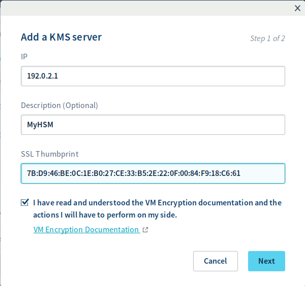
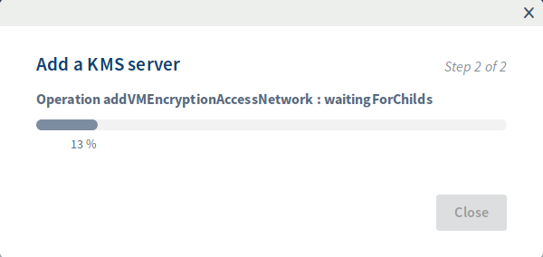
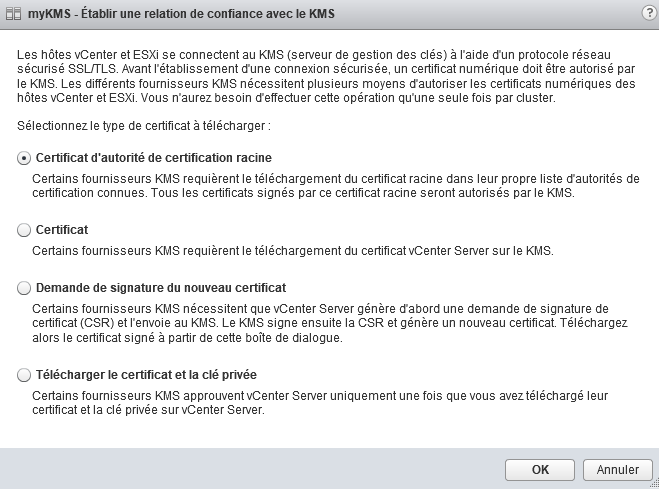
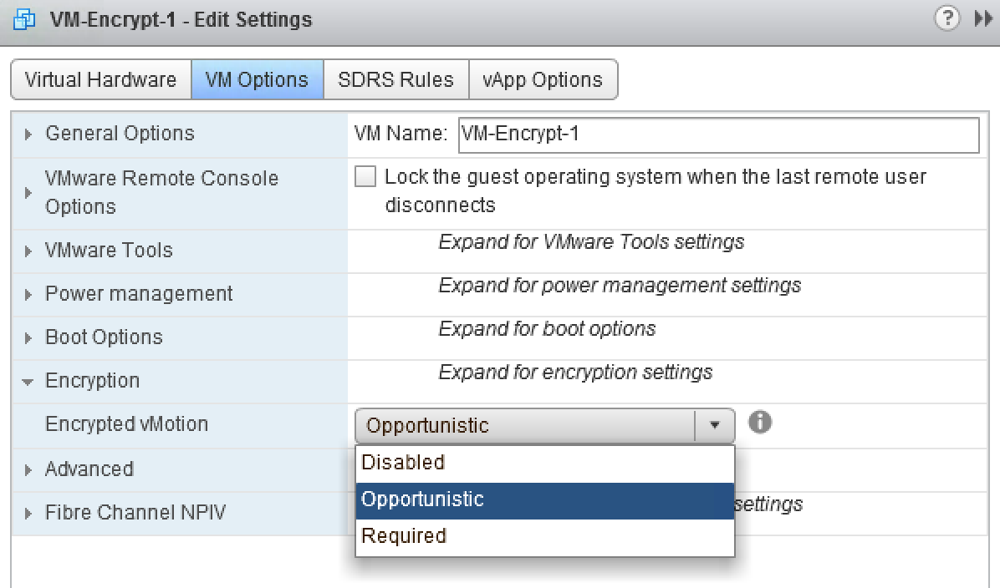
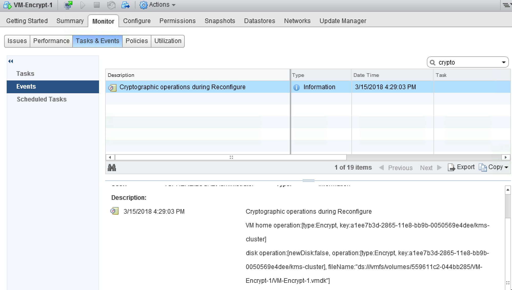
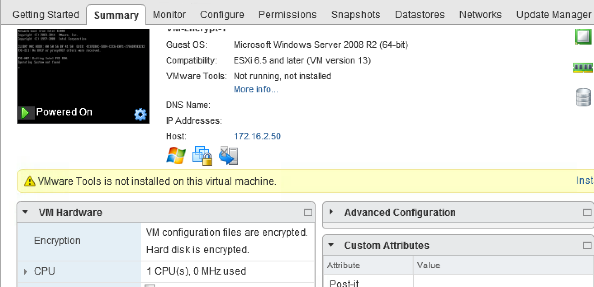

**Last updated Oct. 11th 2018**

## Objective

This guide aims to explain the details of implementing VMencrypt on the OVH Private Cloud, using a storage strategy using an external KMS (Key Management Server).

## Requirements

- Have a [Private Cloud](https://www.ovh.co.uk/private-cloud/){.external} offer.
- Have a external **[KMIP](https://en.wikipedia.org/wiki/Key_Management_Interoperability_Protocol_(KMIP)){.external} 1.1** compatible Key management server (KMS) and how are in VMware [compatibility matrix](https://www.vmware.com/resources/compatibility/search.php?deviceCategory=kms&details=1&feature=293&page=1&display_interval=500&sortColumn=Partner&sortOrder=Asc){.external} VMware
- Access to the vSphere management interface.
- Have virtual machines with a Hardware version 13

## Instructions

### Retrieve the certificate thumbprint from the KMS

Depending on your KMS, you can connect to the server using the browser and navigate to → `View Certificate`{.action} → `Thumbprint`{.action}

{.thumbnail}

{.thumbnail}

Extract value on `SHA1 Fingerprint`{.action} line

Other method with OpenSSL:
```shell
openssl s_client -connect 192.0.2.1:5696 < /dev/null 2>/dev/null | openssl x509 -fingerprint -noout -in /dev/stdin
```

Here it is the value on the right side of the equal sign :

```shell
> SHA1 Fingerprint=7B:D9:46:BE:0C:1E:B0:27:CE:33:B5:2E:22:0F:00:84:F9:18:C6:61
```

### Register your KMS

#### With OVH Manager

In the manager, open the Dedicated universe then in the `Private Cloud`{.action} section, select your service **PCC**.

From the main page of the service, select `Security`{.action}.

{.thumbnail}

Further down the page is the section **Virtual Machine Encryption Key Management Servers**, click on `Add a new KMS Server`{.action}

{.thumbnail}

{.thumbnail}

In the new window, enter the following information:

* IP addresse of KMS
* SSLThumbprint of KMS
* check box to agree the correct consideration of this documentation

Then validate with `Next`{.action}}

{.thumbnail}

A last window displays the progress of the task.

#### With OVH API

Encryption functions can be enabled through the OVH API.

Get your serviceName:

> [!api]
>
> @api {GET} /dedicatedCloud
>

Check that encryption is not yet enabled:

> [!api]
>
> @api {GET} /dedicatedCloud/{serviceName}/vmEncryption
>

```shell
>     "state": "disabled"
```

Then perform the registration of the KMS:

> [!api]
>
> @api {POST} /dedicatedCloud/{serviceName}/kms
>

You must provide the following information:

* the serviceName
* IP address of the KMS
* the SSLThumbprint of the KMS

### Add the KMS to the vCenter

#### About this section

**The vCenter Server creates a KMS cluster when you add the first KMS instance.**

* When you add the KMS, you are prompted to set this cluster as the default. You can later change the default cluster.
* Once the vCenter has created the first cluster, you can add KMS instances from the same supplier to the cluster.
* You can configure the cluster with a single KMS instance.
* If your environment supports KMS solutions from different vendors, you can add multiple KMS clusters.
* If your environment includes several KMS clusters and you delete the default cluster, you must define another one. See defining the default KMS cluster.

#### Procedure

- Connect to the Private Cloud with the vSphere Web Client.
- Browse the inventory list and select the vCenter.
- Click on `Manage`{.action} then `Key Management Servers`{.action}.
- Click `Add KMS`{.action}, specify the KMS information in the wizard, and then click `OK`{.action}.
- Trust the certificate and click on `Trust`{.action}.

{.thumbnail}

Choose the following options:

* KMS cluster : Select `Create new cluster`{.action} for a new cluster. If a cluster exists, you can select it.
* Cluster name : Name of the KMS cluster. You may need this name to connect to the KMS if your vCenter becomes unavailable. The name of the cluster is very important to be unique and keep a note of the same thing.
* Server alias : Alias for the KMS. You may need this alias to connect to the KMS if your vCenter becomes unavailable.
* Server address : IP address or FQDN of the KMS.
* Server port : Port on which the vCenter server connects to the KMS. The standard KMIP port is 5696. It may vary if the KMS of another supplier is configured on a specific port.
* Proxy address : leave empty
* Proxy port : leave empty
* User name : Some KMS providers allow users to isolate the encryption keys used by different users or groups by specifying a user name and password. Specify a user name only if your KMS supports this feature and you intend to use it.
* Password : Some KMS providers allow users to isolate the encryption keys used by different users or groups by specifying a user name and password. Specify a password only if your KMS supports this feature and you intend to use it.

#### Import of the KMS certificate

Most KMS providers need a certificate to  [trust](https://docs.vmware.com/en/VMware-vSphere/6.5/com.vmware.vsphere.security.doc/GUID-0212CEF2-7871-4E00-ADF2-0C71401D5E1A.html){.external} the vCenter.

From the vCenter where we added the KMS server

* Select the KMS server that has been added
* All options → Establish a trust relationship with KMS

> [!warning]
>
> Make sure that the certificate is not encrypted with a password when we download the certificate from the KMS. Example: If you create a user, create a user without a password and download the certificate for the KMS user and download the certificate.
>

{.thumbnail}

#### Check that the KMS is configured

Check that the **Connection Status** of the KMS is **Normal**:

{.thumbnail}

#### Change the storage policy of "VM Encryption Storage"

Create a virtual machine

Once the VM has been created, right-click on the virtual machine and choose `VM Policies`{.action} → `Edit VM Storage Policies`{.action}.

{.thumbnail}

Select the VM files and other hard disks that need to be encrypted.

{.thumbnail}

Make sure that the tasks are performed without errors.

> [!info]
>
> If the KMS is not configured correctly and there are problems with the key exchange between vCenter and KMS, there will be a RuntimeFault error in the task with the error message **Cannot generate Key**.
>

#### vMotion encrypted

For vMotion, encryption works at the VM level and for synchronization, 256-bit encryption keys are used.

VMotion traffic encryption works at the VM kernel level with the widely used AES-GCM (Advanced Encryption Standard / Galois Counter Mode) algorithm.

Modify the virtual machine and navigate to `VM Options`{.action}

We must select the options explicitly if we need encrypted vMotion

There are 3 policies for encrypted vMotion:
* Disabled: Off.
* Opportunistic: Encryption only if supported by the source host and ESXi target host, otherwise vMotion will not be encrypted.
* Required: encryption is used.

{.thumbnail}

The movement of machines between hosts is achieved by exchanging unique keys, which are generated and served by the vCenter server, rather than by KMS.

#### Configuration checks

{.thumbnail}

{.thumbnail}

{.thumbnail}

## Go further

Join our community of users on <https://community.ovh.com/en/>.
