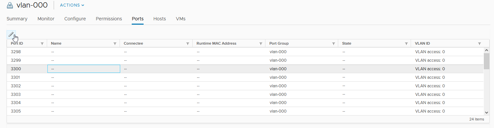
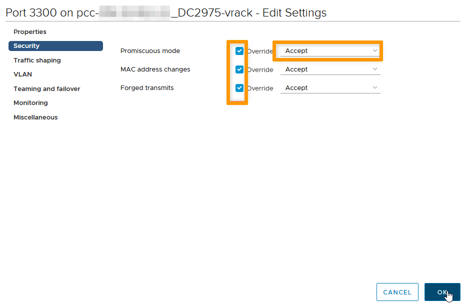

**Dernière mise à jour le 01/05/2023**

## Objectif

Le mode promiscuité élimine tout filtrage de réception que la carte réseau de la machine virtuelle peut effectuer, afin que le système d'exploitation invité reçoive tout le trafic observé sur le réseau. Par défaut, la carte réseau de la machine virtuelle ne peut pas fonctionner en mode promiscuité.

Il peut-être nécessaire dans certains cas d'activer le mode promiscuité pour le bon fonctionnement de certains protocoles HA comme CARP.

 
## En pratique

Il convient de différencier deux situations, suivant le Distributed Virtual Switch (DVS) impliqué, les solutions seront différentes :

- dvs publique (nom : pcc-xxx-xx-xxx-xx_DCxxx-dvs, vmnetwork ou vxlan)

- dvs vrack (nom : pcc-xxx-xx-xxx-xx_DCxxx-vrack, vlan vrack)

 
### DVS Publique

Les clients sont désormais autonomes pour effectuer cette action via notre API. Les appels API suivants peuvent être utilisés.

- Activer le mode promiscuité sur une machine virtuelle
    
> [!api]
>
> @api {POST} /dedicatedCloud/{serviceName}/datacenter/{datacenterId}/vm/{vmId}/enableCarp
>

- Désactiver le mode promiscuité sur une machine virtuelle

> [!api]
>
> @api {POST} /dedicatedCloud/{serviceName}/datacenter/{datacenterId}/vm/{vmId}/disableCarp
>

- Vérifier si l'option est activé ou non sur la machine virtuelle

> [!api]
>
> @api {POST} /dedicatedCloud/{serviceName}/datacenter/{datacenterId}/vm/{vmId}
>
 
### DVS vRack

Dans ce cas, vous pouvez effectuer la manipulation directement depuis vSphere en suivant la procédure ci-dessous.

 
#### Activation du mode promiscuité sur un port dans vSphere

Tout d'abord il faut vérifier que le DVS autorise bien la possibilité d'avoir une configuration différente sur le port (par défaut c'est celle du DVS qui est appliquée).

Pour ce faire, faites un clic droit sur le portgroup, cliquez sur `Modifier les paramètres`{.action}, puis sur `Avancé`{.action} et vérifier que `Autorisé` est choché dans la ligne `Stratégie de sécurité`.

{.thumbnail}

Vous pouvez ensuite sélectionner le port où la VM est connectée et cliquer sur le crayon en haut à gauche.

{.thumbnail}

Vous pourrez alors, dans la section `Sécurité`, cocher `Remplacer` et modifier la stratégie de sécurité vers `Accepter` pour les trois options, si ce n'est pas déjà le cas.

{.thumbnail}

#### Activation du mode de promiscuité sur la totalité d'un portgroup dans vSphere

Cette manipulation ne doit jamais être faite sur un DVS public, uniquement possible sur le DVS vrack.

Il est possible de faire la modification directement sur le portgroup, cela aura l'avantage d'appliquer la configuration à tous les ports (et donc éviter de devoir le faire à la création/restauration d'une VM).

Cependant, cela peut représenter un défaut de sécurité, car les adaptateurs en mode promiscuité ont accès aux paquets, même si certains de ces paquets sont reçus uniquement par un adaptateur réseau spécifique. Cela signifie qu'un administrateur ou un utilisateur racine (root) dans une machine virtuelle peut potentiellement voir le trafic destiné à d'autres systèmes d'exploitation hôtes ou invités.

Il est donc important de le faire en connaissance de cause.

Dans ce cas, il suffit de faire un clic droit sur le portgroup concerné, puis sur `Modifier les paramètres`{.action}. Allez ensuite dans la section `Sécurité` et modifier la stratégie de sécurité vers `Accepter` pour les trois options, si ce n'est pas déjà le cas.

{.thumbnail}

## Aller plus loin

Échangez avec notre communauté d’utilisateurs sur <https://community.ovh.com/>.