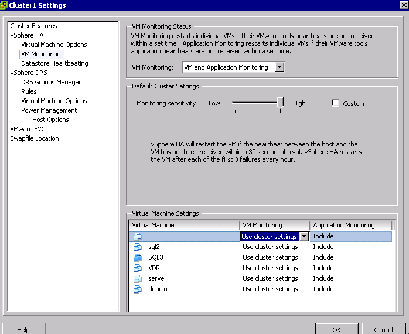

La fonction principale de **VMware HA** (High Availability) en cas de défaillance matérielle est de redémarrer les machines virtuelles sur un autre hôte du cluster. **HA** permet aussi de surveiller les VMs ainsi que les applications.

{.thumbnail}

L'activation et la configuration de **HA** s'effectue depuis les **paramètres** du Cluster. Pour information suite à la livraison de votre Dedicated Cloud les fonctionnalités de type HA et DRS sont activées sur votre Cluster.

{.thumbnail}

La **surveillance** de l'hôte doit être **impérativement** activée pour le bon fonctionnement de **HA,**sa désactivation est nécessaire pour réaliser des opérations de mise à jour avec [update manager]({legacy}2163146) par exemple, dans ce cas précis le hôte est isolé.

{.thumbnail}

L'**Admission Control** vérifie les ressources non-réservées disponibles dans un Host et la gestion de l’autorisation du démarrage des VMs.

le système détermine s'il peut garantir la réservation pour laquelle la machine virtuelle est configurée (le cas échéant). Ce processus est appelé contrôle d'admission.

Si il y a suffisamment de ressources CPU et mémoire non réservées disponibles la VM démarrera, mais sinon, un avertissement apparaît de ce type.

{.thumbnail}

Il existe trois politiques différentes de **contrôle d'admission**.

- ***Host Failures the cluster tolerates***Le nombre "Host failures cluster tolérates" est le nombre d'host primary hors services (failure) qui serait toléré avant que le Admission control interdise le démarrage des VMs. VMware HA va quand même faire une vérification que la capacité de basculement soit respecté malgré le nombre d'host choisi. Un procédé appelé "worst-case scenarios" va s'effectuer ont moment de décider si les VMs sont autorisé à démarrer. Celui-ci va imaginer que des Hosts deviens indisponible (commence par l'Host de plus grand capacité).

- ***Percentage of cluster ressources reserved as failover spare capacity***est le seuil pour la Capacité de basculement. En dessous de ce pourcentage les VMs ne seront plus autorisé à démarrer. Les ressources totales des hôtes disponibles pour les VMs sont calculées en additionnant les ressources en CPU et en mémoire des hôtes.

- ***Specify failover hosts***Un host sera spécifié pour le démarrage des VMs. Si l'host spécifié est aussi indisponible ou même que ses ressources sont insuffisante VMware HA tentera le démarrage de ces VMs sur un autre host du cluster avec des ressources non-réservé disponible. Pour assuré des capacités suffisantes sur l'host, Il est impossible de lui mettre des VMs et il est aussi impossible d'utiliser le vMotion pour faire migrer des VM vers cette host de basculement. Et pour finir le DRS n'utilisera pas l'host de basculement dans la répartition des charges.

{.thumbnail}

La surveillance des machines virtuelles est disponible suite à l'installation des [VMtools]({legacy}7766427), en cas de non réponse via les**tools** (heartbeat) la machine virtuelle sera automatiquement redémarrée. Une configuration avancée est possible par rapport à cette fonctionnalité (intervalle de redémarrage par exemple)

{.thumbnail}
