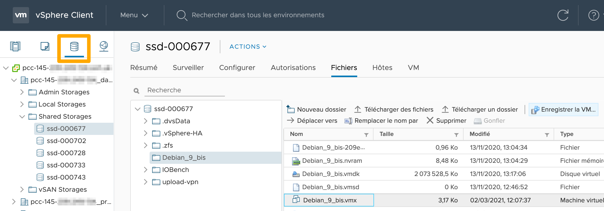
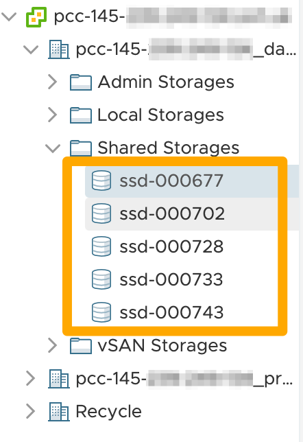
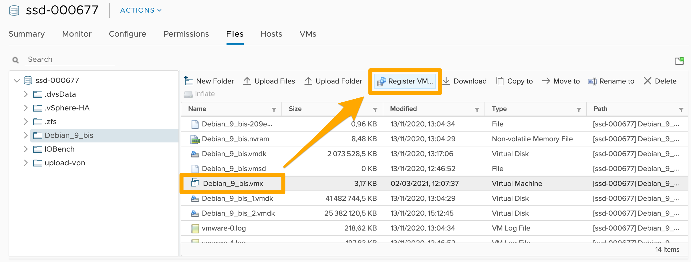
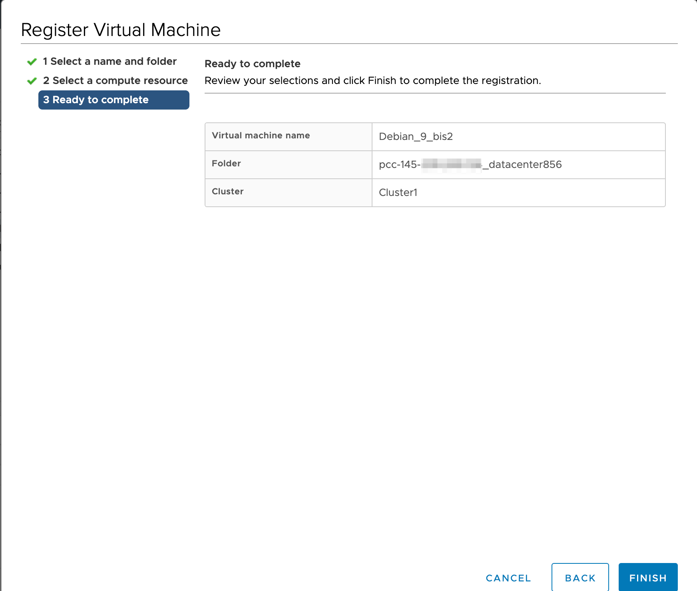
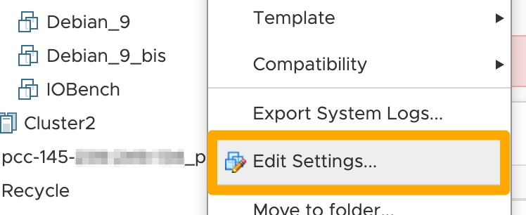
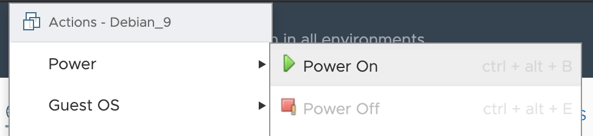

**Last updated 22th March 2021**

## Objective

Following an incident, some virtual machines may no longer appear in your vSphere inventory, but all files are still present in the datastores.

**Find out how to reregister VMs from a datastore in your vSphere inventory.**

## Requirements

- access to your vSphere [interface](../login-vsphere-interface/)
- datastores containing the virtual machine files

## Instructions

In your [vSphere interface](../login-vsphere-interface/), go to the `Storage`{.action} view.

{.thumbnail}

Select a datastore from the list.

{.thumbnail}

In the folders for this datastore, select the `.vmx` file and click `Register VM`{.action}.

{.thumbnail}

Fill in the information required, then click `Finish`{.action}.

{.thumbnail}

You will need to repeat these same operations for each datastore, and for each VM that needs to be reregistered.

Check the settings of your VMs (name, [portgroup](../creation-vlan-vxlan/), etc...) by right-clicking on each one and then selecting `Edit Settings`{.action}.

{.thumbnail}

In the event of a configuration error, an error message will be displayed when you restart the VM. 

You can reactivate a VM by right-clicking on it, then clicking `Power On`{.action}.

{.thumbnail}

## Go further

Join our community of users on <https://community.ovh.com/en/>.
