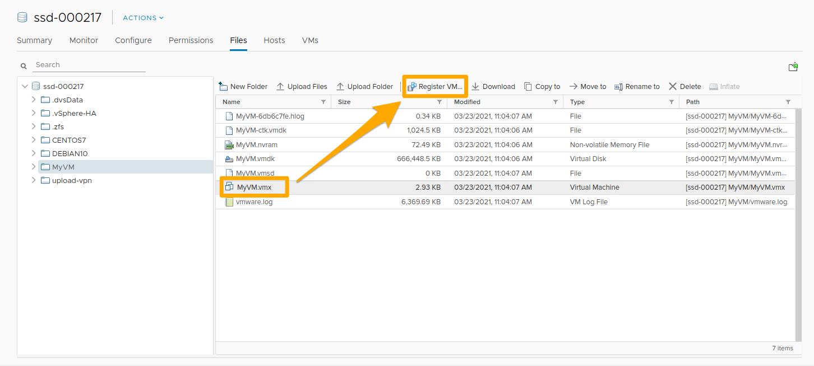
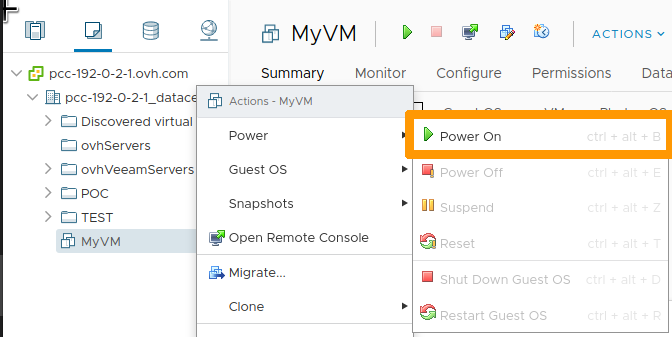

> [!primary]
> Esta traducción ha sido generada de forma automática por nuestro partner SYSTRAN. En algunos casos puede contener términos imprecisos, como en las etiquetas de los botones o los detalles técnicos. En caso de duda, le recomendamos que consulte la versión inglesa o francesa de la guía. Si quiere ayudarnos a mejorar esta traducción, por favor, utilice el botón «Contribuir» de esta página.
> 

**Última actualización: 22/03/2021**

## Objetivo

Debido a una incidencia, las máquinas virtuales ya no aparecen en su inventario vSphere, pero todos los archivos siguen presentes en los datastores.

**Cómo reinscribir MV de un datastore en su inventario vSphere**

## Requisitos

- Ser contacto administrador de la infraestructura [Hosted Private Cloud](https://www.ovhcloud.com/es-es/enterprise/products/hosted-private-cloud/) para recibir las claves de conexión.
- Tener un usuario activo (creado en el [área de cliente de OVHcloud](https://www.ovh.com/auth/?action=gotomanager&from=https://www.ovh.es/&ovhSubsidiary=es))

## Procedimiento

En su [interfaz vSphere](../instalar_el_vsphere_client/), sitúese en la vista `Almacenamiento`{.action}.

{.thumbnail}

Seleccione un datastore de la lista.

{.thumbnail}

En las carpetas de este datastore, seleccione el archivo `.vmx` y haga clic en `Register VM`{.action}.

{.thumbnail}

Introduzca la información solicitada y haga clic en `Finish`{.action}

{.thumbnail}

Estas operaciones se repiten en cada datastore y por cada MV que se va a volver a registrar.

Compruebe los parámetros de sus MV (nombre, [portgroup](../crear-vlan-vxlan/), etc.) haciendo clic derecho sobre cada una de ellas y seleccionando `Edit Settings`{.action}.

{.thumbnail}

Si se produce un error en la configuración, se mostrará un mensaje de error al reiniciar la máquina virtual.

Para encender una máquina virtual, haga clic derecho sobre ella y seleccione `Power On.`{.action}

{.thumbnail}

### Automatización

En caso de tener varias decenas de MV y/o datastores, es posible utilizar scripts para realizar el recorrido de los datastores y el registro de las MV que se encuentren en ellos.

#### Avec PowerCLI

VMware proporciona los PowerCLI para los administradores VMware que utilizan PowerShell: [Instale PowerCLI](https://docs.vmware.com/fr/VMware-vSphere/6.5/com.vmware.vsphere.install.doc/GUID-F02D0C2D-B226-4908-9E5C-2E783D41FE2D.html){.external}.

A continuación puede utilizar el siguiente script, adaptado al que escribió [LucD](https://www.lucd.info/2009/12/02/raiders-of-the-lost-vmx/){.external}.

```powershell
function register-vmxX {
    param($entityName = $null,$dsNames = $null,$template = $false,$ignore = $null,$checkNFS = $true,$whatif=$false)

    function Get-Usage{
        Write-Host "Parameters incorrect" -ForegroundColor red
        Write-Host "register-vmxX -entityName  -dsNames [,...]"
        Write-Host "entityName   : a cluster-, datacenter or ESX hostname (not together with -dsNames)"
        Write-Host "dsNames      : one or more datastorename names (not together with -entityName)"
        Write-Host "ignore       : names of folders that shouldn't be checked"
        Write-Host "template     : register guests ($false)or templates ($true) - default : $false"
        Write-Host "checkNFS     : include NFS datastores - default : $true"
        Write-Host "whatif       : when $true will only list and not execute - default : $false"
    }

    if(($entityName -ne $null -and $dsNames -ne $null) -or ($entityName -eq $null -and $dsNames -eq $null)){
        Get-Usage
        break
    }

    if($dsNames -eq $null){
        switch((Get-Inventory -Name $entityName).GetType().Name.Replace("Wrapper","")){
            "Cluster"{
                $dsNames = Get-Cluster -Name $entityName | Get-VMHost | Get-Datastore | where {$_.Type -eq "VMFS" -or $checkNFS} | % {$_.Name}
            }
            "Datacenter"{
                $dsNames = Get-Datacenter -Name $entityName | Get-Datastore | where {$_.Type -eq "VMFS" -or $checkNFS} | % {$_.Name}
            }
            "VMHost"{
                $dsNames = Get-VMHost -Name $entityName | Get-Datastore | where {$_.Type -eq "VMFS" -or $checkNFS} | % {$_.Name}
            }
            Default{
                Get-Usage
                exit
            }
        }
    }
    else{
        $dsNames = Get-Datastore -Name $dsNames | where {$_.Type -eq "VMFS" -or $checkNFS} | Select -Unique | % {$_.Name}
    }

    $dsNames = $dsNames | Sort-Object
    $pattern = "*.vmx"
    if($template){
        $pattern = "*.vmtx"
    }

    foreach($dsName in $dsNames){
        Write-Host "Checking " -NoNewline; Write-Host -ForegroundColor red -BackgroundColor yellow $dsName
        $ds = Get-Datastore $dsName | Select -Unique | Get-View
        $dsBrowser = Get-View $ds.Browser
        $dc = Get-View $ds.Parent
        while($dc.MoRef.Type -ne "Datacenter"){
            $dc = Get-View $dc.Parent
        }
        $tgtfolder = Get-View $dc.VmFolder
        $esx = Get-View $ds.Host[0].Key
        $pool = Get-View (Get-View $esx.Parent).ResourcePool

        $vms = @()
        foreach($vmImpl in $ds.Vm){
            $vm = Get-View $vmImpl
            $vms += $vm.Config.Files.VmPathName
        }
        $datastorepath = "[" + $ds.Name + "]"

        $searchspec = New-Object VMware.Vim.HostDatastoreBrowserSearchSpec
        $searchspec.MatchPattern = $pattern

        $taskMoRef = $dsBrowser.SearchDatastoreSubFolders_Task($datastorePath, $searchSpec)

        $task = Get-View $taskMoRef
        while ("running","queued" -contains $task.Info.State){
            $task.UpdateViewData("Info.State")
        }
        $task.UpdateViewData("Info.Result")
        foreach ($folder in $task.Info.Result){
            if(!($ignore -and (&{$res = $false; $folder.FolderPath.Split("]")[1].Trim(" /").Split("/") | %{$res = $res -or ($ignore -contains $_)}; $res}))){
                $found = $FALSE
                if($folder.file -ne $null){
                    foreach($vmx in $vms){
                        if(($folder.FolderPath + $folder.File[0].Path) -eq $vmx){
                            $found = $TRUE
                        }
                    }
                    if (-not $found){
                        if($folder.FolderPath[-1] -ne "/"){$folder.FolderPath += "/"}
                        $vmx = $folder.FolderPath + $folder.File[0].Path
                        if($template){
                            $params = @($vmx,$null,$true,$null,$esx.MoRef)
                        }
                        else{
                            $params = @($vmx,$null,$false,$pool.MoRef,$null)
                        }
                        if(!$whatif){
                            $taskMoRef = $tgtfolder.GetType().GetMethod("RegisterVM_Task").Invoke($tgtfolder, $params)
                            Write-Host "`t" $vmx "registered"
                        }
                        else{
                            Write-Host "`t" $vmx "registered" -NoNewline; Write-Host -ForegroundColor blue -BackgroundColor white " ==> What If"
                        }
                    }
                }
            }
        }
        Write-Host "Done"
        }
    }
```

> [!primary]
>
> El siguiente script ha sido adaptado para el entorno VMware de OVHcloud.
> El campo de los datastores NFS está activado por defecto.
>

Una vez que haya declarado el script en su entorno, puede utilizarlo como sigue:

```powershell
register-vmxX -entityName "pcc-192-0-2-1_datacenter1337"
register-vmxX -dsNames "ssd-012345","pcc-012345"
register-vmxX -dsNames "ssd-012345","pcc-012345" -template:$true
register-vmxX -entityName "pcc-192-0-2-1_datacenter1337" -ignore "upload-vpn"
register-vmxX -dsNames "ssd-012345","pcc-012345" -ignore "upload-vpn" -checkNFS:$true
register-vmxX -entityName "pcc-192-0-2-1_datacenter1337" -whatif:$true
```

## Más información

Interactúe con nuestra comunidad de usuarios en <https://community.ovh.com/en/>.
