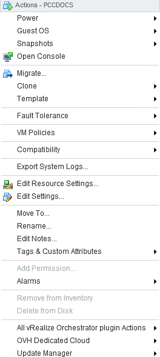
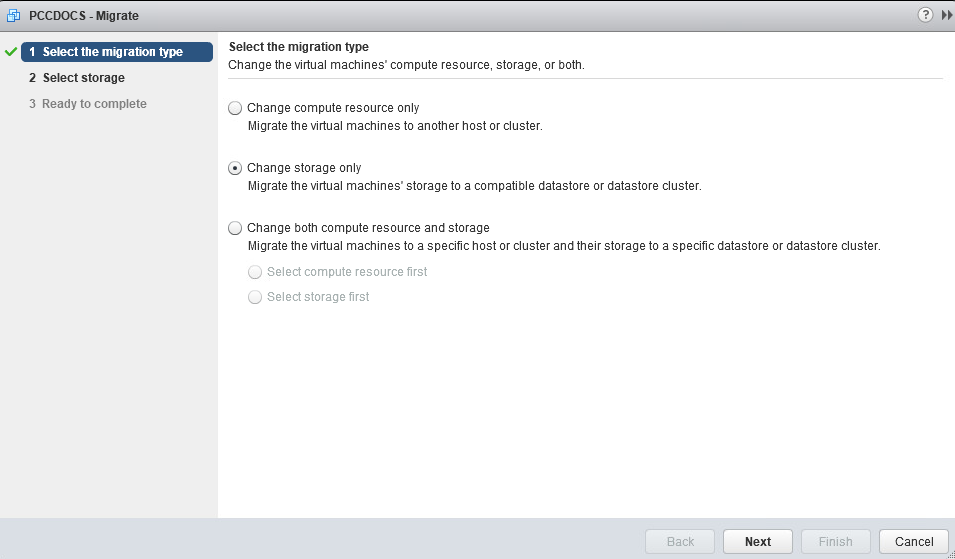
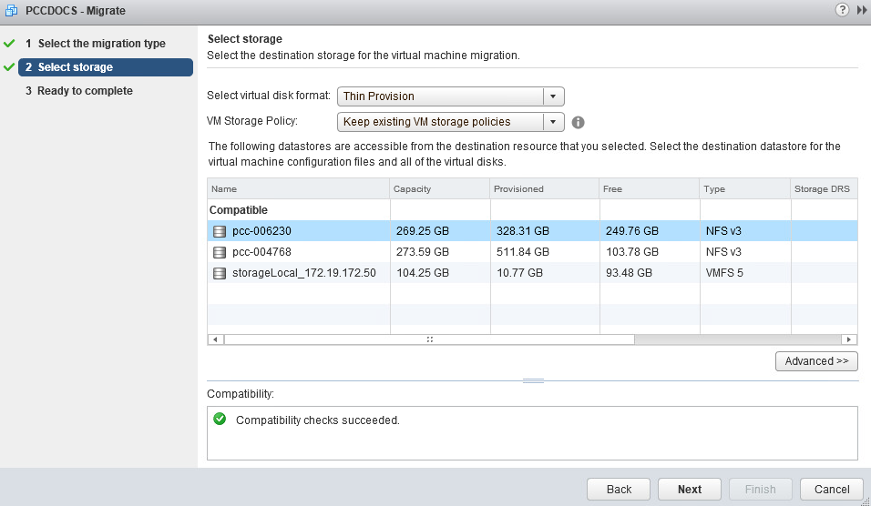
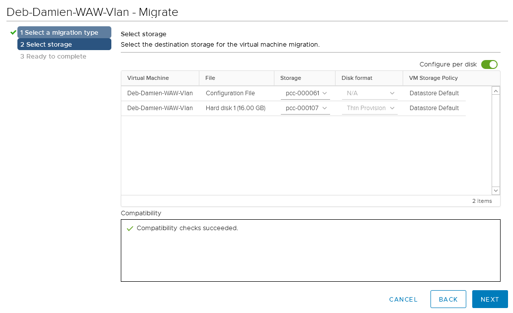
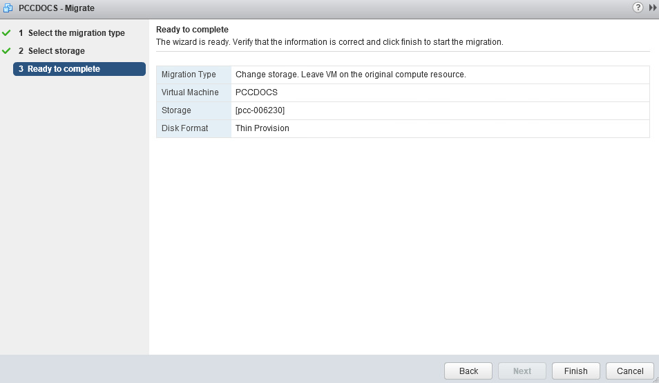
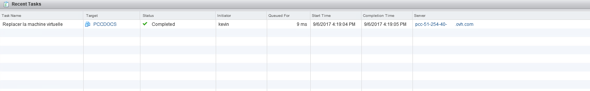

**Last updated 10th July 2020**

## Objective

The **Storage vMotion** allows you to change the storage location of a virtual machine's files while keeping the VM powered on. VMs can be moved completely or disk by disk.

**This guide explains how to perform this operation.**

## Instructions

### Moving a VM disk

To move a virtual machine's files to another datastore, right-click on the virtual machine and select `Migrate...`.

{.thumbnail}

### Choosing a migration type

The menu offers several options for vMotion. In this example, the VM storage is to be migrated to another datastore. Therefore, select "Change storage only".

The option "Change compute resource only" allows to migrate the VM to another host. It is explained in [this guide](../vmotion-new/).

{.thumbnail}

### Choosing a datastore

Choose which storage to migrate the data to.

You can also change the storage policy during this operation.

For example, you can apply the storage policies created if you have [vSAN storage](../vmware-vsan/) or the [VMencryption](../vm-encrypt/) option.

{.thumbnail}

If you have several virtual disks on the same machine, you can also move only one disk of the VM by using the `Configure per disk`{.action} button.

This will lead to the view below.

{.thumbnail}

### Finalising the operation

Click on `FINISH`{.action} to launch the migration task.

{.thumbnail}

### Tracking the vMotion task

In "Recent Tasks", you can track the migration status. It takes more or less time depending on VM size, IO access and bandwidth used.

{.thumbnail}

## Go further

Join our community of users on <https://community.ovh.com/en/>.
