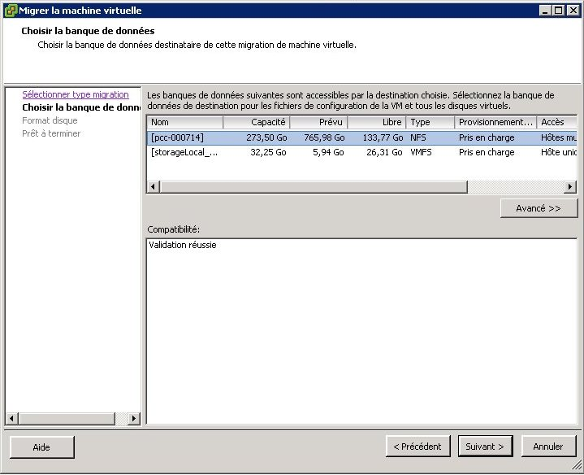

## 
The Storage vMotion allows you to modify the location of a Virtual Machine's file storage while keeping the virtual machine on. 

This option is only available on L and XL hosts with the VMware Enterprise Plus License on the OVH Private Cloud.

## 
To move the Virtual Machine files to another datastore, simply right click on the highlighted virtual machine then select "Migrate" from the menu

{.thumbnail}
You must then choose to which storage you want to move your data.
If you have several virtual disks on the same machine, you can also move only one disk of the VM by using the "Advanced" button:

{.thumbnail}
And modify the location for only one disk:

{.thumbnail}
Once you have chosen the destination of your disks, you will be asked if you want to keep the same type of provisioning or to modify it:

{.thumbnail}

