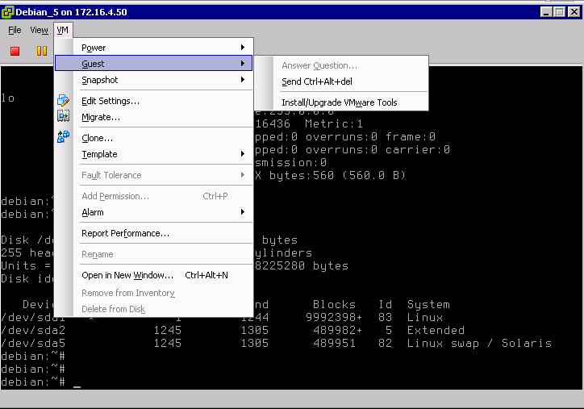

## 
You must use the vSphere client, either by accessing it through your own local client, or by using the pre-configured RDP connection we provided when activating your PCC.


##

LINUX

Mount the VMware tools disk from your VM console by choosing the "Install/Upgrade VWware tools" option:

{.thumbnail}

Then you will have to mount the activated volume with the following command:


```
# mount /dev/cdrom /mnt
```


Uncompress the Tools archive. We do it here in /home:


```
#cd /home (for example)
#tar xvf /mnt/VmareTools-8.3.2-257589.tar.gz
#cd /home/VMWare-tools-distrib
#./VMWare-install.pl default
```


Once the installation is completed, the tool disk will be automatically unmounted from the system. #SECTION Install VMware Tools in Linux.


## 

WINDOWS

Once you have mounted the volume by validating "Install/Upgrade VMware tools" option, you will find the disk in the desktop of your VM. Double click on it in order to run the tool installation:

{.thumbnail}
The installation wizard will then ask you to accept the licences and to choose the type of installation (we recommend you the full installation). 
Once the installation is completed, you will have to restart the VM to update your modifications.

