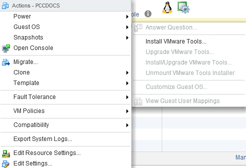

**Última actualización: 28/01/2019**

## Objetivo

VMware Tools es un conjunto de herramientas que mejoran el rendimiento de una máquina virtual y permiten utilizar muchas funcionalidades de los productos de VMware.

**Esta guía explica los pasos a seguir para instalar VMware Tools.**

## Procedimiento

El procedimiento de instalación de VMware Tools depende del sistema operativo de la máquina virtual. Para consultar el procedimiento específico de cada sistema operativo, consulte la [documentación de VMware sobre VMware Tools](https://kb.vmware.com/s/article/1014294){.external-link}.

## Linux

### Versiones recientes

La mayoría de las distribuciones Linux recientes permiten instalar VMware Tools a través de sus sistemas de gestión de paquetes, con el nombre [Open VM Tools](https://kb.vmware.com/s/article/2073803){.external-link}.

Eso permite mantener VMware Tools actualizado del mismo modo que los demás componentes del sistema operativo de la máquina virtual. 

Si la distribución que usted utiliza ofrece el paquete Open VM Tools, podrá encontrarlo con el siguiente nombre: **open-vm-tools**.

Este método de instalación es válido al menos para las siguientes versiones de GNU/Linux:

- Fedora 19 o superior
- Debian 7.x o superior
- openSUSE 11.x o superior
- Ubuntu 12.04 LTS o superior
- Red Hat Enterprise Linux 7.0 o superior
- CentOS 7.0 o superior
- Oracle Linux 7.0 o superior
- SUSE Linux Enterprise 11 SP4 o superior


### Versiones antiguas

En primer lugar, es necesario activar el disco de VMware Tools desde el cliente web vSphere. Para ello, haga clic derecho sobre la máquina virtual para seleccionarla, haga clic en `Guest OS`{.action} y seleccione `Install VMware Tools`{.action}.

{.thumbnail}

A continuación, monte el volumen (previamente activado) con el siguiente comando:

```sh
>     # mount /dev/cdrom /mnt
```

Descomprima el archivo de VMware Tools. En este caso, lo haremos en el directorio **/tmp**.

```sh
> cd /tmp 
> tar xvf /mnt/VMwareTools*.tar.gz
> cd vmware-tools-distrib
> ./vmware-install.pl default
```

> [!success]
>
> Si quiere realizar la instalación de forma desatendida, ofreciendo las respuestas por defecto, añada `default` como argumento al comando de instalación.
> 

Cuando finalice la instalación, el disco se eliminará automáticamente del sistema.

## Windows

Una vez que haya activado el volumen desde vSphere con `Install/Upgrade VMware Tools`{.action}, puede acceder al disco desde el menú `Este equipo`{.action} de su máquina virtual. Haga doble clic en el dispositivo **VMware Tools** para comenzar la instalación.

{.thumbnail}

El asistente de instalación le pedirá que acepte las licencias y que elija el tipo de instalación (le recomendamos la instalación completa).

Una vez finalizada la instalación, reinicie la máquina para que se apliquen los cambios. El lector de CD se desmontará automáticamente.

## Más información

Interactúe con nuestra comunidad de usuarios en [ovh.es/community](https://www.ovh.es/community/){.external}.