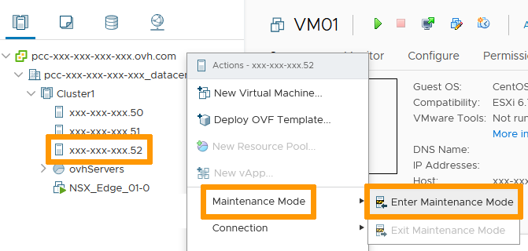
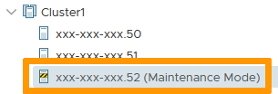
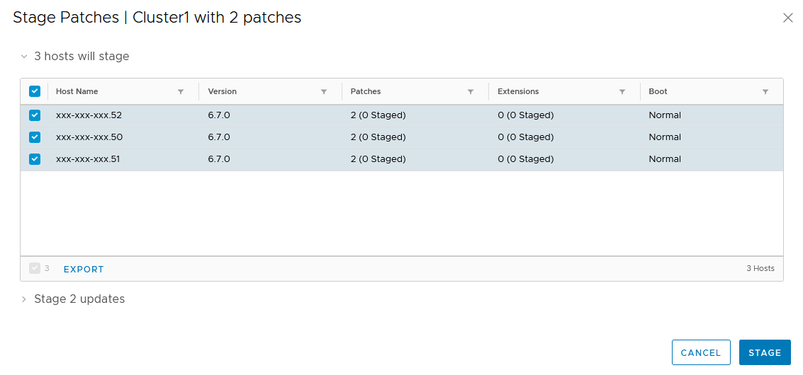
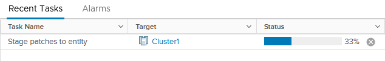
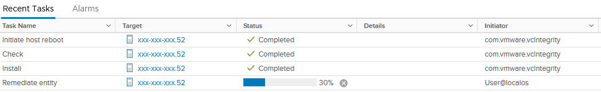
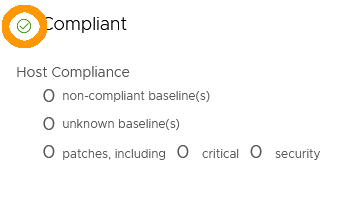

**Last Updated 9th December 2021**

## Objective

VMware Update Manager allows you to keep your hosts up to date by installing Bug Fixes and Security Patches without intervention from our team.     

> [!primary]
> vCenter updates or major updates will still require our involvement.

**This guide will present the Update Manager functionalities**

## Requirements

- being an administrative contact of your [Hosted Private Cloud infrastructure](https://www.ovhcloud.com/asia/enterprise/products/hosted-private-cloud/) to receive login credentials.
- a user account with access to vSphere (created in the [OVHcloud Control Panel](https://ca.ovh.com/auth/?action=gotomanager&from=https://www.ovh.com/asia/&ovhSubsidiary=asia))

## Instructions

### Maintenance Mode

Before working on a host, you'll need to put it in maintenance mode.

Indeed, patching often requires a restart of the host and would impact your live VMs.     
With that in mind, in the vSphere interface menu, go to the `Hosts and Clusters`{.action} dashboard.

{.thumbnail}

On the left side, find your host and right-click on it.  
In the `Maintenance Mode`{.action} section, select `Enter Maintenance Mode`{.action}.

{.thumbnail}

Make sure the box in the following window is checked and click `OK`{.action}.

{.thumbnail}

Assuming DRS is implemented, any live VM will be moved.

> [!primary]
> If you customized your environment, you may have to manually move live VMs from your host before putting it in Maintenance Mode.
>

You may see the following warning:     

{.thumbnail}

Your host is now showing in maintenance mode.

{.thumbnail}

### Update Manager

Select your host and go to the `Update`{.action} tab.

You can see a summary of what is set and its compliance.     
Before trusting what is shown, let's set the baseline against which compliance will be checked.

{.thumbnail}

In the `Attached Baselines` section, click on `Attach`{.action} then `Attach Baseline or Baseline Group`{.action}.

{.thumbnail}

There are predefined Baselines which are the recommended patching level for your hosts depending on criticality of the updates.

> [!primary]
> We'll be using the Critical Patches in this example but you can either use or create your own baselines. You can also apply several baselines to cover different scopes for a same host.

Select the required baseline and click `Attach`{.action}.

{.thumbnail}

Now, the compliance summary may look very different than it used to.     

{.thumbnail}

Back in the `Attached Baselines` section, check the box to select all assigned baselines and click on `Stage`{.action}.

{.thumbnail}

Select the host and click on `Stage`{.action} again.

{.thumbnail}

The staging process starts and will last for a while.

{.thumbnail}

In the `Attached Baselines` section still, check the box to select all assigned baselines and click on `Remediate`{.action}.

{.thumbnail}

Select the host and click on `Remediate`{.action} again.

{.thumbnail}

The updating process starts and will last for a while. Your host will restart if needed.

{.thumbnail}

Once the process has gone through, the compliance check will happen again (you can force it by clicking on the check compliance link) and you will see a green checkmark on the Compliance level.

{.thumbnail}

Your host is now fully up-to-date.

Don't forget to get it out of Maintenance Mode and it will be back in production.

## Go further

Join our community of users on <https://community.ovh.com/en/>.
