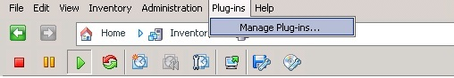
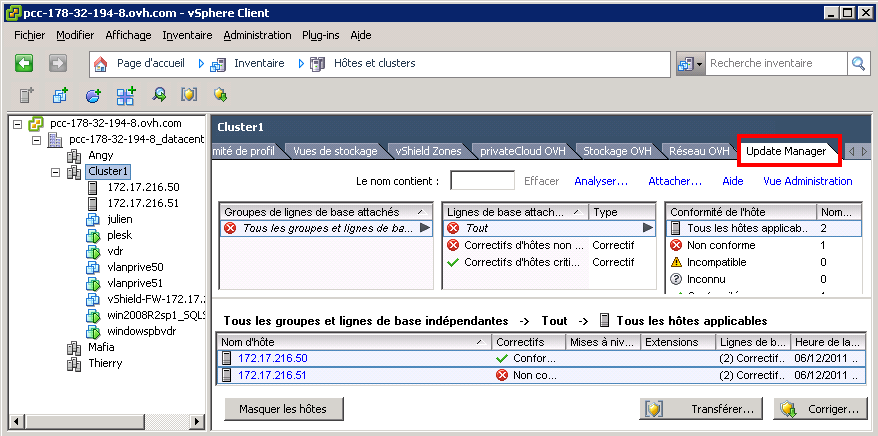
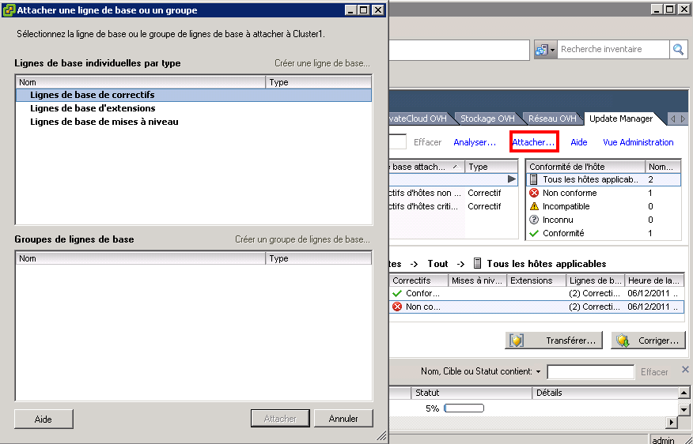
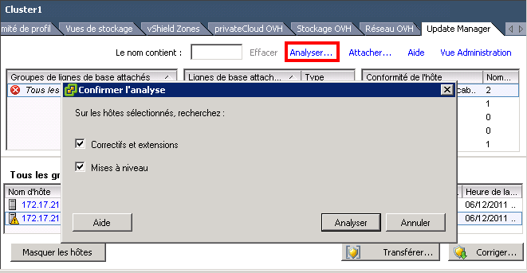
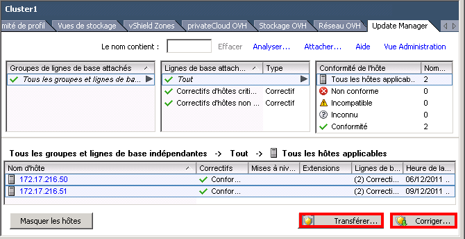

## Prerequisites
We will give you the Update Manager plug-in on the vSphere Client.

You must have previously installed the vSphere Client on your machine:

-[Install the vSphere client]({legacy}600)

## IMPORTANT!!!
If you use the RDP connection supplied when creating your account, it won't be necessary to install the Update Manager.

## 
To install the Update Manager, you must install the associated plug-in to your vSphere:

{.thumbnail}
You will then come to the plug-ins window and the Update Manager is at the bottom of this window. You can then click on "Download & install".

Once that's done you will have a new tab that will appear on the cluster and the hosts:

{.thumbnail}
After that all you need to do is click on the "Attach" button and select the type of update you want:

{.thumbnail}
Once the baselines are selected and attached, you can perform a Patch and Upgrade scan:

{.thumbnail}
You will then have a table that summarises the updates and patches available and the statistics of updated hosts.
If you simply want to download updates without installing them you can use the "Transfer" button and if you then want to install it use the "Correct" button:

{.thumbnail}

