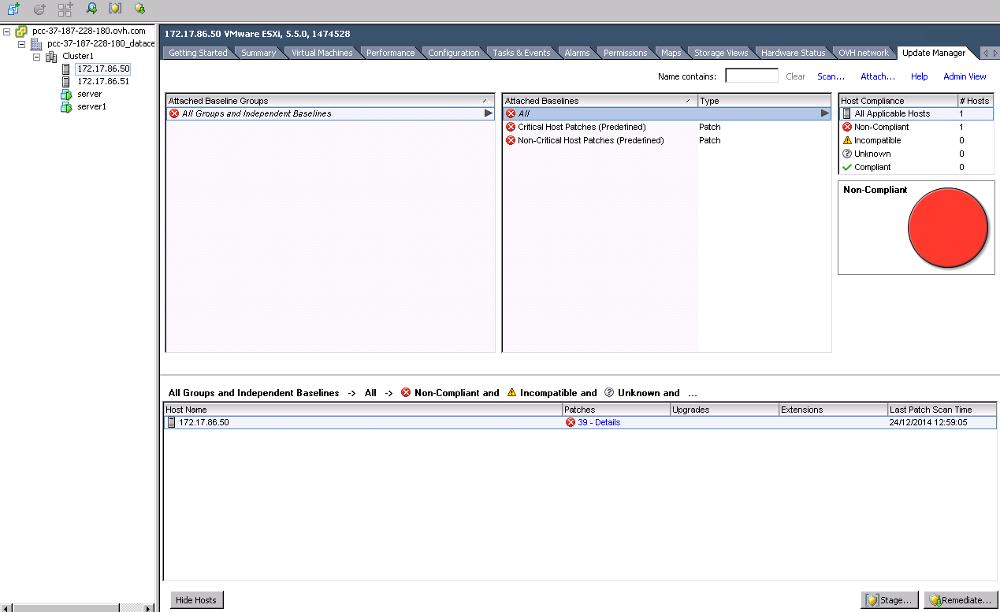
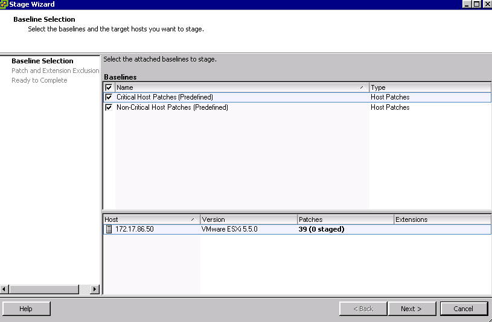
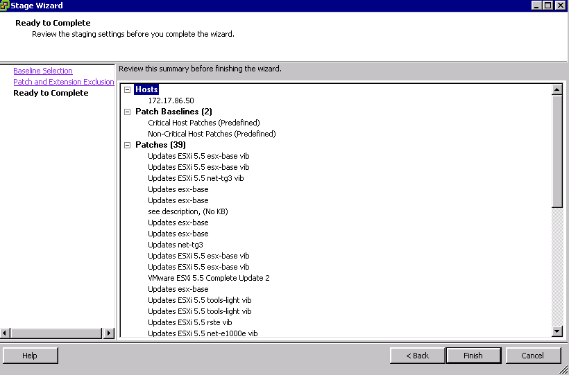
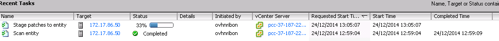
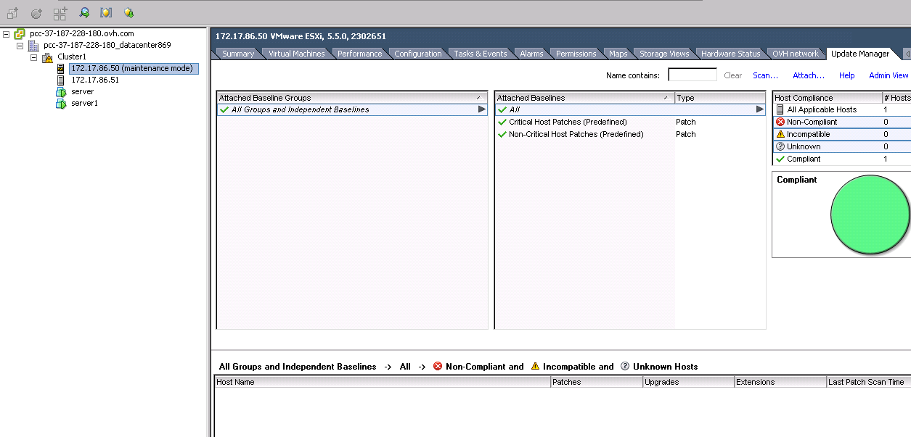

Avec l'outil de VMware en l'occurrence **Update Manager** vous pouvez mettre à jour (patch de sécurité et critique) vos hôtes sans intervention de nos équipes. (Une mise à jour du vCenter ou majeure de votre hôte requiert une opération de notre part)

En premier lieu je vous invite à mettre votre hôte en mode **maintenance**, les machines virtuelles enregistrés seront automatiquement transférés sur un autre hôte de votre **Cluster**.

{.thumbnail}

Le plugin **Update Manager** est actuellement disponible pour le client Lourd en l'occurrence sélectionnez votre hôte et dirigez-vous dans l'onglet "Update Manager" et cliquez sur **Scan**..

{.thumbnail}

Cochez les options suivantes et lancez le **Scan**

- Patches and Extensions
- Upgrades

Lorsque l'opération est terminée je vous invite à cliquer sur l'option "**Attach**" en haute à droite de la page principale de l'**Update Manager**.

{.thumbnail}

Sélectionnez les mises à jours critiques et non critique pour votre hôte et enfin cliquez de nouveau sur **Attach**.

{.thumbnail}

Nous apercevons dans le menu du bas le nombre de patch à appliquer, Cliquez maintenant sur **Stage** pour télécharger les mises à jour sur votre hôte.

{.thumbnail}

Maintenant Il suffit de suivre les opérations en cliquant sur **Next**

{.thumbnail}

Attention au listing des Updates, surtout **ne pas cocher** la mise à jour du **CiscoNexus1000v** car c'est OVH qui gère ce module vDS et en cas d'update automatique vous risquez une isolation réseau de votre hôte.

{.thumbnail}

Voici le récapitulatif des **patches**.

{.thumbnail}

Le téléchargement des **mises à jours**sont en cours sur votre hôte.

{.thumbnail}

Lorsque ce téléchargement est terminé, appuyez sur "**Remediate**" en bas à droite de la page principale de l'**update manager**.

Sélectionnez de nouveau les mises à jours en vérifiant que le patche **Cisco Nexus1000v** n'est pas dans cette liste.

{.thumbnail}

Cette page vous permet de nommer le nom de la tâche pour les logs vSphere ou encore de planifier la date de la mise à jour.

{.thumbnail}

Je vous conseil de cocher les options suivantes.

- Disable High Availability admission control if it is enabled for any of the selected clusters.
- Migration powered off and suspended virtual machines to other hosts in the cluster, if a host must enter maintenance mode.

Sachant que pour la deuxième option, en suivant ce guide vous avez normalement déjà mis votre hôte en **mode maintenance**.

{.thumbnail}

Cliquez sur **Finish**pour lancer la mise à jour.

{.thumbnail}

La mise à jour est en cours sur votre **hôte**, cela prends moins de 5 minutes.

{.thumbnail}

Votre hôte **redémarre** (si pre-requis au niveau de l'update) lorsqu'il répond de nouveau dans votre **Cluster** vous pouvez le sortir du **mode maintenance**, vérifiez aussi dans les **options** de votre **Cluster** que **HA** (High Availability) est bien activée.

{.thumbnail}

Suite à cette **mise à jour**, je vous invite à réaliser des tests en migrant une machine virtuelle sur celui-ci et vérifiez la **connectivité réseau** depuis le réseau **Wan** et **Local**.

Attention La mise à jour de votre**vCenter** doit être réalisé par **OVH** par le biais d'une de la création d'un **ticket** depuis votre [manager](https://www.ovh.com/manager/dedicated/login/){.external-link}.
