**Dernière mise à jour le 22/02/2019**

## Objectif

Avec l'outil **VMware Update Manager** vous pouvez mettre à jour (patch de sécurité et critique) vos hôtes sans intervention de nos équipes. (Une mise à jour du vCenter ou majeure de votre hôte requiert une opération de notre part)

**Ce guide explique le fonctionnement de cet outil**

## En pratique

### Mise en maintenance

Avant toute chose, il est recommandé de mettre votre hôte en mode **maintenance** en faisant un clic droit sur celui-ci, puis `mode maintenance` et `passer en mode maintenance`{.action} .

En effet, la quasi totalité des mises à jour nécessitent un redémarrage de l'hôte.

Durant la mise en maintenance, les machines virtuelles enregistrées seront automatiquement transférées sur un autre hôte de votre cluster si la fonction [DRS](https://docs.ovh.com/fr/private-cloud/vmware-drs-distributed-ressource-scheduler-new/){.external-link} est en mode entièrement automatisé. Si ce n'est pas le cas, vous pouvez modifier ce paramètre, ou déplacer vos machines virtuelles manuellement en effectuant des *[vMotion](https://docs.ovh.com/fr/private-cloud/vmware-vmotion-new/){.external-link}*.

### Update Manager

Vous pouvez retrouver l'onglet `Update Manager` en selectionnant votre cluster.

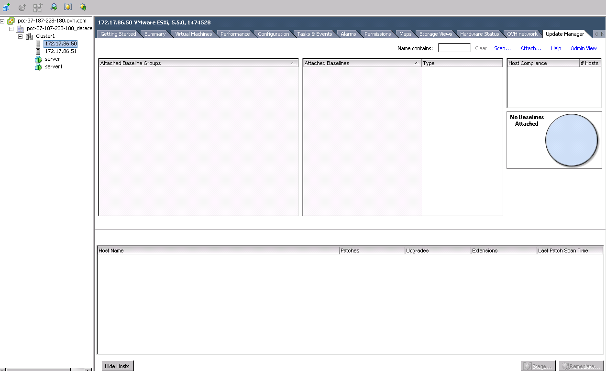{.thumbnail}

#### Attacher une ligne de base

Dans un premier temps, vous devez attacher les lignes de bases.

Pour cela cliquez sur le bouton `Attacher une ligne de base...`{.action}

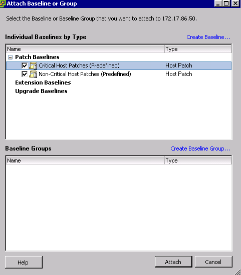{.thumbnail}

#### Rechercher des mises à jour

Les lignes de base étant attachées, vous pouvez à présent cliquer sur le bouton `Rechercher des mises à jour...`{.action}

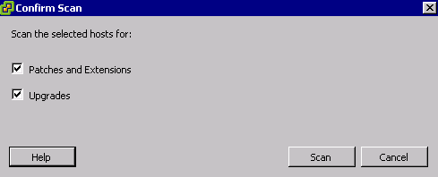{.thumbnail}

Cochez les options suivantes et lancez le **Scan** en cliquant sur `Ok`{.action}

- Patches and Extensions
- Upgrades

Une tâche se lancera par la suite :

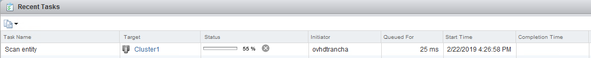{.thumbnail}

### Transférer des correctifs

Le **scan** étant terminé il est à présent possible de télécharger les différents correctifs sur l'hôte de votre choix.

> [!primary]
>
> Cette opération sera à effectuer pour chaque hôte.
>

Pour télécharger les mises à jour, cliquez sur le bouton `Transférer des correctifs...`{.action}.

Une nouvelle fenêtre s'ouvrira avec plusieurs étapes.

Renseignez les lignes de base attachées précedemment

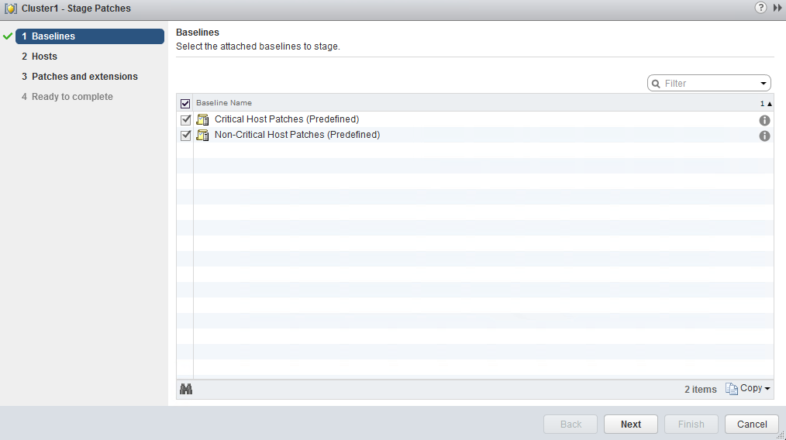{.thumbnail}

Séléctionnez l'hôte sur lequel vous souhaitez appliquer les mises à jour.

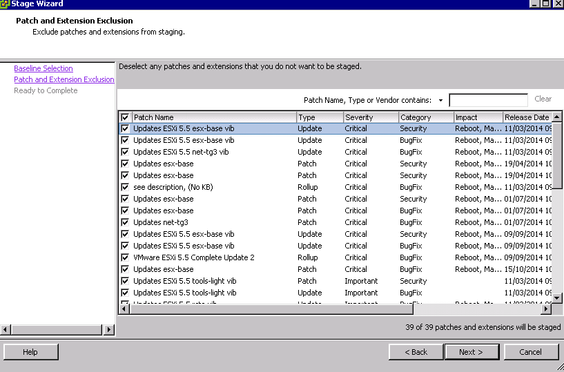{.thumbnail}

Séléctionnez ensuite les mises à jour que vous souhaitez appliquer. Par défaut tout est séléctionné.

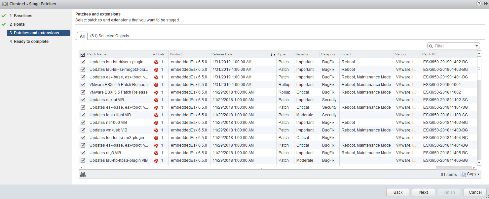{.thumbnail}

Enfin un résumé est disponible. Si tout est conforme, vous pouvez cliquez sur `Terminer`{.action}.

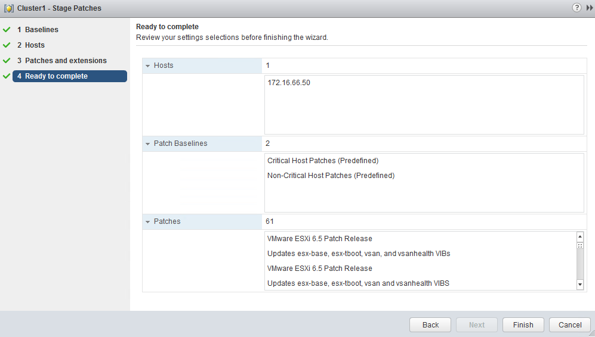{.thumbnail}

Une tâche se lancera sur le cluster, puis sur l'hôte.

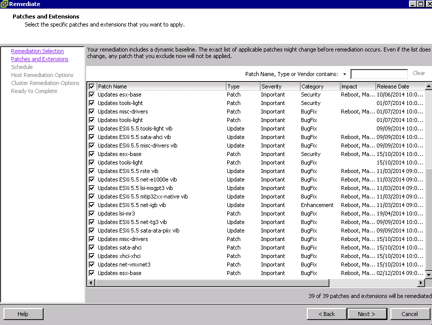{.thumbnail}

### Corriger

Les correctifs sont à présent téléchargés sur l'hôte, vous pouvez maintenant les appliquer.

> [!primary]
>
> Seul cette étape nécessite le passage en mode maintenance de votre hôte.
> 

Pour appliquer ces correctifs, cliquez sur le bouton `Corriger...`{.action}.

Une nouvelle fenêtre s'ouvrira pour configurer l'application des mises à jour.

A nouveau, renseignez les lignes de base :

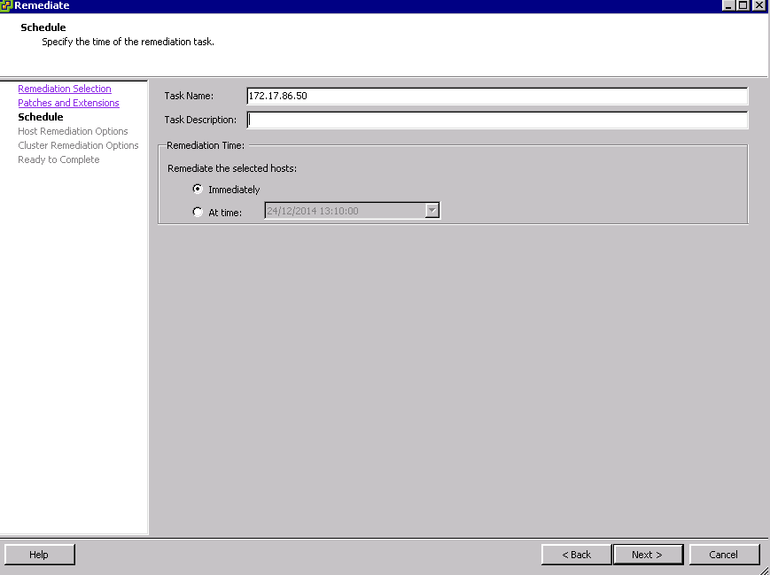{.thumbnail}

Puis l'hôte en mode maintenance sur lequel les mises à jour seront appliquées.

{.thumbnail}

Vous retrouvez ensuite la liste des mises à jour téléchargées à l'étape précédente.

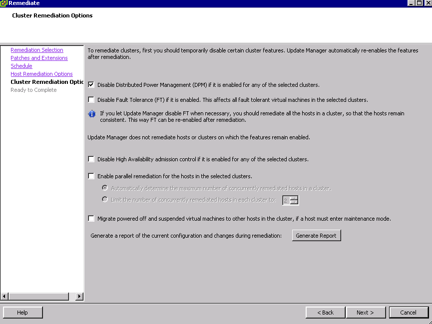{.thumbnail}

Dans les options avancées, vous pouvez planifier votre application. Si vous laissez décoché, elle s'appliquera immédiatement.

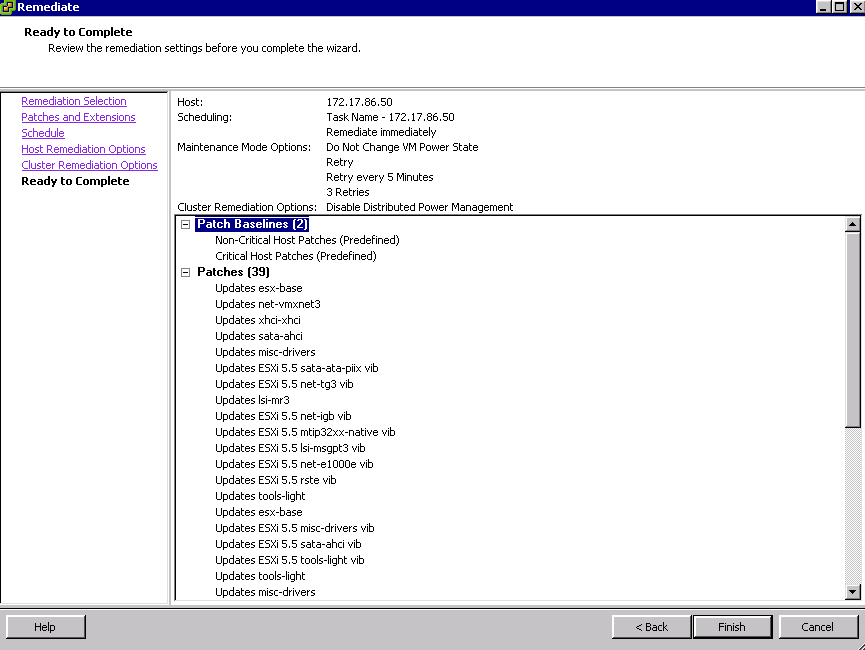{.thumbnail}

Si vous n'avez pas placé votre hôte en mode maintenance ou si vous planifiez l'application des correctifs à une heure ou date ultérieur, vous pouvez planifier la mise en maintenance à cette étape.

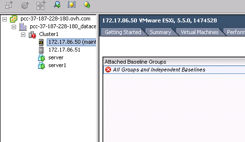{.thumbnail}

Cette ultime étape permet de désactiver certaines options du cluster et de certaines machines virtuelles pour permettre la bonne exécution des mises à jour.

La désactivation du contrôle d'admission peut être interessante si vous ne disposez pas d'assez de ressources en cas de perte d'un hôte (en plus de celui sur lequel vous appliquez les mises à jour).

Il est simplement necessaire de réactiver ce paramètre en editant [la fonction HA du cluster](https://docs.ovh.com/fr/private-cloud/vmware-ha-high-availability/){.external-link}, une fois les mises à jour appliquées sur les différents hôtes.

{.thumbnail}

Enfin, un résumé sera disponible et si tout est en ordre, vous pourrez cliquez sur `Terminer`{.action} pour lancer l'application des mises à jour et le redémarrage de l'hôte.

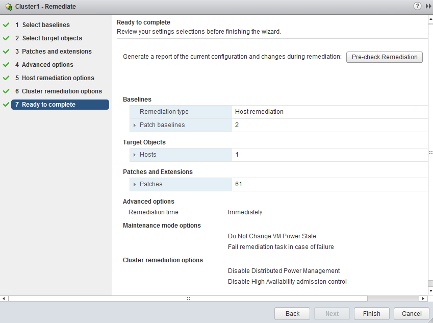{.thumbnail}

Une première tâche se lancera sur le cluster, et en fonction des paramètres choisis, d'autres pourront se lancer également sur le cluster.

Enfin, les tâches d'installation et de redémarrage se lanceront sur l'hôte.

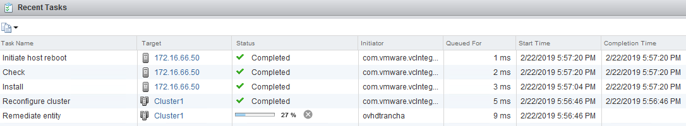{.thumbnail}

Après quelques minutes, votre hôte sera à jour, vous pourrez le sortir du mode maintenance, et si besoin effectuer ces actions sur un autre hôte.

## Aller plus loin

Échangez avec notre communauté d’utilisateurs sur <https://community.ovh.com/>.