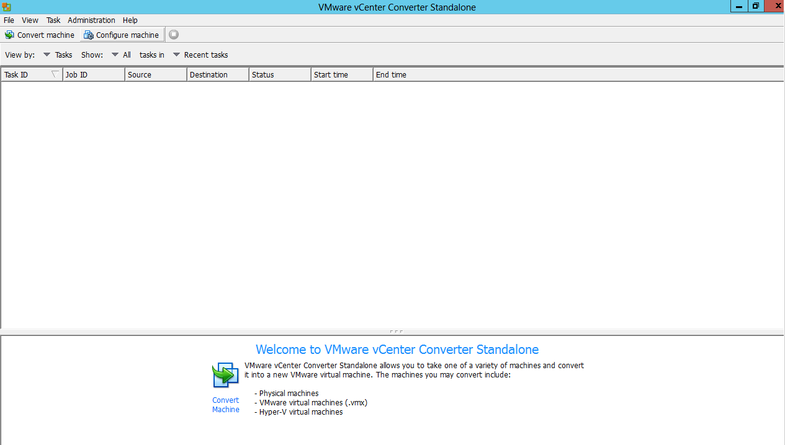
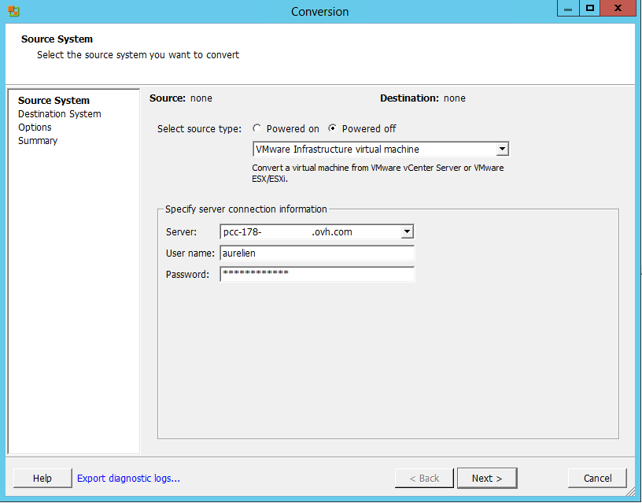

**Dernière mise à jour le 26/03/2018**

**VMware vCenter Converter** est un outil pour convertir une machine physique ou virtuelle vers une infrastructure Cloud en l'occurrence un **P2V** (Physical to Virtual) ou **V2V** (Virtual to Virtual).

Cette [application](https://www.vmware.com/fr/products/converter.html){.external-link} est uniquement compatible Windows.

Nous allons réaliser une migration à froid (VM éteinte) d'une machine virtuelle d'un **Private Cloud** vers un autre, en l'occurrence un **V2V** (Virtual To Virtual). L'action sera effectuée depuis une VM Windows tierce sur l'infrastructure source.

Voici la page d'accueil de **VMware Converter**.

{.thumbnail}

Vous pouvez lancer la tâche de conversion via le bouton "**Convert machine**" en haut à gauche de l'écran d’accueil.

{.thumbnail}

Dans le menu déroulant sélectionnez "**VMware Infrastructure..**" et renseignez le nom de votre source (ici notre Private Cloud) ainsi que votre utilisateur et mot de passe.

{.thumbnail}

Choisissez la machine virtuelle à convertir (**obligatoirement éteinte dans notre cas**). Nous prenons ici l'exemple de la VM "2 Web".

{.thumbnail}

Comme précédemment pour la source, renseignez les informations de l'infrastructure de destination.

{.thumbnail}

Vous pouvez ensuite renommer la VM qui va être créée par conversion et choisir un répertoire.

{.thumbnail}

Vous pouvez choisir votre Cluster1 ainsi que le data-store, la fonctionnalité DRS s'occupe de lui attribué le hôte de destination si DRS est en mode automatique sur ce cluster.

Attention par rapport au choix de la version de la machine virtuelle à convertir car en cas d'utilisation de vSphere il est préférable de ne pas la convertir en**version 10** en raison d'une incompatibilité de paramétrage sur le vSphere Client.

{.thumbnail}

Vous pouvez ensuite modifier les paramètres de la VM de destination si nécessaire, par exemple si un réseau est différent.

Dans les options de la conversion je vous invite à choisir le Network "**VM Network**" sinon vous obtiendrez une erreur de permission par rapport au Network "**Local PortGroup**".

{.thumbnail}

Vous obtenez alors le résumé de votre conversion, récapitulant les choix effectués auparavant.

{.thumbnail}

Le **status** de la conversion est affiché sur la page d'accueil ainsi que la **durée** estimée du temps restant.

{.thumbnail}

Vous pouvez finalement voir si la tâche s'est correctement déroulée et finalisée.

{.thumbnail}
