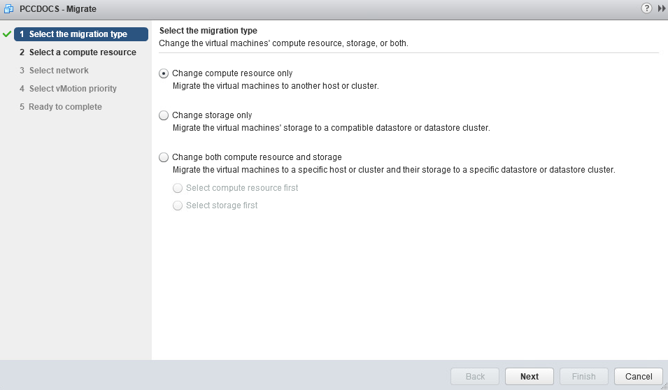
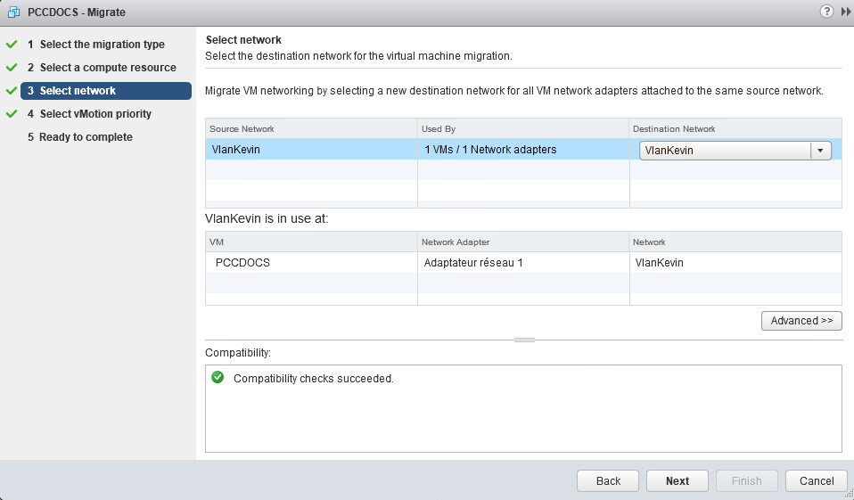
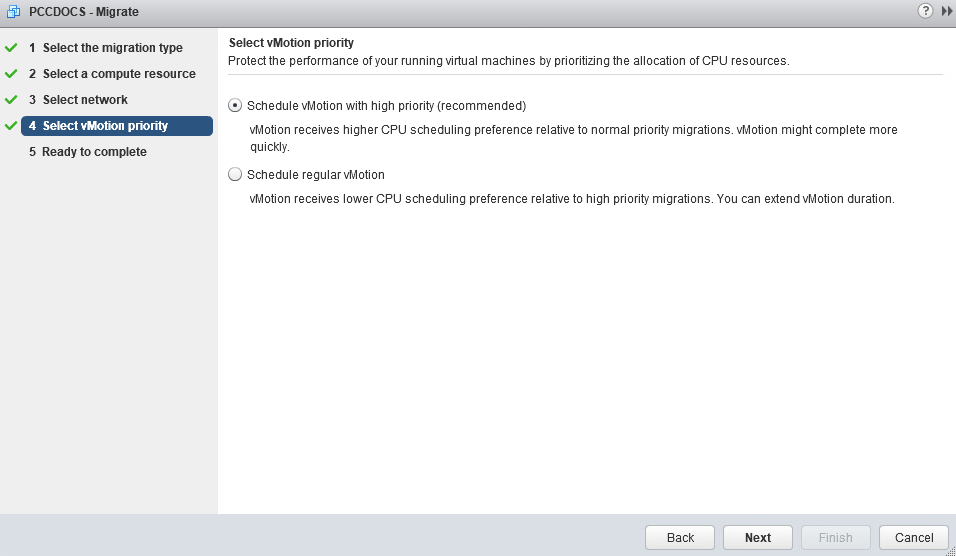
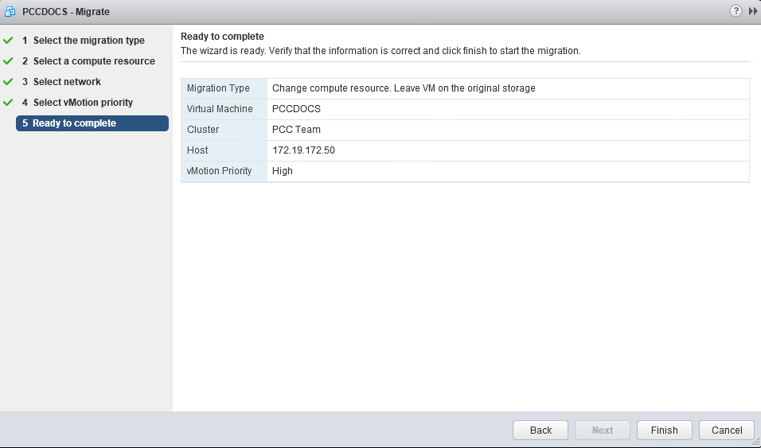
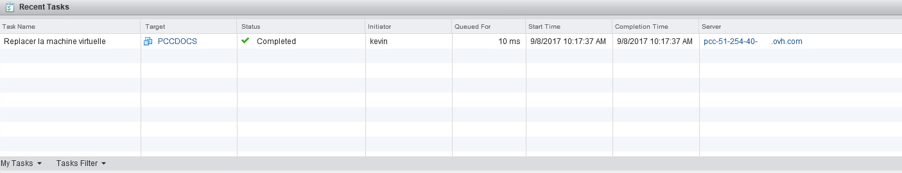

**Last updated 10th July 2020**

## Objective

The **vMotion** feature allows you to to perform a hot migration of a (running) virtual machine from a host to another host, resource pool, or Vapp within the same **cluster**.

**This guide explains how to perform this operation.**

## Instructions

### Moving a VM

To move a virtual machine to another resource, right-click on the VM and select `Migrate...`.

{.thumbnail}

### Choosing a migration type

The menu offers several options for vMotion. In this example, the VM is to be migrated to another host. Therefore, select "Change compute resource only".

The option "Change storage only" allows to migrate the VM to another datastore. It is explained in [this guide](../vmware_storage_vmotion/).

L'option « Modifier uniquement le stockage » permet de migrer la machine virtuelle sur une autre banque de données. Cette opération appelé **Storage vMotion** est décrit dans [ce guide](../vmware-storage-vmotion-new/).

{.thumbnail}

### Choosing a resource

Choisir vers quel ressource migrer la machine virtuelle. Il est possible de migrer la machine virtuelle sur un hôte, un cluster, un ressourcePool ou une Vapp.

Dans notre exemple, nous allons la migrer sur l'hôte .50.

{.thumbnail}

### Choosing the network

Lors de cette étape, il vous est possible de choisir le réseau affecté à la machine virtuelle. Dans notre exemple, nous laissons la machine virtuelle sur son VLAN d'origine.

{.thumbnail}

### Choosing the priority

Nous vous recommandons d'effectuer la migration en priorité haute. Pour ce faire, sélectionnez « Planifier vMotion avec une priorité élevée ».

{.thumbnail}

### Finalising the operation

Click on `FINISH`{.action} to launch the migration task.

{.thumbnail}

### Tracking the vMotion task

In "Recent Tasks", you can track the migration status. It takes more or less time depending on the assigned RAM, work load and bandwidth used.

{.thumbnail}

## Go further

Join our community of users on <https://community.ovh.com/en/>.
