**Last updated 06th December 2018**

## Objective

The aim of this guide is to explain the concepts and details of setting up VMware vSAN on the OVH Private Cloud.

**Find out how to use the power of Hyperconvergence for your virtual machines with vSAN.**

## Requirements

* an [OVH Private Cloud](https://www.ovh.co.uk/private-cloud/){.external} solution
* at least three vSAN hosts added
* access to the vSphere interface

## Instructions

### Key concepts of vSAN

#### What is vSAN?

vSAN is an object storage solution offered by VMware. It gathers a set of disks situated directly in the VMware hosts, and presents them as a single datastore. This architecture, which uses a combination of processing and storage capacity distributed across a group of physical hosts, is also called **hyper-converged architecture**. Since this datastore is virtual and managed by vSAN software, it is also referred to as Software-Defined Storage, or SDS. One of the advantages of vSAN is that it is fully integrated into vSphere, and can be managed directly from vCenter.

#### What is object storage?

One of the most important points to understand is that the vSAN datastore is an object storage system. The VMs hosted on this datastore are made up of different objects, while on a ‘standard’ storage solution, the VMs are made up of files hosted on the LAN. These objects are protected by being replicated across several hosts on the cluster, whereas they would usually be protected by the disk RAID level.

A VM is made up of the following components:
* the VM’s base files (VMX, nvram, logs, memory snapshots, etc.), also called VM Home
* virtual disks (VMDK)
* swap
* disk snapshots

The parts that make up an object are called components. For example, if the object is replicated across two hosts, it is made up of two components. The number of components associated with an object can help you define the level of resilience for your data.

#### Data protection

To ensure that your data is protected in the event of a hardware failure (hosts, disks, etc.), you need to define the levels of redundancy you want. vSAN offers two ways of doing this.

##### Failure To Tolerate (FTT)

The first level of redundancy concerns the number of host failures the vSAN cluster must be able to tolerate, whether it is the loss of a disk, a host or even the network. This value is named ‘Failure To Tolerate’ (or FTT), and it can be between 0 (no redundancy) and 3 (maximum redundancy). Depending on the ‘n’ level set, vSAN will create several components, and distribute them across each of the hosts. This way, the servers will still remain accessible in the event of a failure. The higher the redundancy level you choose, the more hosts will be required.

* FTT=1:  3 hosts minimum
* FTT=2:  5 hosts minimum
* FTT=3:  7 hosts minimum

> [!warning]
>
> Configuring a level 0 FTT means that the data concerned has absolutely zero redundancy. This means that there is a risk of the VMs concerned becoming unavailable.
>

##### Failure Tolerance Method (FTM)

In addition to the level of redundancy supported, vSAN offers two data protection methods: mirroring and erasure coding. These methods work similarly to the RAID clusters used by hard drive controllers, but they are applied directly to the objects, and also to the components as a result.

* Mirroring (RAID 1): The default level. Each object is written simultaneously onto two hosts (mirror).
* Erasure coding + FTT=1 (RAID 5): Each object is split into three components, and a fourth parity component is calculated. It helps find any missing data if one of the components is lost. To write four components, four hosts are needed.
* Erasure coding + FTT=2 (RAID 6): Each object is split into four data components, and two parity components. This way, two missing components can be recalculated. Then, to write six components in different locations and ensure redundancy, six hosts are required.

These different settings will define the number of components that make up an object, and as a result, they can define the minimum number of hosts and outages (hosts, disks, etc.) that can be tolerated without loss of access to the data.

|         | | Object configuration depending on FTT and FTM|||
|------------------------|----------------------------------|------------------------|------------------------|------------------------|
| Failure Tolerance Method (FTM)   | Failure To Tolerate (FTT) | RAID equivalent | Minimum number of hosts | Number of outages tolerated |
| Mirroring | 1 | RAID 1 | 3 | 1 |
| Mirroring | 2 | RAID 1 | 5 | 2 |
| Mirroring | 3 | RAID 1 | 7 | 3 |
| Erasure Coding | 1 | RAID 5 | 4 | 1 |
| Erasure Coding | 2 | RAID 6 | 6 | 2 |

> [!primary]
>
> In the case of erasure coding, levels 5 and 6 RAID protection impose an FTT of 1 or 2 respectively. The other values (0 and 3) are not supported.
>

#### Disk space usage

Obviously, the use of redundancy systems increases the usage of disk space, so it is important to find a solution that works with your disk capacity. One of vSAN’s strong points is that it can choose redundancy policies by VM, rather than choosing a single redundancy policy at the datastore level. This way, you can have different redundancy policies that suit your environment types.

|         | Resource overuse related to redundancy |||
|------------------------|----------------------------------|------------------------|------------------------|
| Protection level   | RAID 1 | RAID 5 | RAID 6 |
| 3 hosts FTT=1          | x 2    | - | - |
| 4 hosts FTT=1          | x 2    | x 1.33 | - |
| 5 hosts FTT=1          | x 2    | x 1.33 | - |
| 6 hosts FTT=2          | x 2    | - | x 1.5 |

> [!warning]
>
> For performance and resilience reasons, VMware recommends not using more than 70% of the volume of a vSAN datastore.
>

#### Average usable space for user data

To give a concrete illustration of the point above, here is a conservative estimate of the space available for data in different PCC vSAN 256 and 512 configurations, taking into account the 70% limit, which VMware strongly recommends not exceeding.

| No. vSAN 256 hosts  | FTT  | Host capacity (TB)  | Total Space  | 	Usable Space RAID 1 Policy (TB)  | Usable Space RAID 5 Policy (TB)  | Usable Space RAID 6 Policy (TB)  |
|---|---|---|---|---|---|---|
| 3  | 1  | 4  | 12  | 4.2  | N/A.  | N/A.  |
| 4  | 1  | 4  | 16  | 5.6  | 8.4  | N/A.  |
| 5  | 1  | 4  | 20  | 7.0  | 10.5  | N/A.  |
| 6  | 1  | 4  | 24  | 8.4  | 12.6  | N/A.  |
| 6  | 2  | 4  | 24  | N/A.  | N/A.  | 11.1  |

| No. vSAN 512 hosts  | FTT  | Host capacity (TB)  | Total Space  | 	Usable Space RAID 1 Policy (TB)  | Usable Space RAID 5 Policy (TB)  | Usable Space RAID 6 Policy (TB)  |
|---|---|---|---|---|---|---|
| 3  | 1  | 8  | 24  | 8.4  | N/A.  | N/A.  |
| 4  | 1  | 8  | 32  | 11.2  | 16.8  | N/A.  |
| 5  | 1  | 8  | 40  | 14.0  | 21.0  | N/A.  |
| 6  | 1  | 8  | 48  | 16.8  | 25.2  | N/A.  |
| 6  | 2  | 8  | 48  | N/A.  | N/A.  | 22.2  |

> [!primary]
>
> These figures are based on the assumption that **100% of the VMs** use the same storage policy.
> They do not take into account the gains in space resulting from deduplication/compression (which can fluctuate enormously depending on the type of data stored).
> As a result, this a very conservative estimation of volume.
>

#### The disk groups

The physical disks present on the hosts are gathered into a disk group. It works as a main management unit for vSAN, and is composed of an SSD cache disk (obligatory) and up to seven storage disks (OVH configurations only use NVMe SSD disks, in order to offer maximum levels of performance). Each host that forms vSAN can have a minimum of one disk group, and a maximum of five. 

When a disk group is added, the cache disks are added to the storage pool, increasing the level of cache space and improving overall performance as a result.

On the other hand, since everything is written in the cache volume, a cache disk failure on a host will automatically make any storage disks on the group concerned inaccessible. If the host has a single disk group, it will not be available for vSAN until the faulty disk has been replaced.

The operation of attributing cache and storage disks to a disk group is called **Claiming**. This operation takes place when vSAN is turned on.

##### The witness

There is a specific object called a witness object. Its purpose is to help resolve partitioning problems in the cluster. A partition is created when certain members of the cluster can no longer communicate, or when a host is isolated.

In the case of a RAID 1 policy, where the two copies of an object are located in a different partition and modified simultaneously, it is no longer possible to know where the reference data is located. This is where the witness object intervenes. It is a small file (2 MB) that only contains the metadata, and determines which copy should serve as a reference. In the case of a cluster with three hosts and a RAID 1 policy, two hosts will receive a copy of the data, and the third is the witness, which contains information on the data objects. In the case of a partition or an isolation, the host that still has access to the witness will continue its activity in degraded mode. When the problem is resolved, the isolated host is re-synced with the most recent data.

The witness component is only used for the RAID 1 policy. For RAID 5 and 6, the data and its
parity is distributed across all the hosts, and there are enough of them to avoid any ambiguity if a host is isolated.

##### Object virtualisation

You can view object statuses by going to the “Monitor” tab, then the vSAN section.

You can also click on “Virtual Objects”.

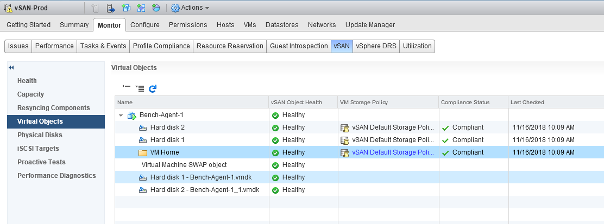{.thumbnail}

You will see three vSAN object types:

* VM Home
* Hard disk
* RAM swap file (vswp file)

If you click on an object, you can see how it is stored in the cluster. You can also see the various components that make up the object:

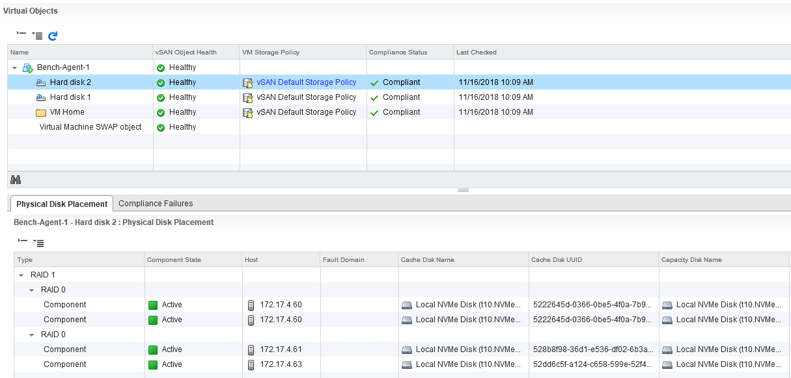{.thumbnail}

To illustrate different object types, we can create a snapshot of this VM:

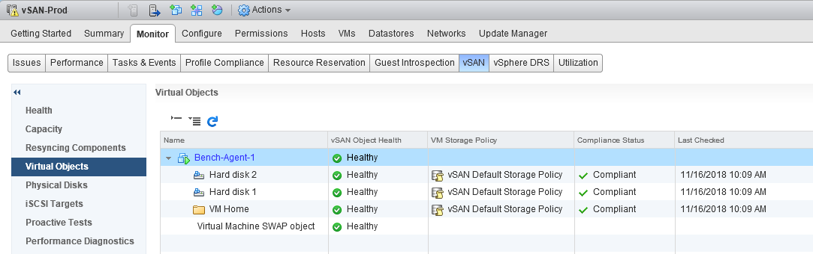{.thumbnail}

You can see that a new snapshot object has been added to each of the hard disk objects.

#### vSAN maximum figures

##### vSAN 6.6

* 5 disk groups per host
* 9,000 components per vSAN host
* 35 storage disks per host
* 64 hosts per vSAN cluster
* only 1 vSAN datastore per cluster
* 6,000 virtual machines per cluster
* 12 stripes per object
* host loss tolerance: 3
* maximum virtual disk size: 62 TB

#### vSAN limitations

##### vSAN 6.6

The following vSphere features are not supported:
  * RDM, VMFS, diagnostic partition
  * Raw Device Mapping (RDM)
  * Storage I/O Control
  * SCSI volume reservation

### Turn vSAN on.

> [!warning]
>
> In vSphere 6.5, operations involving vSAN are only available in the vSphere Web Client in Flash (Flex), not in the HTML 5 interface.
>

#### Turn off high-availability mode (vSphere HA).

vSAN relies on the cluster’s high-availability features. But before you start any operation, it is important to ensure that you have this mode turned off.

To turn it off, go to the properties of the cluster you want to turn on vSAN for, in the ‘vSphere Availability’ section. Next, untick the following box:

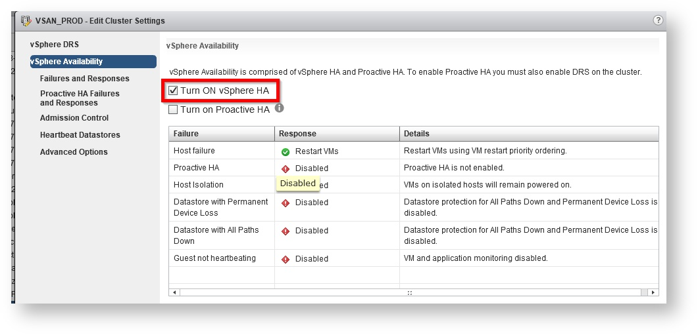{.thumbnail}

#### vSAN Settings

This guide is based on vSAN’s essential features. As a result, we are using the default options, which are perfectly suited to this usage:

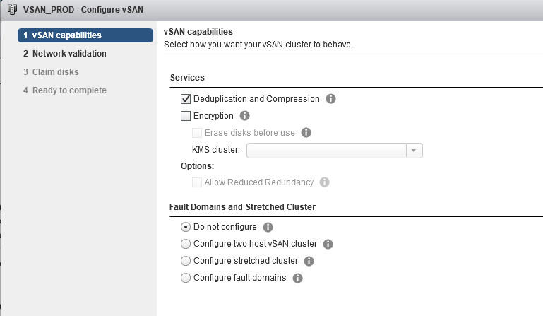{.thumbnail}

The only options we will enable are deduplication and compression. These will help you optimise data storage, by only storing duplicated data once.

This process works by using high-performance flash drives, rather than standard mechanical disks.

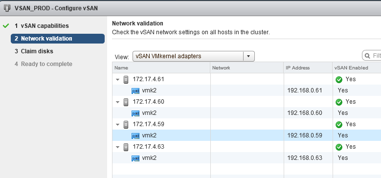{.thumbnail}

The network adapters for vSAN traffic are offered automatically.

Then click `Next`{.action} to select the disks you want to use for vSAN storage. As soon as you turn vSAN on, the disks are detected automatically.

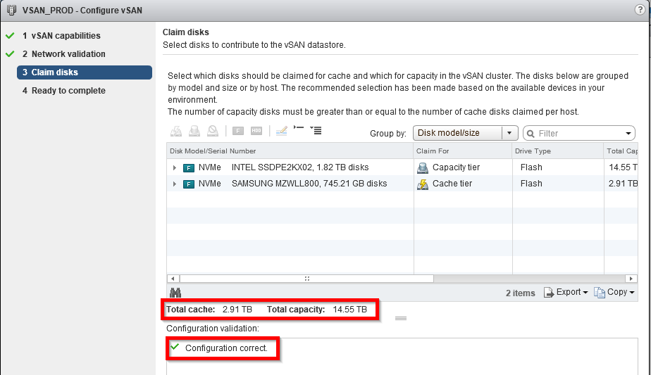{.thumbnail}

> [!primary]
>
> If you have deployed vSAN before and the desks are already set, they do not need to be selected again. The selection screen is empty, but you can still proceed to the next step.
>
> {.thumbnail}
>

In this new screen, you can check that the settings are all correct before you launch the process.

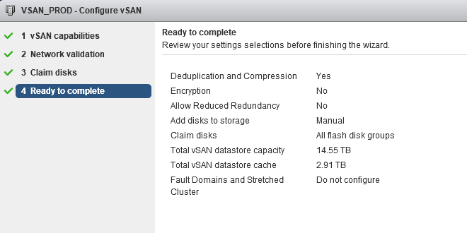{.thumbnail}

It can take a few minutes to turn vSAN on. Once it has been turned on, you can view the configuration details by clicking on the ‘vSAN’ tab.

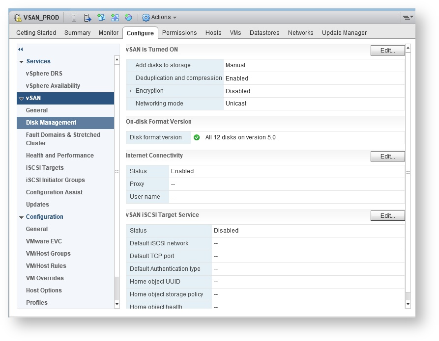{.thumbnail}

> [!warning]
>
> It is important to turn on your cluster’s high-availability feature again.
>

### Turn off vSAN.

> [!warning]
>
> In vSphere 6.5, operations involving vSAN are only available in the vSphere Web Client in Flash (Flex), not in the HTML 5 interface.
>

#### Evacuate the datastore.

With vMotion Storage, you can evacuate all of the virtual machines hosted on the vSAN datastore, or delete the machines you are no longer using.

Click on the ‘Datastore’ tab, and check that there are no virtual machines set up on the vSAN datastore.

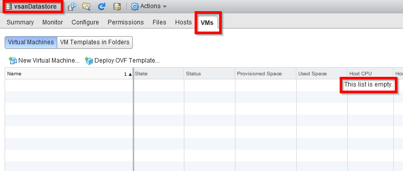{.thumbnail}

#### Delete disk groups.

If you would like to delete all of the vSAN configuration details for your disks, you can delete the group of disks create by vSAN when you turned it on.

To do this, click on the ‘vSAN’ tab in the cluster properties, and go to the ‘Disk Management’ section.

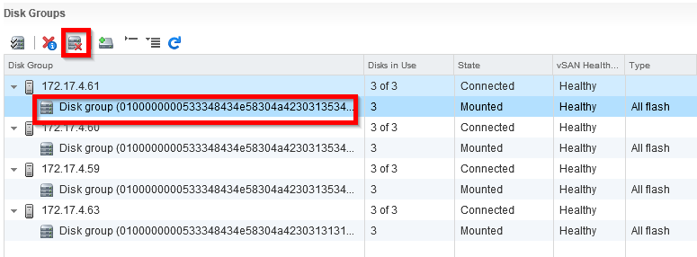{.thumbnail}

For each of your hosts, select the disk group concerned, and click on the delete icon just above it.

You will then be asked to confirm:

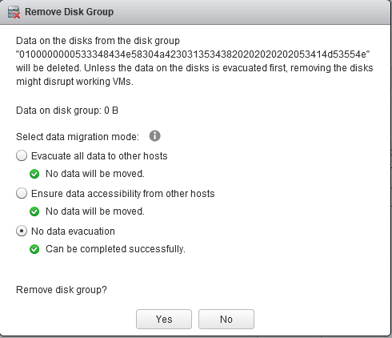{.thumbnail}

The first two options are useful if you want to remove a host from a cluster, but keep your vSAN datastore working.

Since you are about to delete the entire datastore, you do not need to migrate your data. You can select the final option — ‘Do not evacuate data’.

The host deletion will take a few minutes.

Repeat this action for each of the nodes in the cluster, until the entire disk group has been deleted:

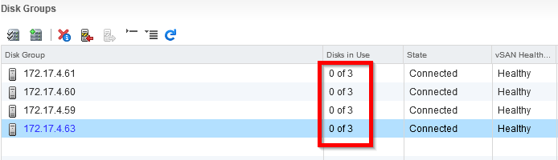{.thumbnail}

You can ignore any error messages that appear regarding the health of the disk group.

#### Turn off high-availability.

The same way you turned on the high-availability feature, you will need to turn it off for the cluster before you stop vSAN. To do this, go to the cluster properties, in the ‘vSphere Availability’ section, then untick the ‘Turn ON vSphere HA” box.

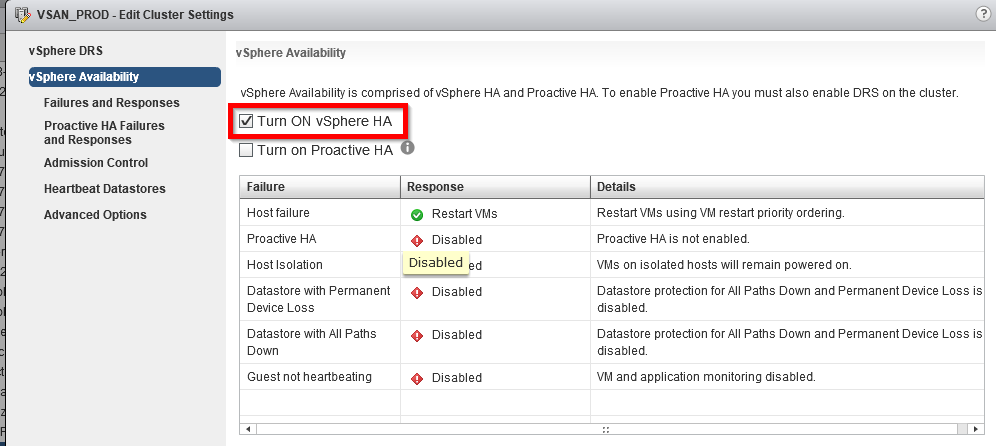{.thumbnail}

#### Turn off vSAN.

Once high-availability has been turned off, you can stop vSAN.

In the cluster’s properties, click ‘Modify’.

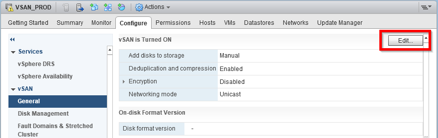{.thumbnail}

Then untick the ‘Turn ON vSAN’ box.

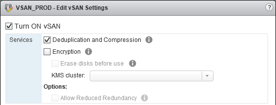{.thumbnail}

Then click confirm for the request that appears:

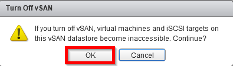{.thumbnail}

> [!primary]
>
> If high-availability has not been turned off correctly, you will receive the following error message:
>
> 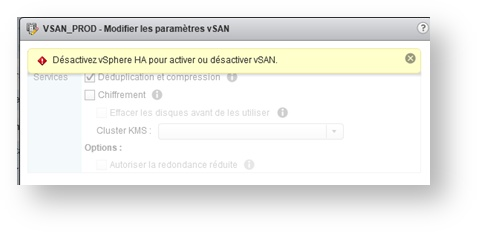{.thumbnail}
>

Once the operation is complete, you will receive the following confirmation message:

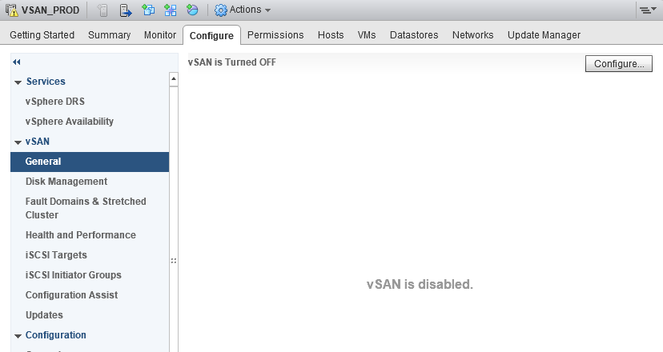{.thumbnail}

> [!warning]
>
> If required, you will need to turn the high-availability features back on after this change, if the cluster continues to host virtual machines stored on external datastores.
>

## Go further

Join our community of users on <https://community.ovh.com/en/>.
