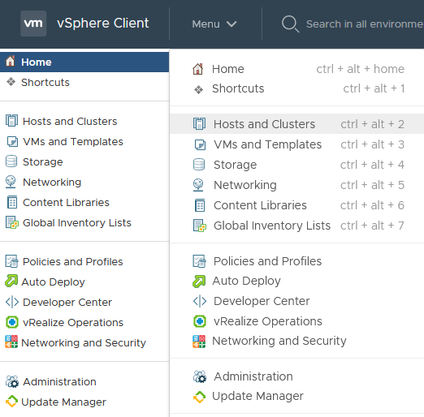
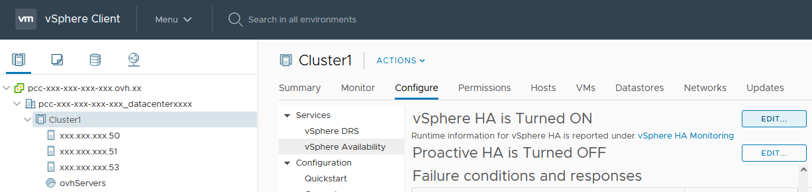
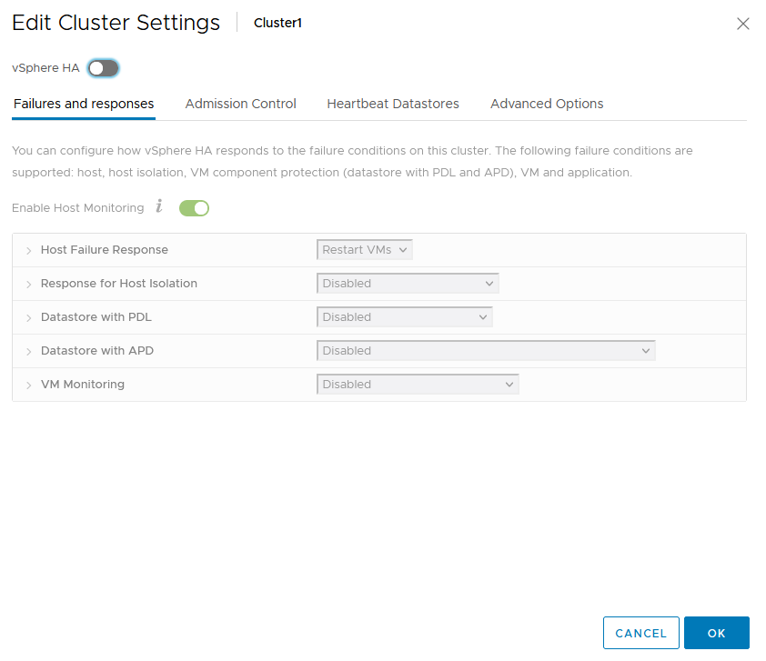
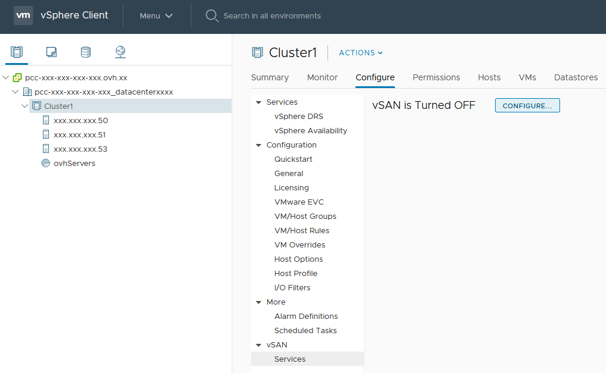
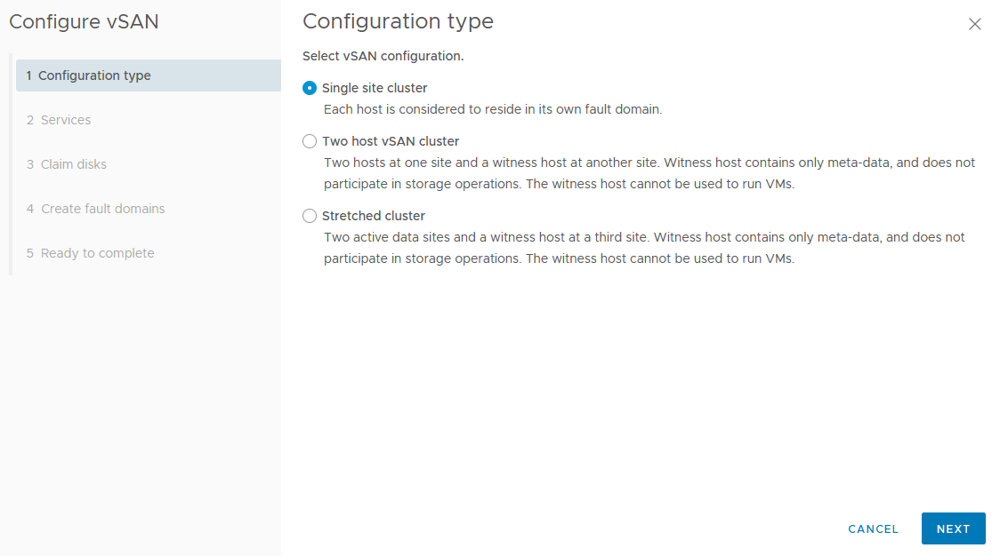
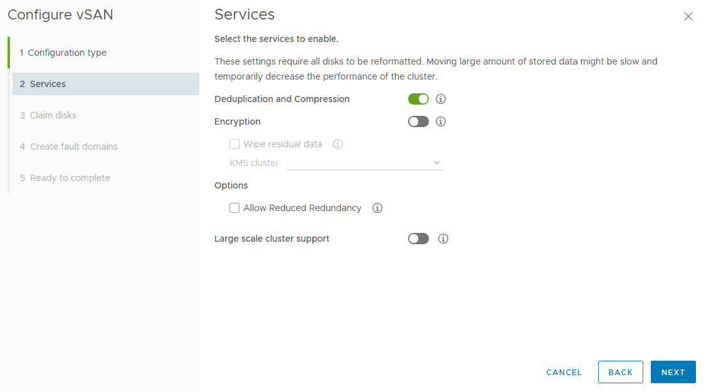
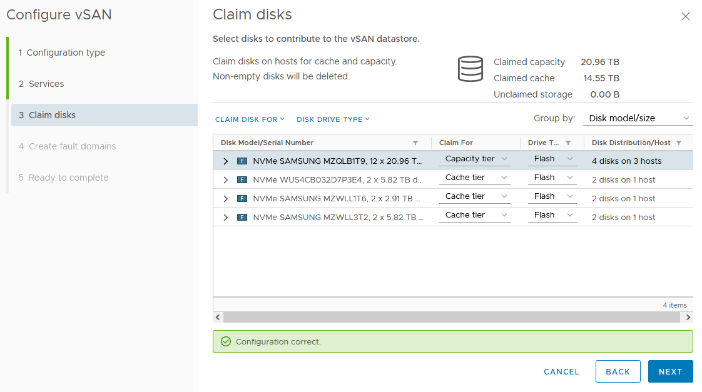
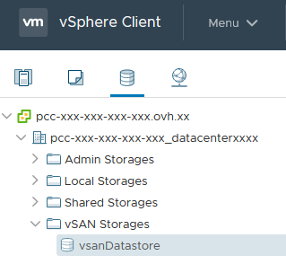
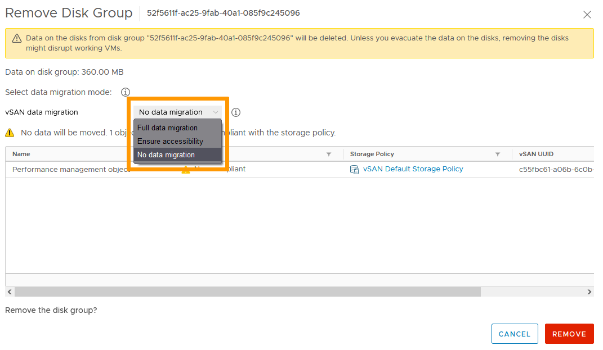

**Dernière mise à jour le 07/09/2022**

## Objectif

Découvrez comment mettre en oeuvre la puissance de l'hyperconvergence pour vos machines virtuelles avec vSAN.

**Ce guide explique comment mettre en place VMware vSAN dans le OVH Private Cloud.**

## Prérequis

- Être contact administrateur de l'infrastructure [Hosted Private Cloud](https://www.ovhcloud.com/fr/enterprise/products/hosted-private-cloud/), afin de recevoir des identifiants de connexion.
- Avoir un identifiant utilisateur actif avec les droits spécifiques pour NSX (créé dans l'[espace client OVHcloud](https://www.ovh.com/auth/?action=gotomanager&from=https://www.ovh.com/fr/&ovhSubsidiary=fr))
- Avoir au minimum trois hôtes vSAN

> [!warning]
>
> Les options de chiffrements **vSAN Data-At-Rest Encryption** et **vSAN Data-In-Transit Encryption** ne sont pas supportées par défaut sur les clusters vSAN. Si toutefois vous souhaitez mettre en œuvre ces solutions veuillez contacter votre **Technical Account Manager**.
> 
> Le chiffrement reste possible au niveau de la machine virtuelle et de ses données comme indiqué dans ce guide [Activation du chiffrement des machines virtuelles avec vSphere Native Key Provider](https://docs.ovh.com/fr/private-cloud/vm-encrypt-vnkp/).
>

## En pratique

### Qu'est-ce que vSAN ?

vSAN est une solution de stockage objet proposée par VMware. Elle agrège un ensemble de disques situés directement dans les hôtes VMware et les présente comme un datastore unique. C'est ce que l'on appelle du Software Defined Storage ou SDS. Un des avantages de vSAN est d'être complétement intégré à vSphere et géré directement depuis vCenter.

Pour une vue complète des concepts et des spécifications techniques, rendez-vous sur la [page officielle VMware VSAN](https://docs.vmware.com/fr/VMware-vSphere/6.7/com.vmware.vsphere.vsan-planning.doc/GUID-18F531E9-FF08-49F5-9879-8E46583D4C70.html){.external}

### Paramétrer vSAN

#### Désactiver vSphere HA

vSAN s'appuie sur les fonctionnalités de haute disponibilité du cluster. Cependant, avant toute opération, il est nécessaire que ce mode soit désactivé.

Dans l'interface vSphere, allez dans le Tableau de bord `Hôtes et clusters`{.action}.

{.thumbnail}

Sur la gauche de votre écran, selectionnez votre cluster, allez dans l'onglet `Configurer`{.action} puis `Disponibilité vSphere`{.action}. 
Cliquez sur `Modifier`{.action}.

{.thumbnail}

Désactivez vSphere HA puis cliquez sur `OK`{.action}.

{.thumbnail}

#### Activer le service vSAN

Dans le menu de configuration du cluster, descendez dans `vSAN`{.action} / `Services`{.action} et cliquez sur `Configurer`{.action}.

{.thumbnail}

Ce guide porte sur les fonctionnalités essentielles de vSAN. Nous utiliserons principalement les options par défaut. 
Tous nos hôtes résidant sur un unique site, nous utiliserons l'option `Cluster à un seul site`. Cliquez sur `Suivant`{.action}.

{.thumbnail}

Nous recommandons d'activer `Déduplication et compression` pour optimiser l'espace de stockage. 
Cliquez sur `Suivant`{.action}.

{.thumbnail}

La fenêtre `Réclamer des disques` attribue automatiquement les disques pour du cache ou du stockage (voir la [page officielle VMware VSAN](https://docs.vmware.com/fr/VMware-vSphere/6.7/com.vmware.vsphere.vsan-planning.doc/GUID-18F531E9-FF08-49F5-9879-8E46583D4C70.html){.external} pour plus de détails) en fonction du type et de la taille. Vous pouvez personnaliser les paramètres. 
Cliquez sur `Suivant`{.action}.

{.thumbnail}

Avec trois hôtes, les domaines de pannes sont créés par défaut et la tolérance de panne est de 1 hôte. 
Cliquez sur `Suivant`{.action}.

{.thumbnail}

Verifiez les paramètres dans la fenêtre de résumé puis cliquez sur `Terminer`{.action}.

{.thumbnail}

Retournez dans la configuration du cluster et réactivez vSphere HA. 
Votre datastore est visible dans le menu Stockage.

{.thumbnail}

> [!warning]
>
> Pour des raisons de performance et de résilience, VMware recommande de ne pas dépasser 70% de remplissage sur un datastore vSAN.
>

### Désactiver vSAN

Avant de désactiver vSAN, assurez-vous d'évacuer toutes les machines virtuelles résidant sur le datastore ou supprimer celles qui ne vous servent plus. 
Cliquez sur l'onglet `Datastore`{.action} et vérifiez qu'aucune machine virtuelle n'est installée sur le datastore vSAN.

{.thumbnail}

#### Suppression des groupes de disques

Pour supprimer toutes les informations de configuration vSAN de vos disques, vous pouvez effacer le groupe de disques créé par vSAN lors de l’activation. 
Dans le menu de configuration du cluster, allez dans `vSAN`{.action} / `Gestion de disques`{.action}. 
Pour chaque groupes de disques, cliquez sur `...`{.action} puis `Supprimer`{.action}. 

{.thumbnail}

Vous avez la possibilité de migrer vos données. Si le datastore est vide, aucune migration de données n'est nécessaire. 
Cliquez sur `Supprimer`{.action}.

{.thumbnail}

Répétez l’opération sur chacun des nœuds du cluster, jusqu’à la suppression totale des groupe de disques. 
Vous pouvez ignorer les messages d'erreur concernant la santé du groupe de disques.

#### Désactiver les Services.

Comme vous aviez désactivé vSphere HA pour paramétrer vSAN, il vous faut à nouveau la désactiver avant d'arrêter vSAN.

{.thumbnail}

Une fois vSphere HA désactivée, arrêtez le service vSAN dans les paramètres du cluster en cliquant sur `Désactiver vSAN`{.action}.

{.thumbnail}

Confirmez par un clic sur `Désactiver`{.action} dans la fenêtre suivante.

{.thumbnail}

vSan est désormais désactivé.

## Aller plus loin

[Activation du chiffrement des machines virtuelles avec vSphere Native Key Provider](https://docs.ovh.com/fr/private-cloud/vm-encrypt-vnkp/).

Échangez avec notre communauté d’utilisateurs sur <https://community.ovh.com/>.
