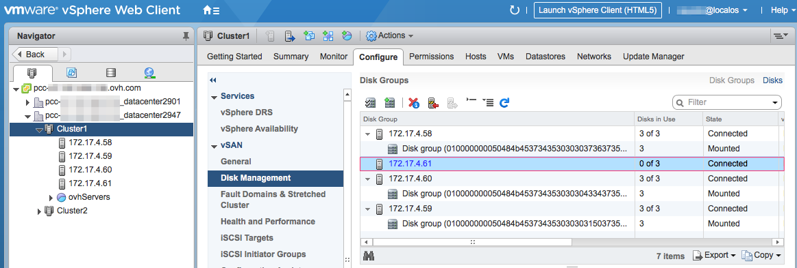
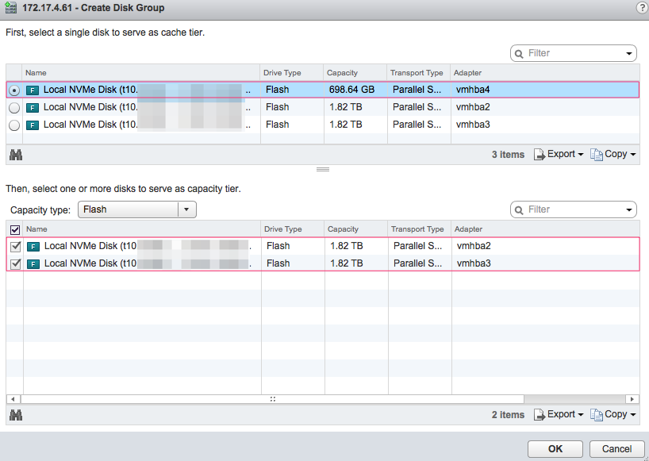
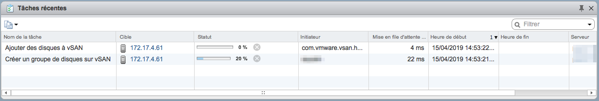
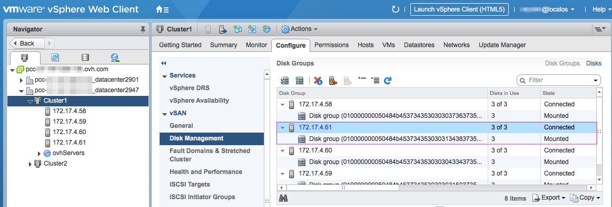

**Dernière mise à jour le 15/04/2019**

## Objectif

Ce guide a pour objectif d’expliquer comment ajouter un serveur ESXi dans un cluster vSAN existant. L'ajout d'un hôte peut avoir lieu dans le cas de la commande d'un nouveau serveur ou bien du remplacement d'un serveur défectueux.

## Prérequis

* Posséder une offre [Private Cloud](https://www.ovh.com/fr/private-cloud/){.external},
* Pouvoir accéder à l’interface de gestion vSphere via le client Flex (Flash),
* Avoir un serveur ESXi à disposition et intégré dans un cluster vSAN.

## En pratique

Les serveurs OVH étant automatiquement préconfigurés à la livraison, l'ajout d'un hôte dans un cluster vSAN consiste uniquement à préciser quels disques seront intégrés au datastore.

Une fois connecté au vCenter, se rendre sur le menu `Hosts and Clusters`, sélectionner le cluster concerné, cliquer sur l'onglet `Configure` et choisir le menu `vSAN` puis `Disk Management`.

Dans le tableau `Disk Groups` sélectionner le nouveau serveur ESXi et s'assurer qu'aucun disque n'est affecté au datastore vSAN (la colonne `Disks in Use` doit indiquer 0 sur X).

{.thumbnail}

Cliquer sur l'icône avec un plus vert. Dans la fenêtre `Create Disk Group` sélectionner le disque de cache et le ou les disques capacitifs puis cliquer sur `OK`.

> [!primary]
>
> Se reporter à la configuration matériel du serveur pour savoir quels sont les disques de cache et capacitif.

{.thumbnail}

Il est possible de suivre l'avancement de la tâche de création du groupe de disque dans la fenêtre `Recent Tasks`.

{.thumbnail}

Une fois la tâche terminée, la colonne `Disks in Use` doit indiquer que tous les disques du serveur sont intégrés au cluster.

{.thumbnail}

Le serveur ESXi est maintenant complètement intégré au cluster vSAN et ses disques sont utilisables par le datastore.

## Aller plus loin

Échangez avec notre communauté d’utilisateurs sur <https://community.ovh.com/>.

