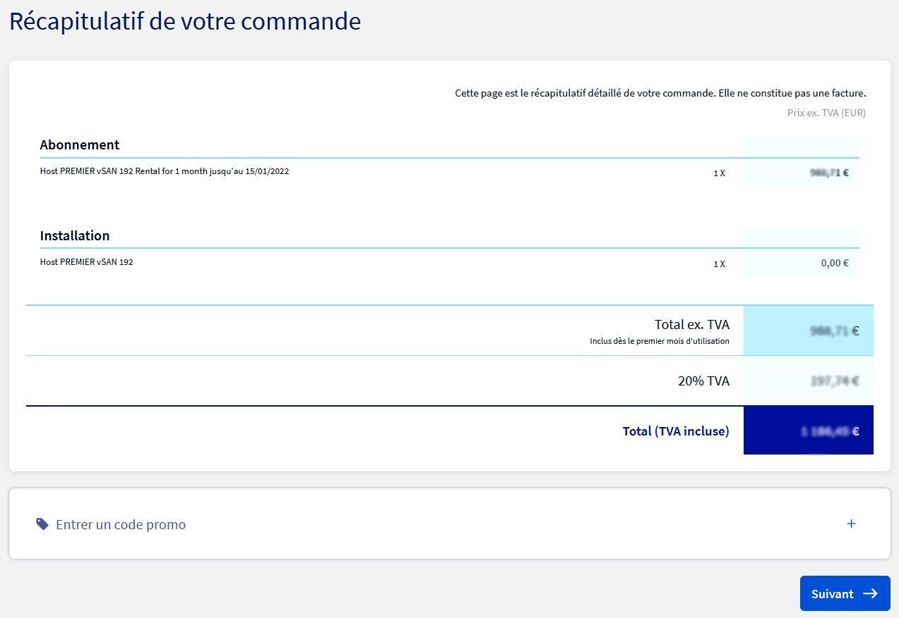
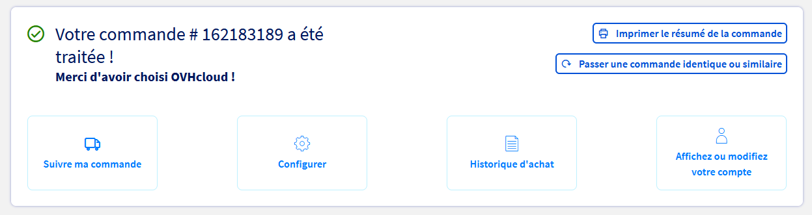

**Dernière mise à jour le 22/12/2021**

## Objectif

Ce guide explique comment ajouter le stockage d'un nouveau serveur ESXi dans un cluster vSAN existant.

## Prérequis

- Être contact administrateur du [Hosted Private Cloud infrastructure](https://www.ovhcloud.com/fr/enterprise/products/hosted-private-cloud/), pour recevoir des identifiants de connexion.
- Avoir un identifiant utilisateur actif avec les droits spécifiques pour NSX (créé dans l'[espace client OVHcloud](https://www.ovh.com/auth/?action=gotomanager&from=https://www.ovh.com/fr/&ovhSubsidiary=fr))
- Avoir déployé un [datastore vSan](https://docs.ovh.com/fr/private-cloud/vmware-vsan/)

## En pratique

### Commander un nouvel hôte vSan

Naviguez vers l'[espace client OVHcloud](https://www.ovh.com/auth/?action=gotomanager&from=https://www.ovh.com/fr/&ovhSubsidiary=fr) et connectez vous avec un compte administrateur.

{.thumbnail}

Dans la section `Hosted Private Cloud`{.action}, Selectionnez votre datacentre et allez dans l'onglet `Hosts`{.action}. 
Cliquez le bouton `Commander un Host`{.action}.

{.thumbnail}

Choisissez l'hôte vSAN qui vous convient puis cliquez `Confirmer la commande`{.action}

{.thumbnail}

Verifier le récapitulatif avant de cliquer `Suivant`{.action}

{.thumbnail}

Cochez les cases pour accepter les termes and conditions puis allez au moyen de paiement.

{.thumbnail}

Vous voyez une confirmation et un numéro de commande.

{.thumbnail}

Le nouvel hôte sera intégré automatiquement à votre infrastructure. Vous recevrez un email de confirmation quand il sera prêt à l'usage dans vSphere.

### Ajouter l'espace de stockage du nouvel hôte vSAN au datastore

Dans l'interface vSphere, allez dans le Tableau de bord `Hôtes et clusters`{.action}.

{.thumbnail}

Le nouvel hôte est visible dans le cluster. 
Sur la gauche de l'écran, sélectionnez le cluster, allez dans l'onglet `Configurer`{.action} puis vSAN / `Gestion de disques`{.action}. 
Cliquez sur `Réclamer des disques inutilisés`{.action}.

{.thumbnail}

Les disques disponibles sont attribués automatiquement au cache ou au stockage (voir [page officielle VMware VSAN](https://docs.vmware.com/fr/VMware-vSphere/6.7/com.vmware.vsphere.vsan-planning.doc/GUID-18F531E9-FF08-49F5-9879-8E46583D4C70.html){.external} pour plus de détails) en fonction du type et de la taille. Vous pouvez personaliser les paramètres. 
Cliquez sur `Créer`{.action}.

{.thumbnail}

Le nouveau groupe de disques prend un peu de temps pour être créé et ajouté au datastore vSAN.

{.thumbnail}

Une fois fini, le datastore est prêt à être utilisé avec l'espace de stockage supplémentaire.

Bravo et merci.

## Aller plus loin

Échangez avec notre communauté d’utilisateurs sur <https://community.ovh.com/>.

