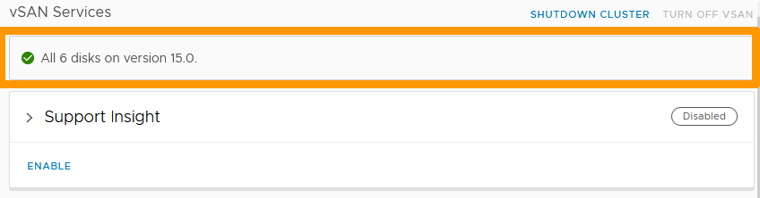

**Last updated 19th January 2023**

## Objective

vSAN disks are regularly upgraded with new versions. You need to update the vSAN disk format version to have new features or to maintain compatibility with the versions of your VMware cluster, as described in this article: [Understanding vSAN on-disk format versions and compatibility (2148493)](https://kb.vmware.com/s/article/2148493).

**This guide explains how to update the format of your vSAN disks.** 

## Requirements

- Being an administrative contact of your [Hosted Private Cloud infrastructure](https://www.ovhcloud.com/en-sg/enterprise/products/hosted-private-cloud/) to receive login credentials
- A user account with access to vSphere as well as the specific rights for NSX (created in the [OVHcloud Control Panel](https://ca.ovh.com/auth/?action=gotomanager&from=https://www.ovh.com/sg/&ovhSubsidiary=sg))
- A deployed [vSan cluster](https://docs.ovh.com/sg/en/private-cloud/vmware-vsan/)

## Instructions

Log in to your vSphere interface using [this guide](https://docs.ovh.com/sg/en/private-cloud/login-vsphere-interface/).

In the vSphere interface, click on your `Cluster`{.action} to the left, go to the `Configure`{.action} tab, choose `Services`{.action} in the **vSAN** section and click `PRE-CHECK UPGRADE`{.action}.

{.thumbnail}

The check result informs you that everything is in order to perform the upgrade.

Click on `UPGRADE`{.action}.

{.thumbnail}

In the new window, click `UPGRADE`{.action} to confirm the operation.

{.thumbnail}

The upgrade will take a few moments.

{.thumbnail}

As soon as the upgrade is complete, you will receive a success message indicating the new vSAN disk format version number.

{.thumbnail}

## Go further

[Upgrading vSAN disk format with vSphere web client](https://docs.vmware.com/en/VMware-vSphere/6.7/com.vmware.vsphere.virtualsan.doc/GUID-9FB6F6D8-80A9-4584-BD0D-8FED073B3D40.html)

Join our community of users on <https://community.ovh.com/en/>.
