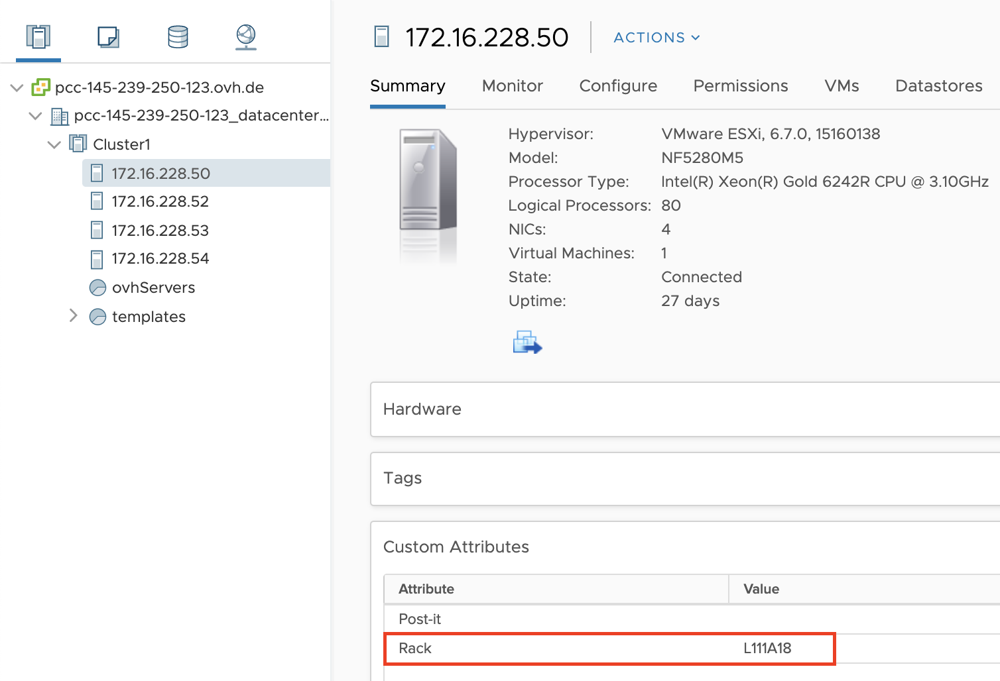
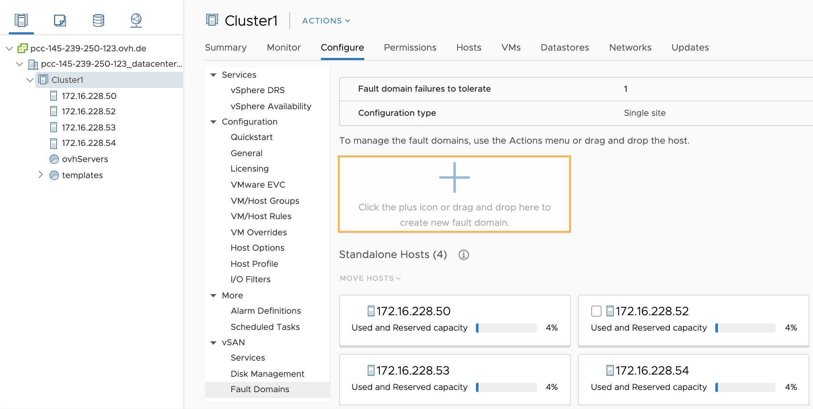
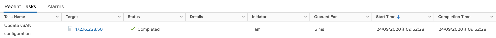

**Dernière mise à jour le 23/12/2021**

## Objectif

Ce guide a pour objectif d’expliquer le fonctionnement et la mise en oeuvre de domaines de pannes vSAN.

## Prérequis

- Être contact administrateur de l'infrastructure [Hosted Private Cloud](https://www.ovhcloud.com/fr-ca/enterprise/products/hosted-private-cloud/), afin de recevoir les identifiants de connexion.
- Avoir un identifiant utilisateur actif avec les droits spécifiques pour NSX (créé dans l'[espace client OVHcloud](https://ca.ovh.com/auth/?action=gotomanager&from=https://www.ovh.com/ca/fr/&ovhSubsidiary=qc))
- Avoir déployé un [datastore vSan](/pages/cloud/private-cloud/vmware_vsan)

## En pratique

### Fonctionnement

Un domaine de pannes (fault domain) fait référence à un ensemble de serveurs, périphériques de stockage ou composants réseaux regroupés au sein d'un emplacement physique du centre de données, et pouvant être affectés collectivement lors d'une panne.

Sur vSAN, il est possible de regrouper les serveurs au sein de domaines de pannes vSAN en prenant en compte leur emplacement physique.
L'intérêt est donc de disposer de plusieurs domaines de pannes afin de bénéficier de la résilience apportée par vSAN, en répliquant ainsi les objets des VMs au travers de ces groupes de serveurs. Retrouvez plus de détails sur [cette documentation](https://core.vmware.com/resource/vmware-vsan-design-guide#sec8-sub3).

Les serveurs OVHcloud mis à votre disposition sont répartis au sein de différentes baies. Ainsi, il est possible de créer des domaines de panne vSAN en fonction de ces baies.

Par exemple, la stratégie par defaut vSAN (niveau de tolérance FTT=1 avec RAID1 (Mirorring)) nécessite 3 domaines de pannes au minimum (pour 2 replicas + 1 objet witness).

### Mise en oeuvre

Il est conseillé d’appliquer cette procédure lorsque plusieurs serveurs se trouvent sur la même baie. Privilégiez également un nombre identique de serveurs par domaine de panne vSAN.
Les données seront ainsi mieux réparties et bénéficieront d’une meilleure protection en cas de dysfonctionnement d'un domaine de panne.

Chaque serveur OVHcloud dispose de l'information de la baie dans laquelle il est hébergé.

Rendez-vous dans le menu `Hosts and Clusters`{.action}, cliquez sur le serveur concerné, puis sur l'onglet `Summary`{.action}. L'information se trouve au niveau de « Custom Attributes » : attribut **Rack**.

{.thumbnail}

Toujours dans le menu `Hosts and Clusters`{.action}, sélectionnez le cluster concerné puis cliquez sur l'onglet `Configure`{.action} et choisissez le menu `vSAN`{.action} puis `Fault Domains`{.action}.

Il suffit alors de glisser le serveur dans la case **+** des « Fault Domains ».

{.thumbnail}

Nommez le domaine de panne (vous pouvez utiliser, par exemple, le nom de la baie) dans le champ « Fault domain name » puis confirmez en cliquant sur `CREATE`{.action}.

Vous pourrez alors suivre l'avancement de la tâche de création du domaine de panne dans la fenêtre `Recent Tasks`{.action}.

{.thumbnail}

Répétez l'opération sur autant de domaines de pannes qu'il y a de baies différentes.

{.thumbnail}

Ajoutez au besoin un serveur dans un domaine de panne existant en le déplaçant dessus puis confirmez en cliquant sur `MOVE`{.action}.

Les informations d'espace disque utilisé, disponible et total s'affichent en survolant le domaine de panne.

Le cluster vSAN dispose désormais de la résilience de données via les domaines de pannes.

## Aller plus loin

Échangez avec notre communauté d’utilisateurs sur <https://community.ovh.com/>.
