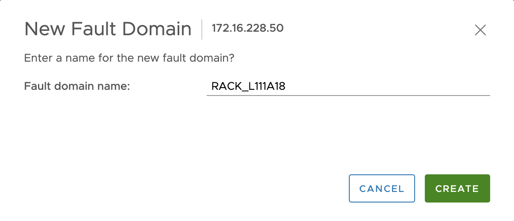

**Dernière mise à jour le 23/09/2020**

## Objectif

Ce guide a pour objectif d’expliquer le fonctionnement et la mise en oeuvre de domaines de pannes vSAN.

## Prérequis

* Posséder une offre [Private Cloud](https://www.ovh.com/fr/private-cloud/){.external},
* Pouvoir accéder à l’interface de gestion vSphere via le client UI,
* Disposer d'un cluster vSAN avec au moins 3 hosts

## En pratique

### Fonctionnement

Un domaine de pannes fait référence à un ensemble de serveurs, périphériques de stockage ou composants réseaux regroupés au sein d'un emplacement physique du centre de données, et pouvant être impacté collectivement lors d'une panne.

Sur vSAN, il est possible de regrouper les serveurs au sein de domaines de pannes vSAN en prenant en compte leur emplacement physique.
L'intérêt est donc de disposer de plusieurs domaines de pannes afin de bénéficier de la résilience apportée par vSAN, en répliquant ainsi les objets des VMs au travers de ces groupes de serveurs (plus de détails ici : https://storagehub.vmware.com/t/vsan-6-7-update-1-technical-overview/fault-domains-31/).

Les serveurs OVH mis à votre disposition sont répartis au sein de différentes baies. Ainsi, il est possible de créer des domaines de panne vSAN en fonction de ces baies.

Par exemple, la stratégie par defaut vSAN (niveau de tolérance FTT=1 avec RAID1 (Mirorring)) nécessite 3 domaines de pannes au minimum (pour 2 replicas + un objet witness).

### Mise en oeuvre

Il est conseillé d'appliquer cette procédure pour un nouveau cluster vSAN afin d'éviter le trafic généré par la réplication de données, qui pourrait impacter l'activité de production.
Un nombre identique de serveurs entre domaines de pannes est recommandé afin d'équilibrer la répartition des données.

Chaque serveur OVH dispose de l'information de la baie dans laquelle il est hébergé.
Se rendre sur le menu `Hosts and Clusters`, cliquer sur le serveur concerné, puis sur l'onglet `Summary`. L'information se trouve au niveau de `Custom Attributes` : attribut `Rack`.

{.thumbnail}

Se rendre sur le menu `Hosts and Clusters`, sélectionner le cluster concerné, cliquer sur l'onglet `Configure` et choisir le menu `vSAN` puis `Fault Domains`.

Il suffit alors de glisser le serveur dans la case `+` des `Fault Domains`.

{.thumbnail}

Utiliser par exemple le nom de la baie comme `Fault domain name` puis confirmer avec `create`.

{.thumbnail}

Il est possible de suivre l'avancement de la tâche de création du domaine de panne dans la fenêtre `Recent Tasks`.

{.thumbnail}

Répéter l'opération sur autant de domaines de pannes qu'il y a de baie différentes.

{.thumbnail}

Ajouter au besoin un serveur dans un domaine de panne existant en le déplaçant dessus puis confirmer avec `move`.

{.thumbnail}

Le cluster vSAN dispose désormais de la résilience de données via les domaines de pannes.

## Aller plus loin

Échangez avec notre communauté d’utilisateurs sur <https://community.ovh.com/>.

