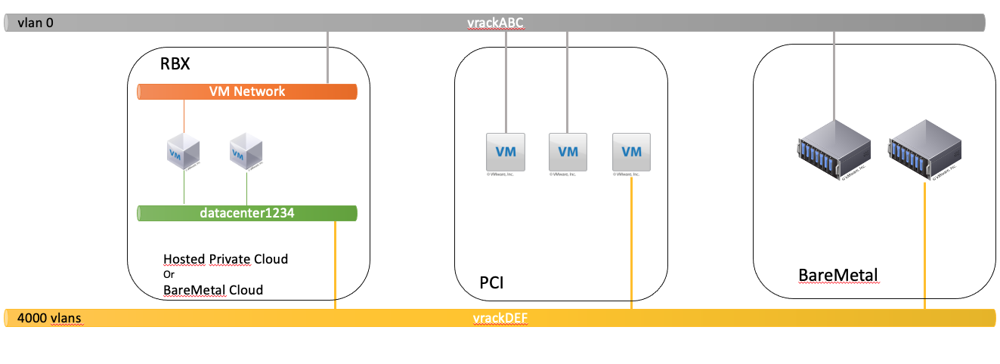
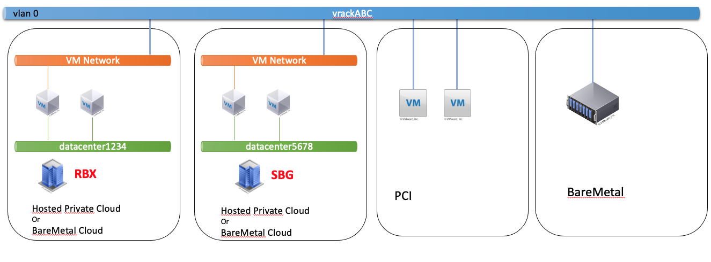
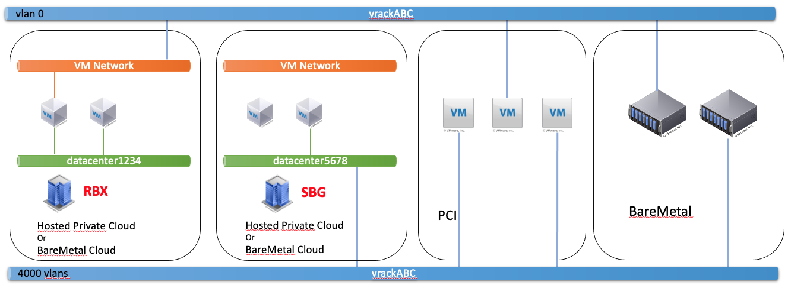
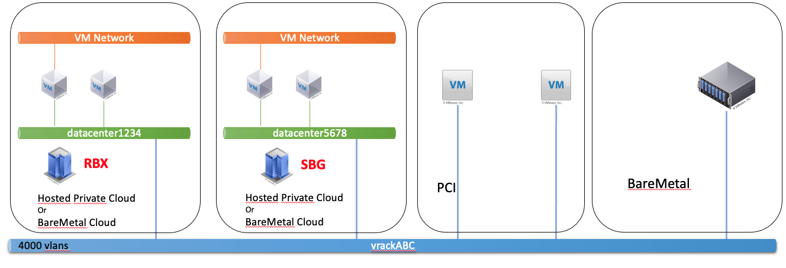
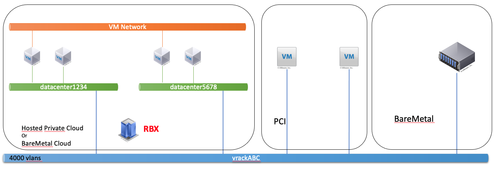
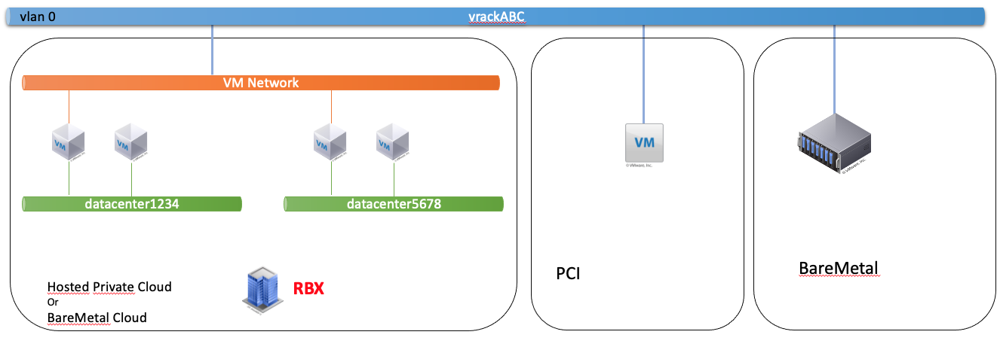
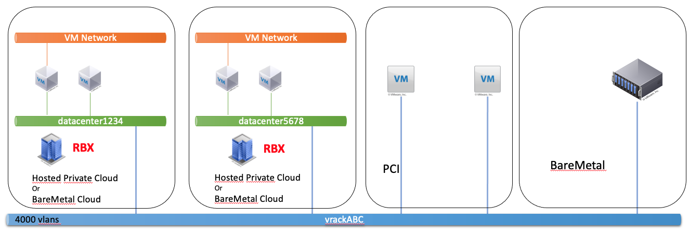
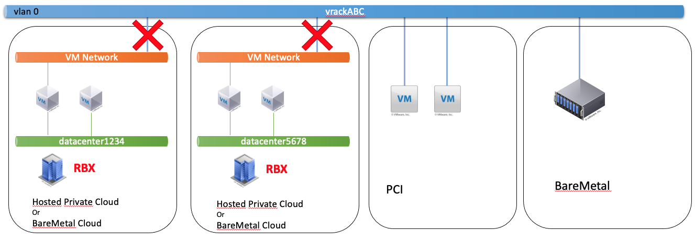
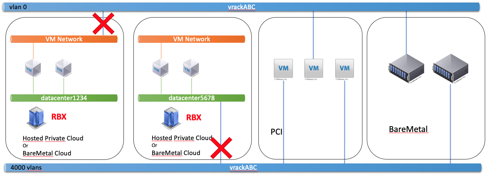
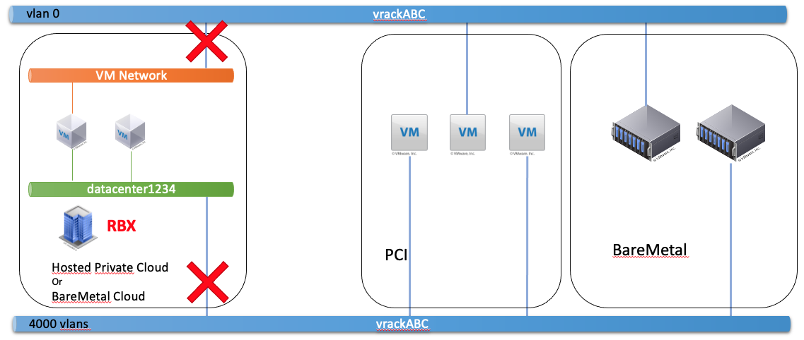

> [!primary]
> Esta traducción ha sido generada de forma automática por nuestro partner SYSTRAN. En algunos casos puede contener términos imprecisos, como en las etiquetas de los botones o los detalles técnicos. En caso de duda, le recomendamos que consulte la versión inglesa o francesa de la guía. Si quiere ayudarnos a mejorar esta traducción, por favor, utilice el botón «Contribuir» de esta página.
> 

**Última actualización: 31/12/2021**

## Objetivo

El producto [vRack](https://www.ovh.es/soluciones/vrack/){.external} permite interconectar varios productos de OVHcloud y comunicarlos a través de una o varias vlan. Algunas configuraciones no son compatibles con la solución Hosted Private Cloud.

**Esta guía explica las compatibilidad de Hosted Private Cloud con el producto vRack.**

## Requisitos

- Ser contacto administrador de la infraestructura [Hosted Private Cloud](https://www.ovhcloud.com/es-es/enterprise/products/hosted-private-cloud/), para recibir claves de conexión.
- Tener un usuario activo (creado en el [área de cliente de OVHcloud](https://www.ovh.com/auth/?action=gotomanager&from=https://www.ovh.es/&ovhSubsidiary=es).

## Algo de contexto

En el producto Hosted Private Cloud, existen 2 tipos de vRack:

- "MV Network", que es un vRack en una vlan única, la vlan nativa de la vlan pública de Hosted Private Cloud. Esta vlan se utiliza en Hosted Private Cloud para enrutar las IP públicas. Se incluye en el inventario de vSphere como PortGroup, en la categoría "Red", denominada "MV Network". Este vRack está asociado al switch virtual íntegramente gestionado por OVHcloud.

- "Datacenter vRack" o "vRack vDC" o "dvs-vrack" es el vRack que permite tener 4.000 vlans. Este vRack está asociado al switch virtual gestionado por el cliente, con sus propias tarjetas de red dedicadas.

Es importante señalar que algunas gamas comerciales, como las gamas a base de Hosts AMD, no tienen switch virtual gestionado por el cliente. Solo está disponible el vRack de tipo "VM Network".

Para ver el contexto:

{.thumbnail}

## Procedimiento

### Lo que se puede hacer

**Conectar 2 vRack MV Network entre ellos, en diferentes zonas geográficas, en diferentes Hosted Private Cloud.**

{.thumbnail}

**Conectar 1 vRack MV Network y 1 vRack vDC en diferentes zonas geográficas en diferentes Hosted Private Cloud.**

{.thumbnail}

> [!primary]
>
> Para que las MV del vRack VM Network y las MV del vRack vDC se comuniquen entre sí, las MV del vRack vDC deben estar en la vlan nativa.
> 

**Conectar 1 vRack y 1 vRack vDC en diferentes zonas geográficas en diferentes Hosted Private Cloud.**

{.thumbnail}

**Conectar 1 vRack y 1 vRack vDC en un mismo Hosted Private Cloud.**

{.thumbnail}

**Todos los vDC de un mismo Hosted Private Cloud comparten el mismo vRack VM Network.**

{.thumbnail}

**Conectar 1 vRack y 1 vRack vDC en una misma zona geográfica en diferentes Hosted Private Cloud.**

{.thumbnail}

### Lo que no se puede hacer

**Conectar 1 vRack MV Network y 1 vRack MV Network, en una misma zona geográfica, en diferentes Hosted Private Cloud.**

{.thumbnail}

**Conectar 1 vRack VM Network y 1 vRack vDC en una misma zona geográfica en diferentes Hosted Private Cloud.**

{.thumbnail}

**Conectar 1 vRack MV Network y 1 vRack vDC, en una misma zona geográfica, en el mismo Hosted Private Cloud.**

{.thumbnail}

## Más información

Interactúe con nuestra comunidad de usuarios en <https://community.ovh.com/en/>.
