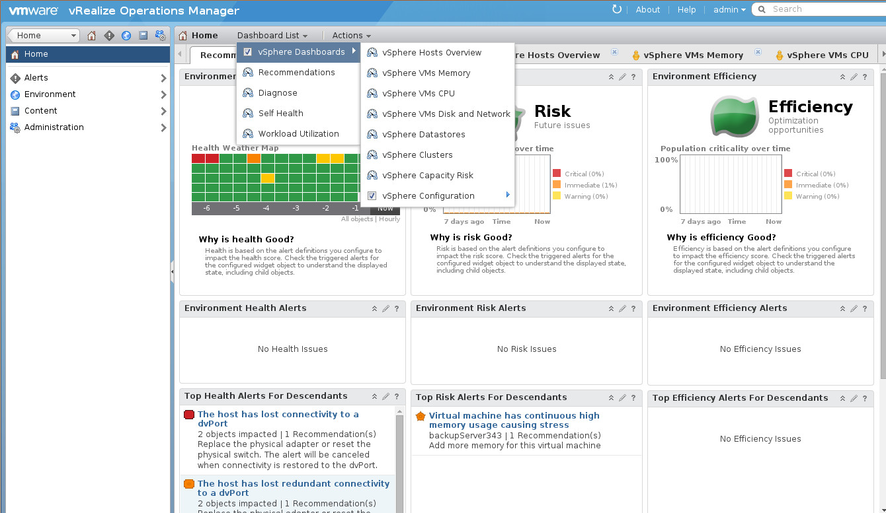

Dashboards provides you an instant visualization of your infrastructure.

You can find are some dashboards configured by default that represents the main metrics about any VMware vSphere Infrastructure.

You have the rights to create new custom dashboards.

You can display the Dashboard list as following, you can check/uncheck the vSphere dasboard to display them or not in the dashboards tab.

{.thumbnail}

