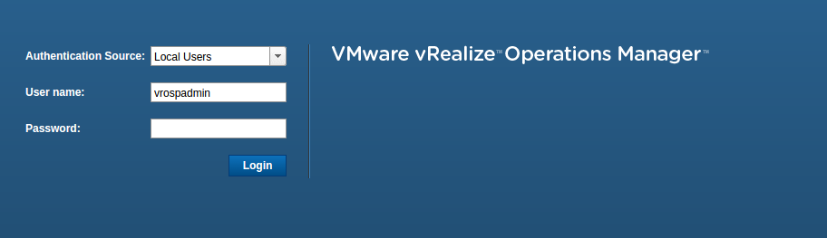
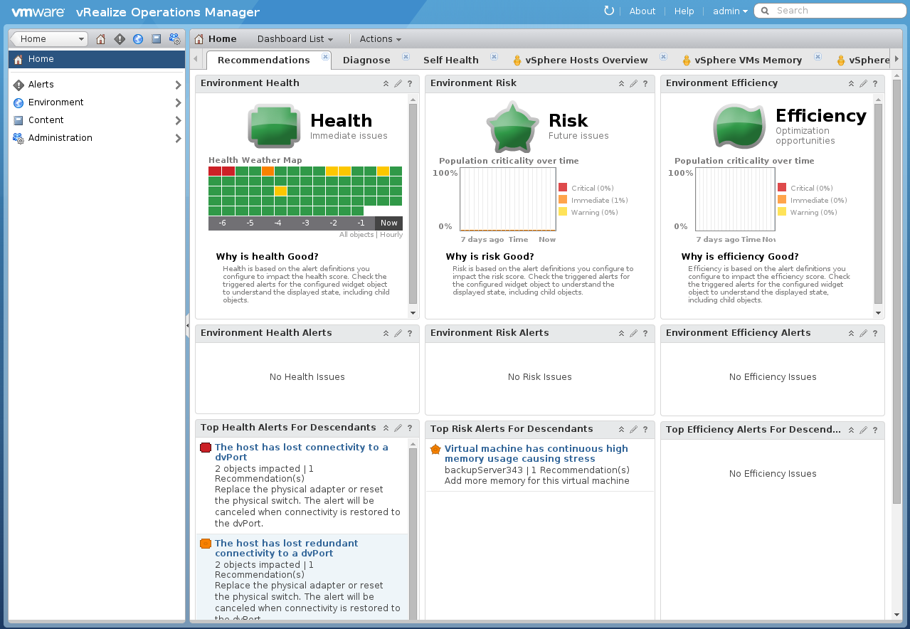

**This section describes your initial setup when you login for the first time on the vRops appliance.**

Go to the url you received by email.

Enter your user name and your password. Authentication Source is local.

{.thumbnail}

You will be prompted to the default dashboard list :

{.thumbnail}

