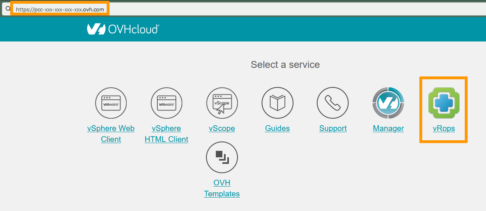
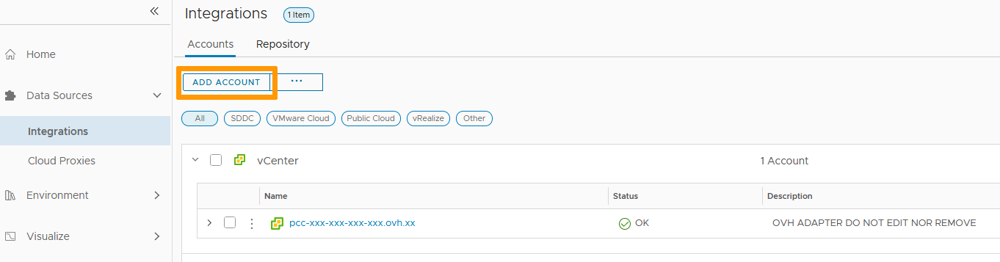

**Last Updated on 23/02/2022**

## Objective

vRealize Operations is an operations management tool that monitors physical, virtual, and cloud infrastructures and allows automation of maintenance tasks.

**This guide offers an introduction to the vROPS interface.**

## Requirements

- Be an administrative contact of your [Hosted Private Cloud infrastructure](https://www.ovhcloud.com/en-gb/enterprise/products/hosted-private-cloud/) to receive login credentials
- Have a user account with access to vSphere and vROPS (created in the [OVHcloud Control Panel](https://www.ovh.com/auth/?action=gotomanager&from=https://www.ovh.co.uk/&ovhSubsidiary=GB))

## Instructions

### Interface access

To access vROPS, type in your dedicated cloud address in a browser. 
Click on the vROPS icon. 

{.thumbnail}

Use your vSphere login or the vROPS local user that you own.

{.thumbnail}

You are now on the vROPS Home page with access to all its functionalities.

{.thumbnail}

### Data Sources

The Data Sources section lists the different spaces monitored by vROPS. By default, your OHVcloud infrastructure is added.

{.thumbnail}

Clicking on `ADD ACCOUNT`{.action} gives you the ability to centralize multiple spaces, from VMware to Azure through AWS.

{.thumbnail}

### Environment

The Environment section

{.thumbnail}

### Visualize

The Visualize section

{.thumbnail}

### Troubleshoot

The Troubleshoot section

{.thumbnail}

### Optimize

The Optimize section

{.thumbnail}

### Plan

The Plan section

{.thumbnail}

### Configure

The Configure section

{.thumbnail}

### Automation

The Automation section

{.thumbnail}

### Administration

The Administration section

{.thumbnail}

## Go further

Join our community of users on <https://community.ovh.com/en/>.
