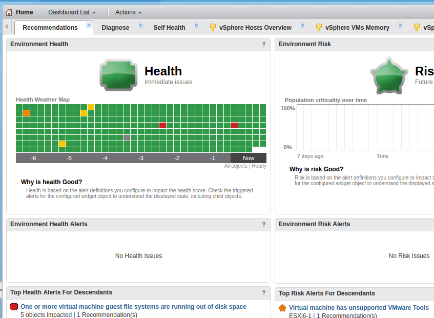
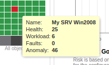
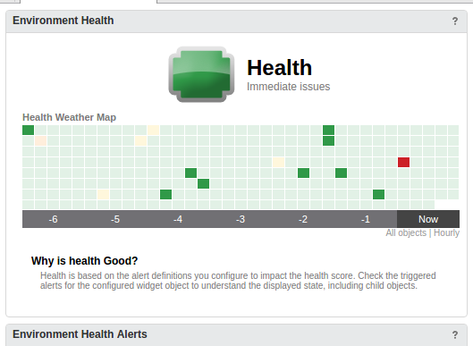
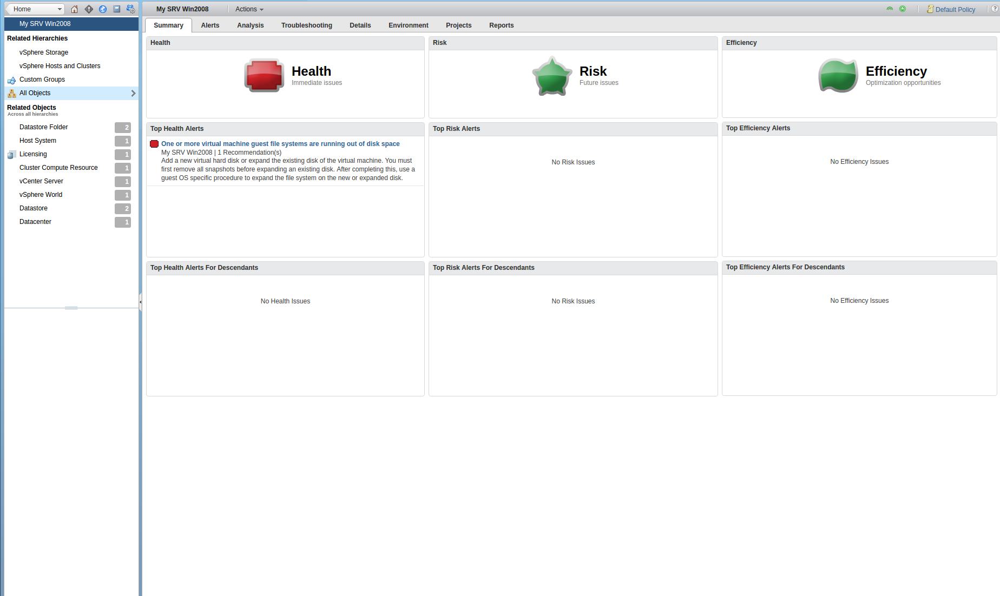

When you first log in, you see on your home page a section with a Health Weather Map, like this :

{.thumbnail}

This heat map let you quickly know if one of your VM is healthy or not regarding the risk, the health and the efficiency of your environment.

Note: when passing the mouse pointer on the square, you'll see some details about one square :

{.thumbnail}

When you click on one of your squares, it will display all squares related to your object. In this documentation, we focus on one VM named "My SRV Win2008", which is red.

{.thumbnail}

By double clicking on the square, you are forwarded to the detailed object view, on the summary page where you see quickly what's wrong with this object :

{.thumbnail}

In our case, we have a recommandation to apply, which is to increase the size of our "My SRV Win2008" VM.
