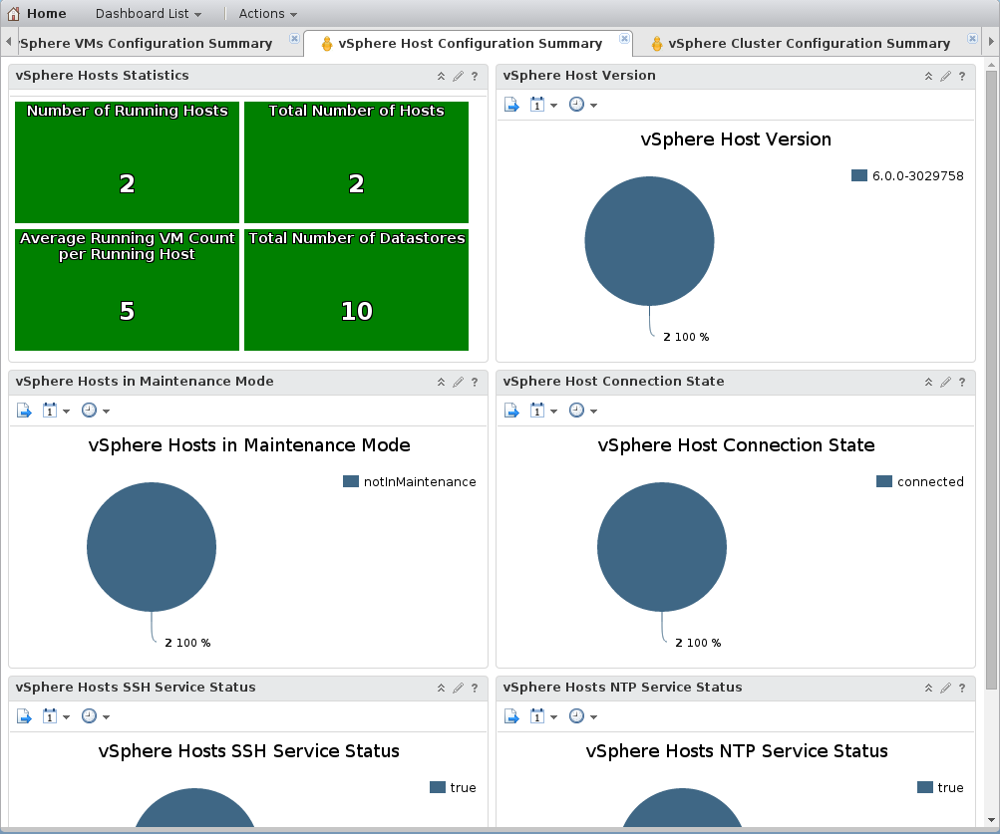

On this dashboard you can check your hosts' integrity.

On this dashboard, you can check the hosts connectivity to the vSphere, the homogeneity of the host versions, and the maintenance state of your hosts.

You can also see the SSH and NTP services status.

{.thumbnail}
