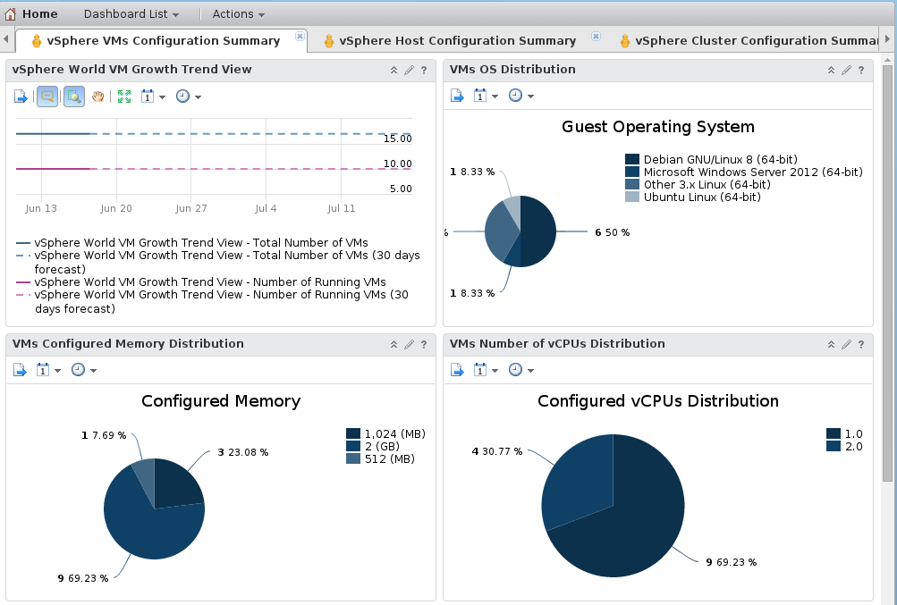
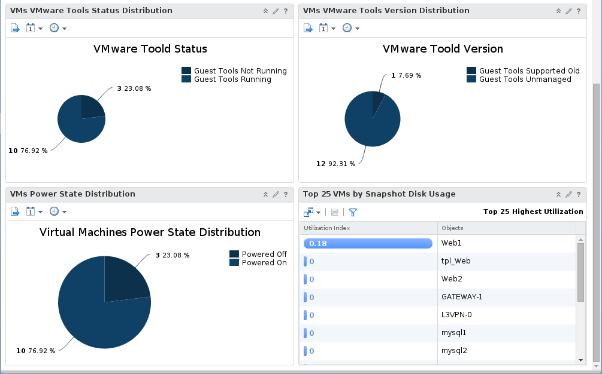

On this dashboard you can check some informations about your VMs registered on your infrastructure.

This one helps you to control, allocation ressources on your VMs (vCPU and Memory distribution).

There is also the guest operating system setup on your VMs.

You can check quickly that VMware tools are deployed on your VMs and up to date.

{.thumbnail}

{.thumbnail}
