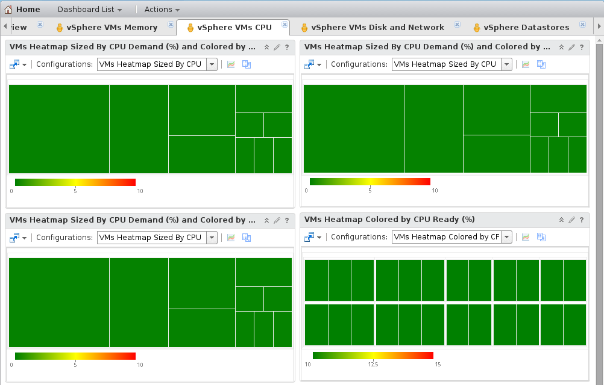
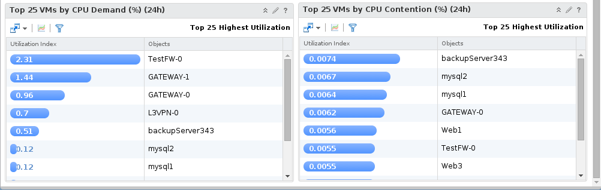

On this dashboard you can see CPU metrics on your VMs.

You can see metric as CPU demand, CPU Ready, CPU Contention.

When a metric is too high, you are alerted by the heatmap.

{.thumbnail}

{.thumbnail}

