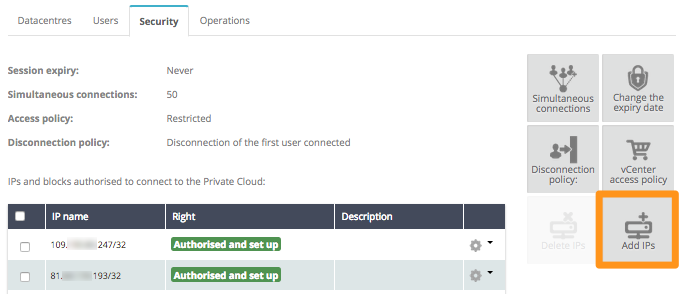
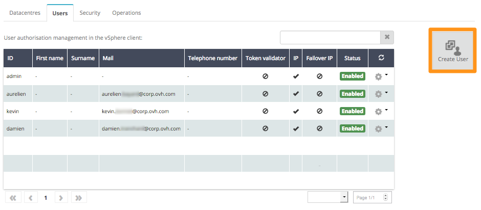
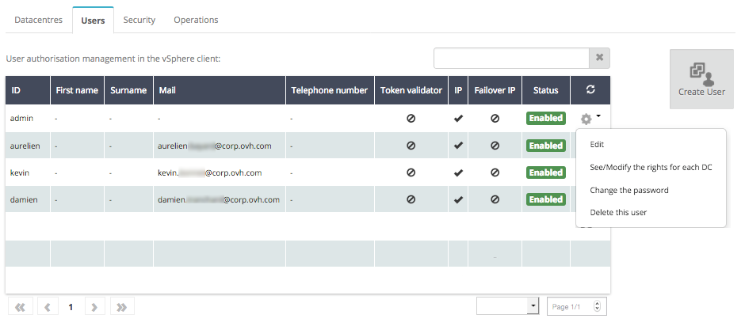
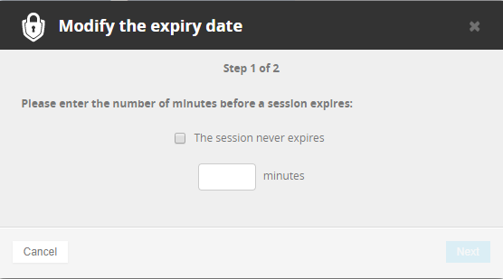

**Last updated 02nd March 2018**

## Objective

To ensure optimal security for your system, we recommend limiting access to it. We offer a number of different methods for this.

**Find out how to secure access to your vSphere web client quickly and easily, using our tips below.**

## Requirements

- You must be logged in to the [OVH Control Panel](https://www.ovh.com/auth/?action=gotomanager){.external}.

## Instructions

### Restrict access by IP address

This first method involves restricting access based on the user's IP address. For this purpose, we recommend continuing to work with a registration system that uses whitelisting. This technique refuses access by default for all IP addresses. You can then manually add the IPs that require access to your infrastructure.

You can do this directly in your [OVH Control Panel](https://www.ovh.com/auth/?action=gotomanager){.external}. Go to the Private Cloud section, then `Security`{.action}. In this section, you will see a table listing all authorised or denied IP addresses. To add new ones, click `Add IPs`{.action} on the right-hand side:

{.thumbnail}

### Create specific users

We highly recommend creating personal accounts for each user that requires access to your infrastructure. You can also do this in your [OVH Control Panel](https://www.ovh.com/auth/?action=gotomanager){.external}, in the `Users`{.action} tab. To add new users, click the `Create User`{.external} button on the right-hand side.

{.thumbnail}

When you create a new user, you are required to set a password.

> [!primary]
>
> To ensure that your data is secure, your password must meet the criteria listed below:
>
> - It must contain at least eight characters.
> - It must contain at least three character types.
> - It must not contain a dictionary word.
> - It must not contain any personal information (e.g. your first name, surname or date of birth).
> - It must not be used as a password by any other user accounts.
> - It must be stored in a password manager.
> - It must be changed every three months.
> - It must not be identical to any previously used passwords.
>

You can then manage each user’s rights by clicking on the cogwheel icons at the far right of each user row:

{.thumbnail}

### Limit session times

When users finish a session, we recommend closing the session accordingly. To limit connection time, you can set a session expiry duration.

To do this, go to your [OVH Control Panel](https://www.ovh.com/auth/?action=gotomanager){.external}. Go to the Private Cloud section, then `Security`{.action}. Next, click the `Change expiry duration`{.action} button, situated on the right-hand side of the screen. In the following window, you can choose the time (in minutes) before a session expires.

{.thumbnail}

## Go further

Join our community of users on <https://community.ovh.com/en/>.