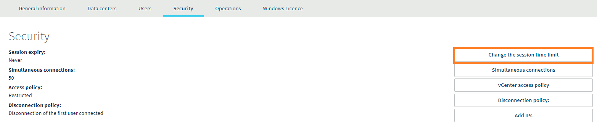

**Dernière mise à jour le 30/06/2020**

## Objectif

Pour assurer l'intégrité de votre infrastructure, il convient d'en restreindre l'accès. Pour cela, nous vous proposons différentes méthodes.

**Apprenez à sécuriser rapidement et facilement l'accès à votre client vSphere Web grâce à quelques conseils.**

## Prérequis

- Être connecté à l'[espace client OVHcloud](https://www.ovh.com/auth/?action=gotomanager){.external}.

## En pratique

### Contrôler les accès par IP

Le premier conseil est lié à la restriction de l'accès par IP. Nous vous conseillons de toujours fonctionner avec un système d'inscription sur une liste blanche. Cette technique fonctionne sur l'interdiction de principe de toutes les adresses IP et d'ajout des adresses pouvant avoir accès à votre infrastructure.

Cette action est accessible directement dans votre [espace client OVHcloud](https://www.ovh.com/auth/?action=gotomanager){.external}. Une fois sur votre espace Private Cloud, allez dans `Sécurité`{.action}. Un tableau s'affichera, sur lequel vous pourrez voir les adresses IP autorisées ou refusées. Pour en ajouter de nouvelles, cliquez à droite sur `Ajout des IP`{.action} :

{.thumbnail}

### Créer des utilisateurs spécifiques

Nous vous conseillons fortement de créer un accès personnel pour chaque personne devant avoir accès à votre infrastructure. Cette opération s'effectue également dans l'[espace client OVHcloud](https://www.ovh.com/auth/?action=gotomanager){.external}, mais cette fois dans l'onglet `Utilisateurs`{.action}. Pour en ajouter de nouveaux, cliquez sur le bouton situé à droite : `Créer un utilisateur`{.action}.

{.thumbnail}

Lors de la création d'un utilisateur, un mot de passe est demandé.

> [!primary]
>
> Pour sécuriser parfaitement vos données, votre mot de passe doit suivre ces quelques recommandations :
>
> - comporter au minimum huit caractères ;
> - comporter au minimum trois types de caractères ;
> - ne pas être tiré du dictionnaire ;
> - ne pas comporter d’informations personnelles (votre prénom, nom ou date de naissance) ;
> - ne pas être utilisé pour plusieurs accès utilisateur ;
> - être stocké dans un coffre-fort de mots de passe ;
> - être changé tous les trois mois ;
> - être différent des mots de passe précédents.
>

Vous pourrez ensuite gérer les droits de chaque utilisateur en cliquant sur le bouton `...`{.action} à droite de chaque identifiant :

{.thumbnail}

### Limiter les temps de session

En fin d'utilisation, il est conseillé de fermer la session de votre utilisateur. Pour limiter le temps de connexion, il est possible d'ajouter une durée d'expiration de session.

Celle-ci est paramétrable dans l'[espace client OVHcloud](https://www.ovh.com/auth/?action=gotomanager){.external}. Une fois sur votre espace Private Cloud, choisissez `Sécurité`{.action}. Cliquez ensuite sur le bouton `Changer le délai d'expiration`{.action} situé sur la droite.

{.thumbnail}

Renseignez ensuite le nombre de minutes avant qu'une session expire.

{.thumbnail}

## Aller plus loin

Échangez avec notre communauté d'utilisateurs sur <https://community.ovh.com>.
