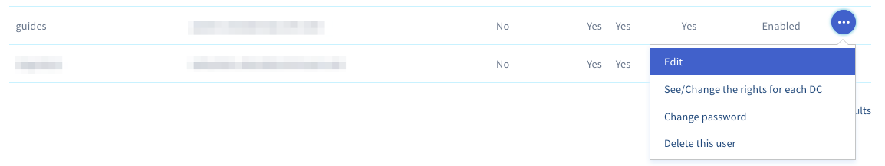

**Dernière mise à jour le 06/07/2020**

## Objectif

Il est possible d'associer un nom, prénom, numéro de téléphone et adresse e-mail à  l'utilisateur vSphere de votre Private cloud. L'adresse e-mail permet notamment la validation par token.

**Découvrez comment associer une adresse e-mail à votre utilisateur vSphere**

## Prérequis

- Disposer d'une offre [Hosted Private cloud](https://www.ovhcloud.com/fr/enterprise/products/hosted-private-cloud/){.external}.
- Être connecté à [l'espace client OVHcloud](https://www.ovh.com/auth/?action=gotomanager).

## En pratique

Connectez-vous à votre [espace client OVHcloud](https://www.ovh.com/auth/?action=gotomanager) et dirigez-vous dans la section `Server`. Cliquez sur `Private Cloud` dans la barre de services à gauche puis sélectionnez l'infrastructure concernée.

{.thumbnail}

Dirigez-vous sur onglet `Utilisateurs`{.action}, cliquez sur `...`c à droite de l'utilisateur concerné puis sur`Modifier`{.action} 

{.thumbnail}

La fenêtre suivante s'affiche :

{.thumbnail}

Vous pouvez définir vos nom, prénom, numéro de téléphone et adresse e-mail.

Cette fenêtre permet également d'ajouter des droits d'édition aux adresse **IP**, **IP Failover**,**InterfaceNSX** ainsi que le droit **Token validator** utilisé pour approuver certaines actions sensible sur des infrastructures ayant l'option**"Sécurité avancée"** d'activée.

Cliquez sur le bouton `Valider`{.action} pour confirmer vos modifications.

## Aller plus loin

Échangez avec notre communauté d’utilisateurs sur [https://community.ovh.com/](https://community.ovh.com/){.external}.
