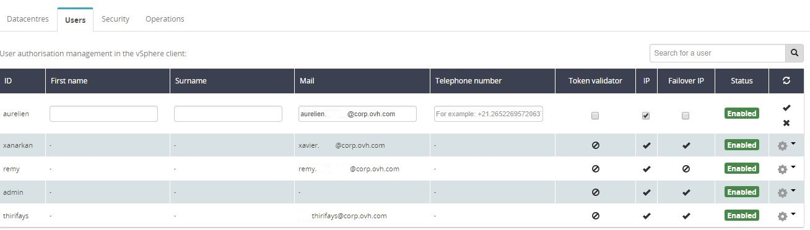

Cette action se réalise dans l'[espace client OVH (Manager)](https://www.ovh.com/manager){.external-link}.

Ce menu permet d'ajouter un nom, prénom, numéro de téléphone et adresse email à un utilisateur vSphere.

Il permet également d'ajouter des droits d'édition aux adresse IP, IP Failover ainsi que le droit "Token validator" utilisé pour approuver certaines actions sensible sur des infrastructures ayant l'option**"Sécurité avancée"** d'activée.

Dans la section **Dédié →Private Cloud**, sélectionner ensuite l'infrastructure correspondante puis l'onglet **Utilisateurs.** Une fois sur l'utilisateur concerné, cliquer sur l'action **Modifier** dans la liste des actions disponibles.

{.thumbnail}

Les champs texte****de l'utilisateur seront alors modifiables. Il ne reste qu'à entrer l'adresse email et/ou le numéro de téléphone et/ou le nom/prénom ainsi qu'à cocher les cases correspondantes aux options que vous souhaitez activer pour cet utilisateur.

Penser à valider la modification en cliquant sur le **"V"** pour qu'elle soit bien prise en compte.

{.thumbnail}
