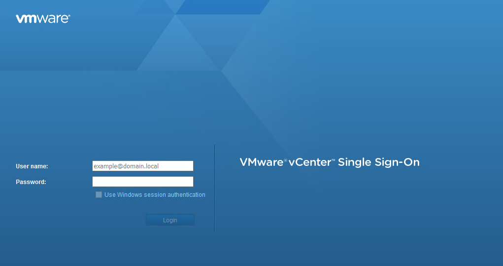

**Last updated 25th June 2020**

## Objective

**This guide explains the different ways to connect to the vSphere client.**

## Requirements

- a [Hosted Private Cloud infrastructure](https://www.ovhcloud.com/en-gb/enterprise/products/hosted-private-cloud/) of which you are an administrative contact (to receive login credentials)
- a user account with access to vSphere (created in the [OVHcloud Control Panel](https://www.ovh.com/auth/?action=gotomanager))


## Instructions

### Retrieving credentials

Login credentials are sent out by email when the Private Cloud service is created, when a password is changed or when a user profile is created.

```
Name/IP address: pcc-xxx-xxx-xxx-xxx.ovh.com Username: admin password: xxxxxx
```

To ensure access, please refer to the VMware documentation, in which the different ports to be opened in your firewall are listed: [Client access](https://kb.vmware.com/kb/1012382){.external}.


### Using the HTML5 web client

The HTML5 web client is available on the Private Cloud web interface at this URL: <https://pcc-xxx-xxx-xxx-xxx.ovh.com/ui> (replace pcc-xxx-xxx-xxx-xxx.ovh.com with your Private Cloud address).

{.thumbnail}

You will arrive at this interface:

{.thumbnail}

The `Home`{.action} page provides accces to the main menus of your vCenter. You will be able to perform various actions, such as:

- deploying a virtual machine by going to `Hosts and Clusters`{.action}
- browsing your datastores.

> [!warning]
>
> *NSX Edge* management is not yet available in the web client.
>

### Using the Flash web client

The Flash web client is available on the Private Cloud web interface at this URL: <https://pcc-xxx-xxx-xxx-xxx.ovh.com/vsphere-client> (replace pcc-xxx-xxx-xxx-xxx.ovh.com with your Private Cloud address).

Log in using the credentials that were sent to you:

{.thumbnail}

You can then access this interface:

{.thumbnail}

On the `Home`{.action} page you can find your vCenter main menus. You will be able to perform a number of actions, such as:

- deploying a virtual machine by going to `Hosts and Clusters`{.action}
- if you have this option, using NSX by going to `Networking & Security`{.action}
- browsing your data stores.


## Go further

Join our community of users on <https://community.ovh.com/en/>.
