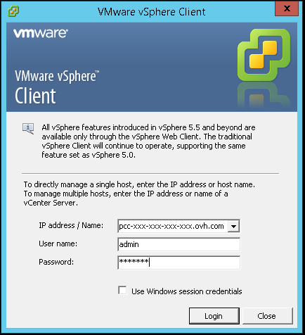
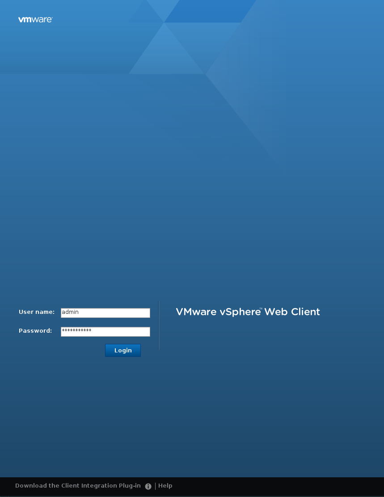
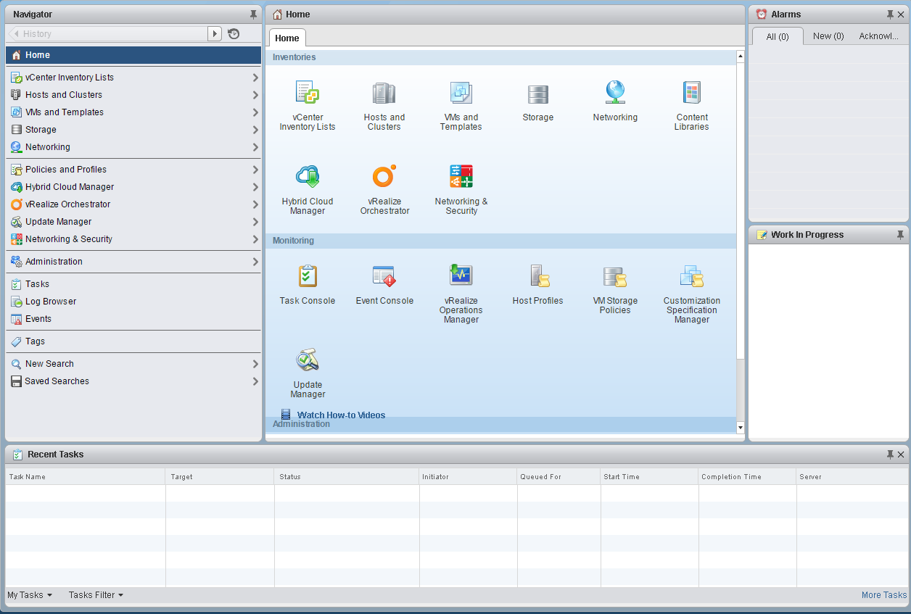

**Last updated 1st February 2018**

## Objective

**This guide will show you the different ways to log in to vSphere.**

## Requirements

- You must be an administrative contact of a Private Cloud that receives login credentials.
- You must have created an active user account in the Control Panel.


## Instructions

### Recovering credentials

Login credentials are sent out by email when the Private Cloud is created, when a password is changed or when a user profile is created.

```
Name/IP address: pcc-xxx-xxx-xxx-xxx.ovh.com Username: admin password: xxxxxx
```

This VMware document lists the different ports that you must open on your firewall, to access the console, for example: [Access the console](https://kb.vmware.com/kb/1012382){.external}.


### Using the thick vSphere client

First, download the vSphere client installation file. You will find the link in the user creation email.

The web client is available on the Private Cloud web interface at this URL: <https://pcc-xxx-xxx-xxx-xxx.ovh.com/vsphere-client> (replace *pcc-xxx-xx-xx-xxx.ovh.com* with your Private Cloud address).

Once you have downloaded the file, run it. The installation will begin. Initially, the installation wizard will prompt you to select the language you want to use, and accept the VMware terms of use.

Once the installation is complete, the wizard will suggest connecting to the Private Cloud by entering the information you gave previously.

{.thumbnail}

### Using the web client

The web client is available on the Private Cloud web interface at this URL: <https://pcc-xxx-xxx-xxx-xxx.ovh.com/vsphere-client>(replace pcc-xxx-xx-xx-xxx.ovh.com with your Private Cloud address).

Log in using the credentials that were sent to you:

{.thumbnail}

You can then access this interface:

{.thumbnail}

On the `Home`{.action} page you can find your vCenter main menus. You will be able to perform a number of actions, such as:

- deploying a virtual machine by going to `Hosts and Clusters`{.action}
- using NSX by going to `Network & Security`{.action} (if you have this option)
- browsing your data stores


## Go further

Join our community of users on <https://community.ovh.com/en/>.