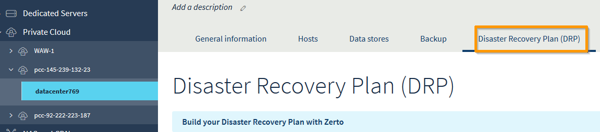
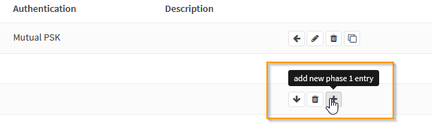
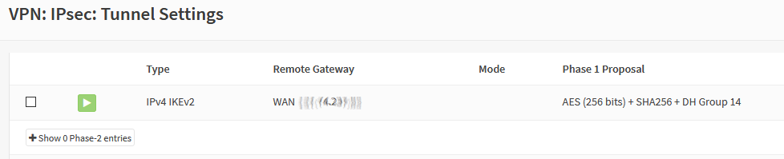
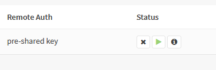
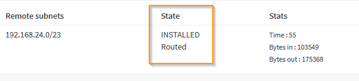
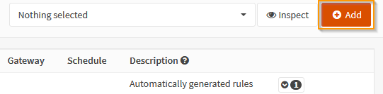
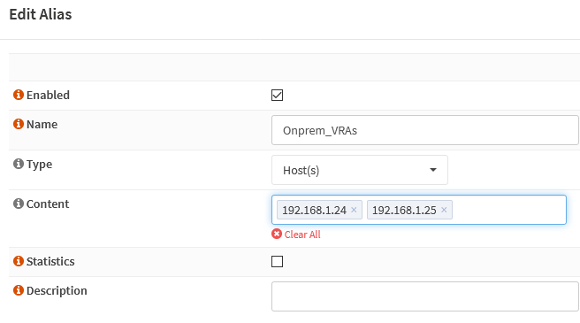

**Dernière mise à jour le 06/12/2019**

## Objectif :
Ce guide a pour objectif de vous aider à configurer le réseau privé virtuel (VPN) pour raccorder votre plateforme locale à votre Hosted Private Cloud OVHcloud et mettre en œuvre la solution de reprise d’activité
Zerto.
Pour illustrer la mise en œuvre de l’interconnexion, nous utiliserons les fonctionnalités VPN d’OPNSense qui est une plateforme firewall/VPN open source. 
Pour faciliter les explications, nous décrirons la configuration la plus simple où la passerelle VPN dispose d'une connexion dans le réseau de la Zerto Virtual Manager (ZVM). 

## Prérequis :

- Le PCC de destination doit disposer d'au moins une adresse IP publique disponible pour le point de connexion VPN.
- Le site client doit disposer d’une installation Zerto opérationnelle.
- Les machines de réplication Zerto (VRA : Virtual Réplication Appliance) coté client et coté OVHCloud doivent pouvoir échanger entre elles sur les ports TCP 4007 et 4008
- Les machines d’administration Zerto (ZVM : Zerto Virtual Manager) coté client et coté OVHCloud doivent pouvoir échanger entre elles sur les ports TCP 9081

## En pratique

### Présentation de l'architecture de la solution

**Définition des paramètres de cette architecture :**

Côté client :

- Adresse publique du point de connexion VPN (1)
- Adresse interne du point de connexion VPN (2)
- Adresse interne de la ZVM (3)
- Plan d’adressage du réseau ZVM (4)

Côté OVHcloud :

- Adresse publique du point de connexion VPN (5)
- Plan d’adressage du réseau ZVM (6)
- Adresse de la ZVM (7)

> [!primary]
>
>Vous devez choisir la plage réseau dans laquelle vous souhaitez qu’OVHcloud déploie la ZVM distante, afin d’éviter toute collision avec vos adresses internes. 
>
>Vous pouvez simplement accepter celle qui vous est proposée par défaut dans l’interface de l’espace client si elle convient.
>

### Étape 1 : activer la fonction Zerto client vers OVHcloud

L’activation se fait très simplement depuis l’espace client OVHcloud. Sélectionnez d'abord le datacenter associé au PCC, puis cliquez sur l'onglet `Plan de reprise d'activité(PRA)`{.action}.

Sélectionnez l’option `Entre votre infrastructure et un Private Cloud OVH`{.action} puis cliquez sur `Activer Zerto PRA`{.action}.

Sélectionnez une adresse publique disponible dans la plage proposée.

Saisissez ensuite la plage réseau souhaitée pour le déploiement de la ZVM.

Cliquez ensuite sur `Installer`{.action}.

### Étape 2 : activer le service IPSec

Depuis la console OPNSense, allez dans le menu `VPN`{.action} sur la gauche, puis dans la rubrique `IPSec`{.action} et sélectionnez  `Tunnel Setting`{.action}.

Cochez la case `Enable IPsec`{.action}.

Sauvegardez en cliquant sur `Save`{.action}.

### Étape 3 : paramétrer le tunnel IPSec

La configuration du tunnel se fait en complétant deux groupes de paramètres appelés **Phase 1** et **Phase 2**.

#### 3.1 Ajouter la Phase 1

Dans le menu `VPN`{.action}, puis la rubrique `Tunnel setting`{.action}, cliquez sur le `+`{.action} à droite de l’écran.

##### 3.1.1 Phase 1 : ajout des informations générales

Vous pouvez conserver les valeurs par défaut :

- Methode de connection : Default
- Protocole d’échange de clés : V2
- Protocole Internet : IPV4
- Interface : WAN

Vous devez néanmoins renseigner impérativement l’IP du point de connexion IPSec d’OVHcloud, dans le champ `Remote gateway`{.action}.

##### 3.1.2 Phase 1 : authentification

Là encore, vous pouvez conserver les paramètres par défaut. Vous devrez juste saisir le mot de passe partagé dans le champ `Pre-Shared Key`{.action}.

##### 3.1.3 Phase 1  : choix des algorithmes de chiffrement

Les valeurs supportées des paramètres sont les suivantes :

- Algorithme de chiffrement : AES 256 bits
- Algorithme de hachage : SHA256
- Groupe de clés Diffie-Hellman : 14 (2048 bits)
- Durée de vie : 28 800 secondes

Les paramètres avancés peuvent conserver les valeurs par défaut. Cliquer sur `Save`{.action} puis sur `appliquer les changements`{.action}.

La Phase 1 est maintenant disponible dans l’interface.

#### 3.2 Ajout d'une entrée Phase 2

Cliquez sur le bouton `afficher les entrées Phase 2`{.action}.

Aucune phase 2 n’est alors disponible, il faut donc en ajouter une :

Cliquez sur le bouton `+ `{.action}.

##### 3.2.1 Phase 2 : Informations générales

Vérifiez que le mode est bien positionné sur « Tunnel IPV4 ».

##### 3.2.2 Phase 2 : Réseau Local

Le type de réseau local sélectionné doit être « Sous réseau Local »

##### 3.2.3 Phase 2 : Réseau distant

A ce stade il faut saisir le plan d’adressage du réseau sur lequel se trouve la ZVM OVHcloud. 

Le réseau sera forcément en /23 (512 IPs).

> [!warning]
>
> Soyez vigilants car si une erreur se produit à ce stade, le VPN ne pourra pas fonctionner. 
>

##### 3.2.4 Phase 2 : Échanges de clés

Les paramètres supportés sont

- Protocole : ESP :
- Algorithmes de chiffrement : AES 256 bits
- Algorithmes de hachage : SHA256
- PFS : Off

Il n’est pas nécessaire de modifier les options avancées. Cliquez sur `Save`{.action} puis sur `Appliquer les changements`{.action}.

#### 3.3 Vérification de l’état du VPN :

Appuyez sur le triangle orange à droite pour lancer la connexion.

Si les paramètres sont corrects, le tunnel s’établit. Deux nouvelles icônes apparaissent alors :

- Désactiver le tunnel
- Obtenir des informations sur l’état du tunnel

Cliquez sur l’icône d’informations.

Le tunnel est maintenant opérationnel. N’oubliez pas, si nécessaire à ce stade, d’ajouter une route sur la ZVM locale vers le réseau de la ZVM OVHcloud.

**En cas de dysfonctionnement** :

Si le tunnel ne monte pas, vérifiez que les paramètres suivants ont bien été saisis :

- La clé partagée
- L’IP du point de connexion distant.
- La plage IP du réseau distant

Vérifiez également qu’un firewall ne bloque pas les flux entre les deux extrémités du VPN.

Vous pouvez également consulter le fichier de log IPSec dans /var/log/ipsec.log.

### Étape 4 : configuration du firewall

Afin de permettre l’appairage entre le site client et le site OVHcloud, vous devez autoriser :

- Le port 9081 entre les ZVM
- Les ports 4007 et 4008 entre les vRAs

#### 4.1 Ouvertures ZVM

Rendez-vous dans le menu `Firewall`{.action} , puis la section `Rules`{.action} et sélectionnez `IPSec`{.action}.

Cliquez sur `Add`{.action} pour créer une nouvelle régle.

Cette règle comporte les paramètres suivants :

- Action : « Pass » (Autoriser le flux)
- Interface : « IPsec » (les flux entrant à autoriser proviennent  du VPN)
- Protocole : « TCP »

Les sections Source et Destination sont de type « Single host or Network » et référencent respectivement les IPs de la ZVM OVHcloud vers la ZVM client.

Le port TCP de destination autorisé est le 9081.

Sauvegardez la règle et déployez-la.

#### 4.2 Ouvertures pour les vRA

Les ouvertures pour les vRA sont un peu plus complexes puisqu’il y a autant de vRA que d’ESXi, aussi bien côté client que côté OVHCloud. 

Toutes doivent pouvoir se parler sur les ports TCP 4007 et 4008. 

Pour simplifier ce type de situations, OPNSense offre les alias. Un alias est un groupe d’objets (IPs, réseaux, URLs etc…) qui peut être utilisé dans la définition des règles de firewall.

Dans notre cas, nous aurons besoins de 3 alias :

- Un pour les IPs des vRAs côté client
- Un pour les IPs des vRAs côté OVHcloud
- Un pour les ports à autoriser

L’IP des vRAs coté OVHcloud visible dans l’interface vSphere du Private Cloud de destination :

Créez l’alias OVH_VRA pour les vRAs coté OVHcLoud :

De manière similaire, il faut créer un alias pour les machines coté client :

Il ne reste plus qu’à créer l’alias pour les ports :

Vous avez maintenant tous les éléments pour créer vos règles firewall qui autorisent le flux en provenance d’OVHcloud vers la plateforme client. La procédure est la même, il suffit simplement d’utiliser les alias dans les paramètres :

À ce stade, la connexion VPN est opérationnelle et sécurisée.

### Étape 5 : appairage des ZVM

Une fois la ZVM installée sur le site client, vous pouvez vous connecter à l’interface Zerto. 

L’écran suivant s’affiche.

Choisissez l’option `Pair to a site with a licence`{.action} et saisissez l’adresse IP de la ZVM coté OVHcloud puis cliquez sur `Start`{.action}.

Dans le tableau de bord, un message indique que l’appairage est en cours.

Si l’opération s’est bien déroulée, le message suivant s’affiche :

Vous pouvez vérifier que le le nom de votre PCC OVHcloud est bien visible dans l’onglet `Sites`{.action}.

À ce stade, votre solution Zerto est opérationnelle et vous pouvez créer vos groupes de protection virtuels (VPG).

#### **Diagnostic** :

En cas d’impossibilité d’établir un dialogue entre les ZVM (notamment en cas d’omission au niveau des règles de firewall) le message suivant s’affiche :

Puis vous êtes ramené à l’écran de connexion de la ZVM avec le message d’erreur suivant.

La cause la plus probable est que la ZVM OVHCloud n'arrive pas à contacter la ZVM client sur le port TCP 9081. Il est nécessaire qu'elle puisse ouvrir la connexion.

## Aller plus loin

Échangez avec notre communauté d'utilisateurs sur <https://community.ovh.com>.
