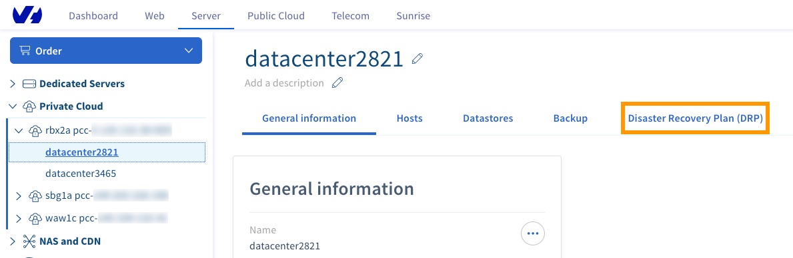

> [!primary]
> Questa traduzione è stata generata automaticamente dal nostro partner SYSTRAN. I contenuti potrebbero presentare imprecisioni, ad esempio la nomenclatura dei pulsanti o alcuni dettagli tecnici. In caso di dubbi consigliamo di fare riferimento alla versione inglese o francese della guida. Per aiutarci a migliorare questa traduzione, utilizza il pulsante "Modifica" di questa pagina.
>

**Ultimo aggiornamento: 11/02/2022**

## Obiettivo

Questa guida ti mostra come configurare la rete privata virtuale (VPN) per collegare una piattaforma terza al tuo Hosted Private Cloud OVHcloud e implementare la soluzione Disaster Recovery Zerto. 
Per illustrare la procedura di interconnessione utilizzeremo le funzionalità VPN di OPNSense, una piattaforma firewall/VPN open source.
Per facilitare la spiegazione, descriveremo il modo più semplice per stabilire un tunnel VPN con la rete dell’interfaccia Zerto Virtual Manager (ZVM).

Per il secondo caso, consulta la nostra guida "[Zerto tra due datacenter OVHcloud](https://docs.ovh.com/it/private-cloud/zerto-virtual-replication-vmware-vsphere-drp/)".

## Prerequisiti

- Un indirizzo IP pubblico disponibile nel Private Cloud di destinazione, verso il punto di connessione VPN.
- Una piattaforma Zerto installata e operativa nell'infrastruttura del cliente.
- Le macchine di replica Zerto (VRA: Virtual Replication Appliance) lato cliente e lato OVHcloud devono essere in grado di comunicare tra di loro sulle porte TCP 4007 e 4008 
- Le macchine di gestione Zerto (ZVM: Zerto Virtual Manager) lato cliente e lato OVHcloud devono essere in grado di comunicare tra loro sulle porte TCP 9081

## Procedura

### Presentazione dell’architettura della soluzione

{.thumbnail}

**Definizione dei parametri dell’architettura:**

Lato cliente:

- Indirizzo pubblico del punto di connessione VPN (1)
- Indirizzo interno del punto di connessione VPN (2)
- Indirizzo interno della ZVM (3)
- Piano di indirizzamento della rete ZVM (4)

Lato OVHcloud:

- Indirizzo pubblico del punto di connessione VPN (5)
- Piano di indirizzamento della rete ZVM (6)
- Indirizzo della ZVM (7)

> [!primary]
>
>È necessario scegliere l’intervallo di rete in cui si vuole che OVHcloud implementi la ZVM remota, per evitare qualsiasi impatto con gli indirizzi interni. 
>
>Se si adatta alle proprie esigenze, è possibile accettare semplicemente quella suggerita di default nell’interfaccia dello Spazio Cliente. 
>

### Step 1: attiva la funzione Zerto Client in OVHcloud

L’attivazione si effettua semplicemente dallo Spazio Cliente OVHcloud. Prima di tutto, seleziona il datacenter associato al PCC e poi clicca sulla scheda `Disaster Recovery Plan (DPR)`{.action}.

{.thumbnail}

Seleziona l’opzione `Tra la tua infrastruttura e un Private Cloud OVH`{.action}, quindi clicca su `Attiva Zerto DRP`{.action}.

{.thumbnail}

Seleziona un indirizzo pubblico disponibile nell’intervallo proposto.

{.thumbnail}

Inserisci l’intervallo di rete per l’implementazione della ZVM.

{.thumbnail}

Per proseguire, clicca su `Installa`{.action}.

{.thumbnail}

### Step 2: attiva il servizio IPSec

Dalla console OPNSense, clicca sul menu `VPN`{.action} a sinistra, poi sulla sezione `IPSec`{.action}, quindi seleziona `Tunnel Setting`{.action}.

{.thumbnail}

Seleziona la casella `Enable IPsec`{.action}.

{.thumbnail}

Per salvare l’operazione, clicca su`Salva`{.action}.

### Step 3 : configura il tunnel IPSec

Per configurare il tunnel è necessario completare due gruppi di configurazione chiamati **Phase 1** e **Phase 2**.

#### 3.1 Aggiungi la Phase 1

Nel menu `VPN`{.action}, sezione `Tunnel setting`{.action}, clicca sul simbolo `+`{.action} a destra dello schermo.

{.thumbnail}

##### 3.1\. Phase 1: aggiungi le informazioni generali 

{.thumbnail}

È possibile mantenere i valori predefiniti:

- Metodo di connessione: Default
- Protocollo di scambio di chiavi: V2
- Protocollo Internet: IPv4
- Interfaccia: WAN

Tuttavia è obbligatorio inserire l’IP del punto di connessione IPSec di OVHcloud, nel campo `Remote gateway`{.action}.

##### 3.1.2 Phase 2: effettua l’autenticazione

Anche qui, è possibile mantenere le impostazioni predefinite. Sarà necessario soltanto inserire la password condivisa nel campo `Pre-Shared Key`{.action}.

{.thumbnail}

##### 3.1.3 Phase 1: scegli gli algoritmi di cifratura

{.thumbnail}

I valori supportati per ogni parametro sono i seguenti: 

- Algoritmi di cifratura:  AES 256 bits 
- Algoritmo di hash: SHA256
- Gruppo di chiavi Diffie-Hellman: 14 (2048 bit)
- Durata di vita: 28 800 secondi

Le impostazioni avanzate possono mantenere i valori predefiniti. Clicca su `Salva`{.action} e poi su `applica le modifiche`{.action}.

La Phase 1 è ora disponibile nell’interfaccia.

{.thumbnail}

#### 3.2 Aggiungi un record Phase 2

Clicca sul pulsante `visualizza i record Phase 2`{.action}. 

{.thumbnail}

Non è disponibile alcuna fase 2, quindi è necessario aggiungerne una:

{.thumbnail}

Clicca sul simbolo `+`{.action}.

{.thumbnail}

##### 3.2.1 Phase 2: Informazioni generali

{.thumbnail}

Verifica che la modalità sia impostata su « Tunnel IPv4 ».

##### 3.2.2 Phase 2: Rete Locale

{.thumbnail}

Il tipo di rete locale selezionato deve essere “Sotto rete Locale”

##### 3.2.3 Phase 2 : Rete remota

A questo punto è necessario inserire il piano di indirizzamento della rete su cui si trova la ZVM OVHcloud. 

La rete sarà necessariamente in /23 (512 IPs).

> [!warning]
>
> Attenzione: se si si verifica un errore in questa fase, la VPN non sarà in grado di funzionare. 
>

{.thumbnail}

##### 3.2.4 Phase 2 : Scambio di chiavi

Le impostazioni supportate sono

- Protocollo: ESP
- Algoritmi di cifratura:  AES 256 bits 
- Algoritmo di hash: SHA256
- PFS: Off

{.thumbnail}

Non è necessario modificare le opzioni avanzate. Clicca su `Salva`{.action} e poi su `Applica le modifiche`{.action}.

#### 3.3 Verifica lo stato della VPN:

{.thumbnail}

Clicca sul triangolo arancione a destra per avviare la connessione.

{.thumbnail}

Se le impostazioni sono corrette, il tunnel sarà stabilito. A questo punto, visualizzi due nuove icone:

- Disattivare il tunnel
- Ottenere informazioni sullo stato del tunnel

{.thumbnail}

Clicca sull’icona delle informazioni.

{.thumbnail}

Il tunnel è ora operativo. Ricordati, se necessario, di aggiungere una route sulla ZVM locale verso la rete della ZVM OVHcloud.

**In caso di malfunzionamento**:

Se il tunnel non è stabilito, verifica che siano stati inseriti correttamente i seguenti parametri:

- chiave condivisa
- L’IP del punto di connessione remota
- L’intervallo IP della rete remota

Verifica inoltre che il traffico tra le due estremità della VPN non sia bloccato da un firewall.

Puoi anche consultare il file di log IPSEec in /var/log/ipsec.log

### Step 4: configura il Firewall

Per consentire il collegamento tra l’infrastruttura del cliente e quella di OVHcloud, è necessario autorizzare:

- La porta 9081 tra le ZVM
- Le porte 4007 e 4008 tra le vRAs

#### 4.1 Apri le porte sulla ZVM

Clicca sul menu `Firewall`{.action}, sezione `Regole`{.action} e poi seleziona `IPSec`{.action}.

{.thumbnail}

Clicca su `Aggiungi`{.action} per creare una nuova regola.

{.thumbnail}

{.thumbnail}

Questa regola ha i seguenti parametri: 

- Scenario possibile: “Pass” (Autorizza il traffico)
- Interfaccia: “IPSec” (il traffico in entrata da autorizzare proviene dalla VPN)
- Protocollo: “TCP”

Le sezioni Sorgente e Destinazione sono di tipo “Single host o Network” e fanno rispettivamente riferimento gli indirizzi IP da ZVM OVHcloud alla ZVM del cliente.

{.thumbnail}

La porta TCP di destinazione autorizzata è la 9081.

Salva la regola e applicala.

#### 4.2\. Apri le porte sulla vRA

L’apertura delle porte al traffico vRA è un po’ più complesso poiché vi sono tante vRA quante sono le ESXi, sia lato cliente che lato OVHcloud. 

Tutte devono essere in grado di comunicare sulle porte TCP 4007 e 4008. 

Per facilitare questo tipo di situazioni, OPNSense mette a disposizione gli alias. Un alias è un gruppo di oggetti (IPs, reti, URL, ecc.) che può essere utilizzato per definire le regole di firewall.

Nel nostro caso, avremo bisogno di 3 alias:

- Uno per le IP delle vRA lato cliente
- Uno per le IP delle vRA lato OVHcloud 
- Uno per le porte da autorizzare

L’IP delle vRA lato OVHcloud visibile nell’interfaccia vSphere del Private Cloud di destinazione:

{.thumbnail}

Crea l’alias OVH_VRA per le VRA lato OVHcloud:

{.thumbnail}

Allo stesso modo, è necessario creare un alias per le macchine lato cliente:

{.thumbnail}

Infine, non rimane che creare l’alias per le porte:

{.thumbnail}

A questo punto disponi di tutti gli elementi per creare le tue regole firewall per autorizzare il traffico proveniente da OVHcloud verso la piattaforma del cliente. La procedura è la stessa, basta semplicemente utilizzare gli alias nelle impostazioni:

{.thumbnail}

In questa fase, la connessione VPN funziona ed è sicura.

{.thumbnail}

### Step 5: collega le ZVM

Una volta installata la ZVM sulla piattaforma del cliente, puoi collegarti all’interfaccia Zerto. 

Visualizzi questo schermo:

{.thumbnail}

Seleziona l’opzione `Pair to a site with a licence`{.action}e seleziona l’indirizzo IP della ZVM lato OVHcloud, quindi clicca su `Start`{.action}.

Nella dashboard, un messaggio ti informa che il collegamento è in corso:

{.thumbnail}

Se l’operazione è stata effettuata correttamente, visualizzi il seguente messaggio:

{.thumbnail}

Verifica se il nome del tuo PCC OVHcloud è visibile nella scheda `Sites`{.action}.

{.thumbnail}

In questa fase, la tua soluzione Zerto funziona correttamente ed è possibile creare gruppi di protezione virtuali (VPG).

#### **Diagnostica**:

Se non è possibile stabilire un dialogo tra le ZVM (in particolare in caso di omissione delle regole di firewall) visualizzi il seguente messaggio:

{.thumbnail}

Dopodiché sarai reindirizzato alla pagina di login della ZVM con il seguente messaggio di errore:

{.thumbnail}

La causa più probabile è che la ZVM OVHcloud non riesca a contattare la ZVM del cliente tramite la porta TCP 9081. La ZVM OVHcloud deve essere in grado di stabilire la connessione.

## Per saperne di più

Contatta la nostra Community di utenti all’indirizzo <https://community.ovh.com/en/>.
