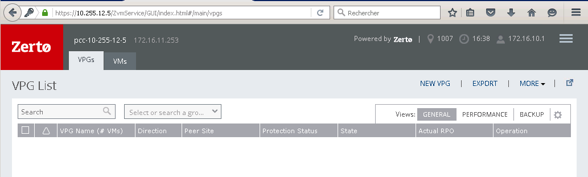
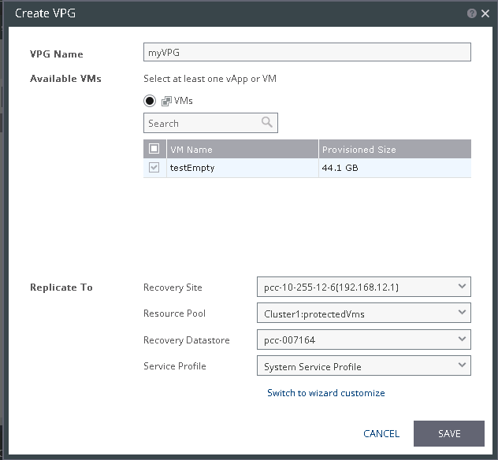
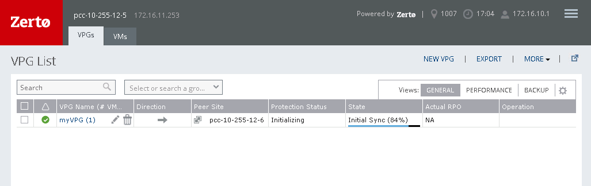
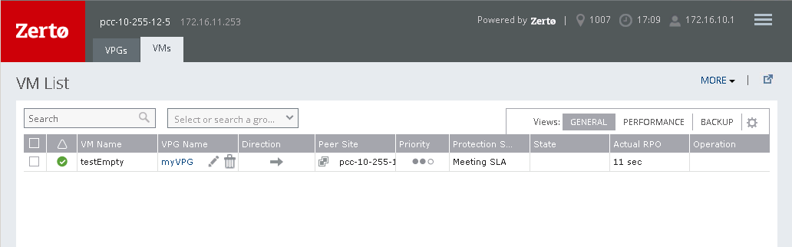

A VPG (Virtual Protection Group) is a group of selected VM you want to protect.

**You need to move your VMs in the ressource pool protectedVms to link them to the VPG before creating it.**

### Create your first VPG

In VPGs tab you can create a new VPG via the button.

{.thumbnail}

Name your VPG and select the virtual machines you want to protect and the ressources where you want to replicate the VMs.

You can also customize replication if you switch to wizard customize.

{.thumbnail}

Click on save. Then your new VPG is now in creation. You just need to wait for the first sync between source and recovery sites.

{.thumbnail}

In the VMs tab you can see your protected virtual machines.

{.thumbnail}

