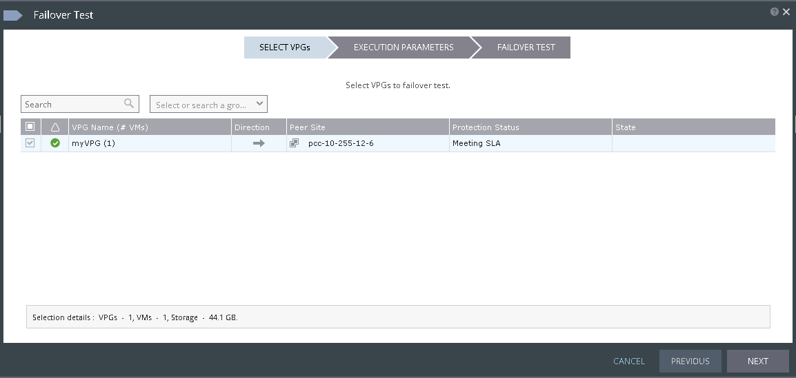
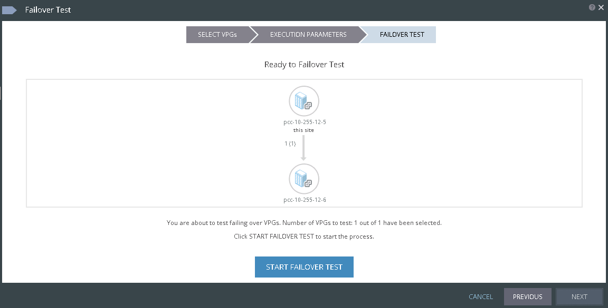
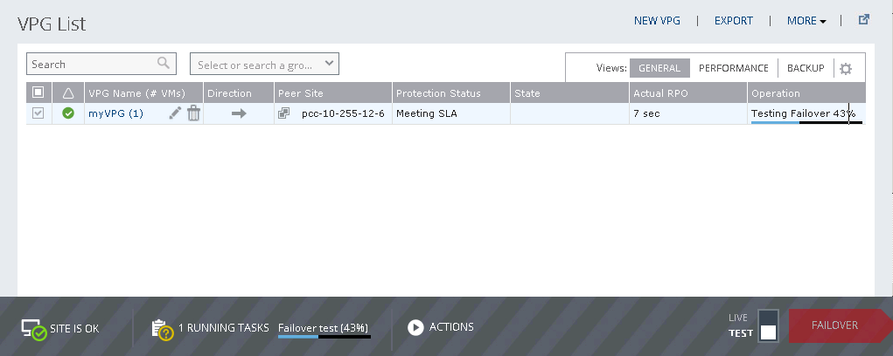

To launch failover, choose the mode (live or test) then click on FAILOVER.

{.thumbnail}

Then choose START FAILOVER TEST to launch failover.

{.thumbnail}

{.thumbnail}

Failover has started! Once finished you can check on destination the source VM is up.
