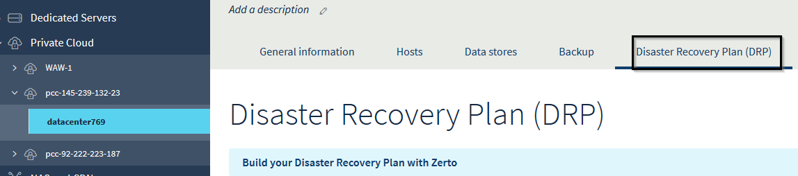
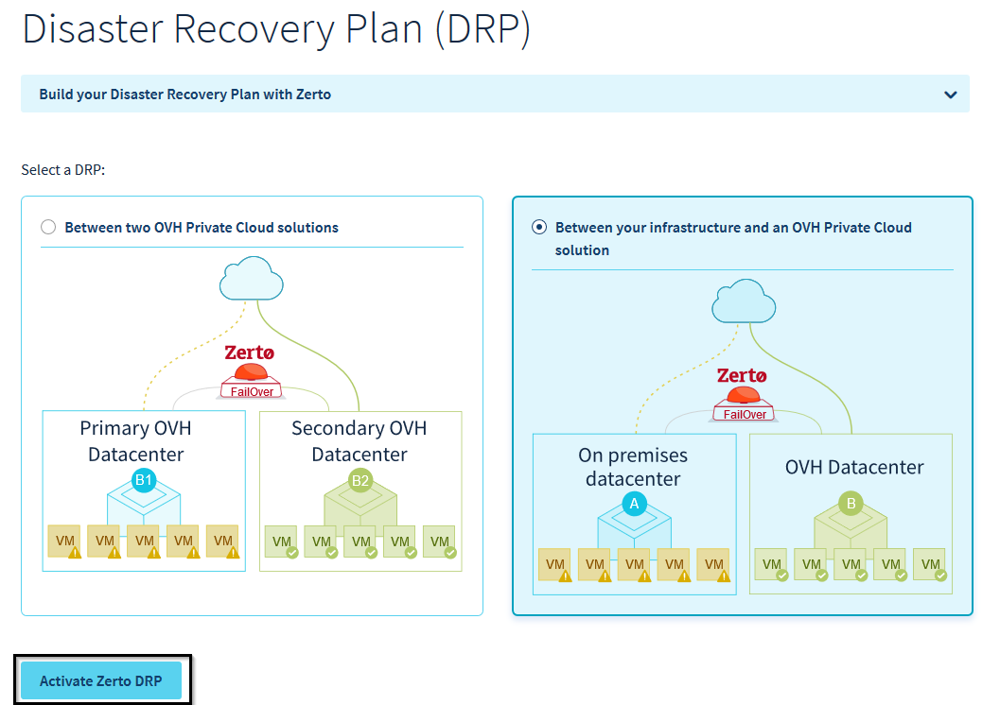
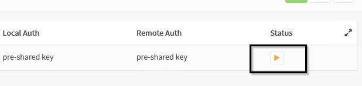
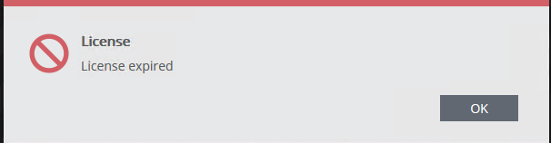

## Introduction

This document will help you configure a virtual private network between an on-prem Zerto platform and an OVH Cloud Private Cloud.
We will use the OpnSense open source VPN Solution as an example, we will focus on the simplest configuration where the VPN tunnel arrives in the Zerto network. 

## Prerequisites

- The target private Cloud needs to have at least one public IP availaible for the VPN endpoint   
- The on-prem platform needs to have a Zerto platform installed
- The VRAs (Virtual Replication Appliances) on both side need to be able to connect to their counterparts on TCP ports 4007 and 4008
- Zerto administration consoles or ZVMs (Zerto Virtual Managers ) on both side need to be able to connect to their counterpart on TCP port 9081

## 1. Solution Architecture

## 2. Parameters

Customer side :

- VPN Endpoint public IP adress (1)
- VPN Endpoint internal IP adress (2)
- ZVM Internal IP adress (3)
- ZVM Internal network (4)

OVHCloud Side :

- VPN Endpoint public IP adress (5)
- ZVM Internal network (6)
- ZVM Internal IP adress (7)

**Note :** You need to decide in which network the OVHCloud ZVM must be deployed to avoid any overlap with local networks, which would prevent routing.
You can either accept the suggested network or provide your own, as long as it is a valid /23 range

## 3. Activate Zerto features

Feature activation is very simple from the OVHCloud control panel. You just need to select the datacenter associated to the PCC you want to use in the Disaster Recovery Plan tab.

Select « Between your infrastructure and an OVH Private Cloud  » then click  « Activate Zerto DRP »

Select a free public IP from the dropdown menu

Vous pouvez ensuite saisir la plage réseau souhaitée pour le déploiement de la ZVM

Confirm the VRA Network range and then click « Install»

## 4. IPSec Service Activation

From OPNSense interface, go to VPN menu on the left, IPSec section and select « Tunnel Setting »

Click  « Enable IPsec »

Click « Save »

## 5. IPSec Tunnel configuration

IPSec Tunnel configuration is done by defining two sets of parameters, called phase 1 and phase 2.

### a. Phase 1 Setup

In the VPN menu, go to "Tunnel settings" click on the "+" to add a new phase 1:

#### i. Tunnel settings : General information

> 

The default values are correct :

- Connection Method : Default
- Key Exchange version : V2
- Internet Protocol  : IPV4
- Interface : WAN

The only required parameter is OVHCloud IPSec Endpoint IP adress.

#### ii. Tunnel settings : Phase 1 Authentication

Once again default values are valid, you only need to give the shared secret for authentication

#### iii. Tunnel settings  : Phase 1 Encryption algorithms

Supported values for each parameters :

- Encryption algorithms : AES 256 bits
- Hash algorithms : SHA256
- Diffie-Hellman key group : 14 (2048 bits)
- Lifetime : 28 800 seconds

You can keep the default values for the other parameters.
Click  « SAVE » then  « Apply changes »

The new Phase 1 is now present in the interface:

### b. Phase 2 Setup

Click on  « Show Phase 2 entries »

There is no available phase 2, so you need to add one :

Click on « + »

#### i. Phase 2 - General information

Check that the mode is set to  « Tunnel IPV4 »

#### ii.Phase 2 – Local Network

Local Network type must be set to  « Lan subnet »

#### iii. Phase 2 – Remote Network

You need to give the ZVM IP and the associated network range. Make sure to double check the parameters otherwiser the VPN tunnel won't come up.
On OVHCloud side, the ZVM network is always a /23 network (512 IPs)

#### iv.  Phase 2 – Key Exchange

Supported values are:

- Protocole : ESP
- Encryption algorithm : AES 256 bits
- Hash algorithms : SHA256
- PFS : Off

You can leave advanced parameters to their default value.
Click « Save » then « Apply changes »

### c. Check VPN status

Click the green triangle on the right to initiate connexion :

If all the parameters are correct, the tunnel comes up and 2 new icons appear :

- Tear down tunnel
- Tunnel information

Click on the information icon.

Tunnel is now up, make sure to add, if required, to add a route to OVHCloud ZVM Network on your local ZVM.

**Troubleshooting** :

If the tunnel is not coming up, make sure that the parameters values are identical on both sides:

- Shared secret
- Remote Endpoint IP address
- Remonte network range

Make that a firewall is not interfering in the dialog between the local and remote endpoint.
You can check the IPSec logfile in /var/log/ipsec.log on the OPNSense appliance to get more information

## 6. Firewall opening

To allow the pairing between on-prem and OVHCloud instance, traffic must be authorized on the following ports:

- TCP 9081 between ZVMs
- TCP 4007/4008 between vRAs

### a. ZVM Opening

Go to « Firewall » menu,  « Rules » section,  « IPSec » interface:

Click on  Add to create a new rule

Rule parameter are as follow :

- Action : « Pass » (Authorize traffic)
- Interface : « IPsec » (incoming traffic comming from the VPN tunnel)
- Protocol : « TCP »

For Source and Destination, select « Single host or Network » type.
Source is the OVHCloud ZVM and destination is on-prem ZVM.

Destination TCP port is 9081.
click "Save" and "Apply Change"

### b. vRAs opening

vRAs opening si a bit more complex since there are multiple VRAs on each side that need to be able to exchange information on TCP ports 4007 and 4008.
To simplify this setup we are going to use the alias feature of OPNSenser. An alias is a group of objects IPs, networks, URLs…) that can be used in firewall rules..

We will define 3 aliases :

- One for vRA IPs on customer side
- One for vRA IPs on OVHCloud side
- One for the ports

You can get the OVH Cloud vRAs IP from the destination Private Cloud vCenter interface  

Let's create the  OVH_VRA alias  for OVHCLoud vRAs:

In the same fashion we can create an alias for the on-prem vRAs :

Last step, let's create the ports alias

We have now all the elements we need to implements the required firewall rules to authorize data coming from the OVHCloud platform.
It is the same procedure as before, we just need to use the aliases instead of explicit IPs or ports:

At this point we have a functional and secure link between our on-prem and cloud instance.

## 7. ZVM Pairing

Login into your on-prem ZVM, the following screen is displayed:

Select « Pair to a site with a licence » , enter OVHCloud ZVM IP and press "Start"

In the dashboard you can see the pairing is ongoing:

You are notified when the pairing is successfull :

You can check that your PCC OVHCloud is visible in the « Sites » tab

At this point your Zerto setup is functionnal and you can start to create your virtual protection groups (VPGs)

***NOTE :*** If the on-prem ZVM is not able to contact successfully the OVHCloud ZVM (for example due to an incorrect firewall setup) you will get the following message:

then you are brought back to the login screen with the following error message.

The most probable cause is that the OVHCloud ZVM is not authorized to contact on-prem ZVM on TCP 9081 (it needs to be able to initiate the connection)