## Introduction :
Ce document a pour objectif de vous aider à configurer de réseau privé virtuel (VPN) pour raccorder votre plateforme locale à votre Hosted Private Cloud OVH pour mettre en œuvre la solution de reprise d’activité
Zerto.
Pour illustrer la mise en œuvre de l’interconnexion, nous utiliserons les fonctionnalités VPN d’OPNSense qui est une plateforme firewall/VPN open source. 
Nous décrirons la configuration la plus simple où passerelle VPN dispose d'une connexion dans le réseau de la ZVM pour faciliter les explications

## Prérequis :

- Le PCC de destination doit disposer au moins une adresse IP publique disponible pour le point de connexion VPN
- Le site client doit disposer d’une installation Zerto opérationnelle.
- Les machines de réplication Zerto (VRA : Virtual Réplication Appliance) coté client et coté OVHCloud doivent pouvoir échanger entre elles sur les ports TCP 4007 et 4008
- Les machines d’administration Zerto (ZVM : Zerto Virtual Manager ) coté client et coté OVHCloud doivent pouvoir échanger entre elles sur les ports TCP 9081

## 1. Architecture de la solution

## 2. Paramètres à définir

Coté client :

- Adresse publique du point de connexion VPN (1)
- Adresse interne du point de connexion VPN (2)
- Adresse interne de la ZVM (3)
- Plan d’adressage du réseau ZVM (4)

Coté OVH :

- Adresse publique du point de connexion VPN (5)
- Plan d’adressage du réseau ZVM (6)
- Adresse de la ZVM (7)

**NB :** Vous devez choisir La plage réseau dans laquelle vous souhaitez qu’OVH déploie la ZVM distante afin d’éviter toute collision avec vos adresses internes. Vous pouvez simplement accepter celle qui vous est
proposée par défaut dans l’interface de l’espace client si elle convient.

## 3. Activation de la fonction Zerto client vers OVH

L’activation se fait très simplement depuis l’espace client OVHCloud, en sélectionnant le datacenter associé au PCC, onglet Disaster Recovery Plan

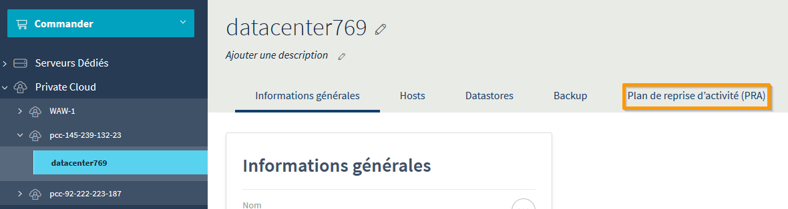

Sélectionner l’option « Entre votre infrastructure et un Private Cloud OVH » puis cliquer sur « Activer Zerto PRA »

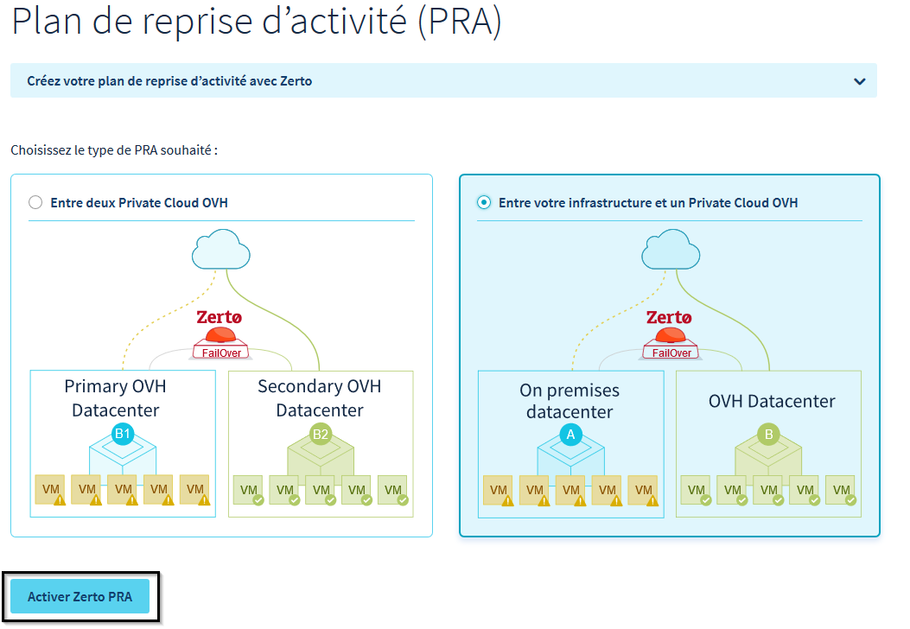

Sélectionner une adresse publique disponible dans la plage proposée :

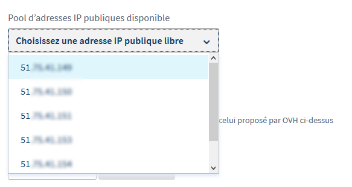

Vous pouvez ensuite saisir la plage réseau souhaitée pour le déploiement
de la ZVM

Cliquez ensuite sur « Installer »

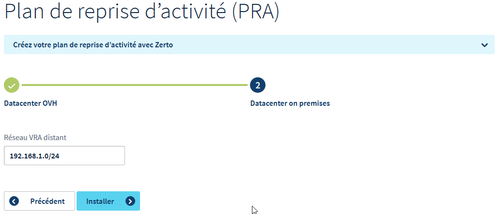

## 4. Activation Service IPSec :

Depuis la console OPNSense, allez dans le menu VPN sur la gauche, rubrique IPSec et sélectionnez « Tunnel Setting »

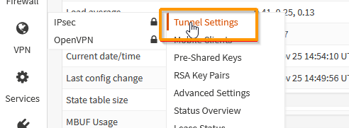

Et cochez la case « Enable IPsec »

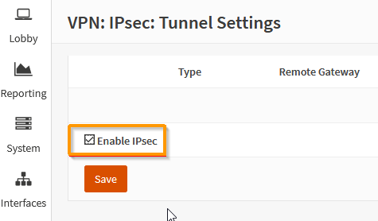

Faire « Save »

## 5. Paramétrage du Tunnel IPSec

La configuration  du tunnel se fait en paramétrant deux groupes de paramètres appelés phase 1 et phase 2.

### a. Ajout de la phase 1

Dans le menu VPN à la rubrique Tunnel setting cliquer sur la croix à droite de l’écran :

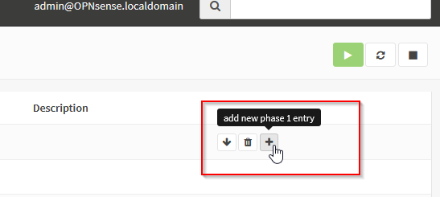

#### i. Informations générales

> 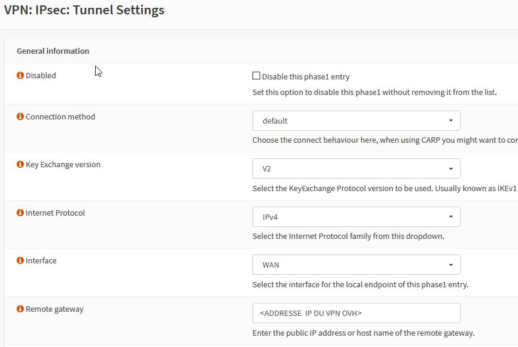

Vous pouvez conserver les valeurs par défaut :

- Methode de connection : Default
- Protocole d’échange de clés : V2
- Protocole Internet : IPV4
- Interface : WAN

Le seul paramètre à rentrer est l’IP du point de connexion IPSec d’OVH.

#### ii. Phase 1 Authentification

Là encore vous pouvez conserver les paramètres par défaut, il suffit de saisir le secret partagé

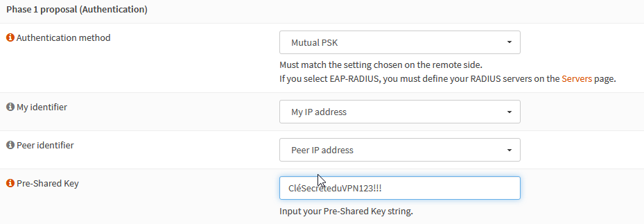

#### iii. Phase 1 Choix des algorithmes de chiffrement

Les valeurs supportées des paramètres sont les suivantes :

- Algorithme de chiffrement : AES 256 bits
- Algorithme de hachage : SHA256
- Groupe de clés Diffie-Hellman : 14 (2048 bits)
- Durée de vie : 28 800 secondes

Les paramètres avancés peuvent rester avec les valeurs par défaut. Cliquer sur « SAVE » puis « appliquer les changements »

La Phase 1 est maintenant disponible dans l’interface

### b. Ajout d’une entrée Phase 2

Cliquer sur le bouton « afficher les entrées Phase 2 »

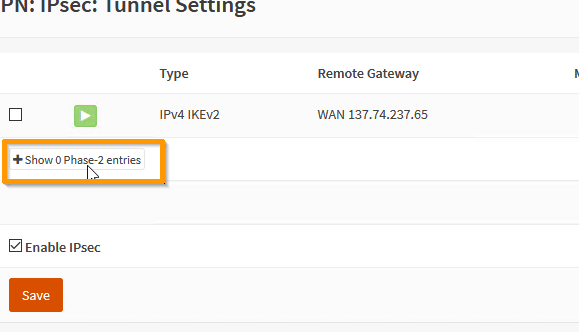

Aucune phase 2 n’est disponible, il faut donc en ajouter une :

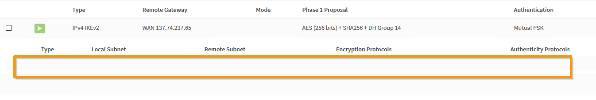

Cliquez sur le bouton « + »

#### i. Phase 2 - Informations générales

Vérifiez que le mode est bien positionné à « Tunnel IPV4 »

#### ii.Phase 2 – Réseau Local

Le type de réseau local doit être à « Sous réseau Local »

#### iii. Phase 2 – Réseau distant

A ce stade il faut saisir le plan d’adressage du réseau sur lequel se trouve la ZVM OVH. Soyez vigilants si une erreur se produit à ce stade le VPN ne pourra pas fonctionner. Dans tous les cas il s’agit forcément d’un réseau en /23 (512 IPs)

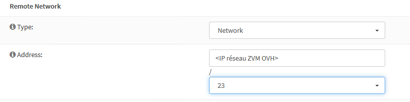

#### iv. Phase 2 – Echanges de clés

Les paramètres supportés sont

- Protocole : ESP :
- Algorithmes de chiffrement : AES 256 bits
- Algorithmes de hachage : SHA256
- PFS : Off

Il n’est pas nécessaire de modifier les options avancées. Faites « Save » puis « Appliquer les changements »

### c. Vérification de l’état du VPN :

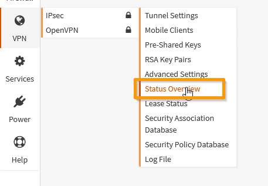

Appuyez sur le triangle vert à droite pour lancer la connexion :

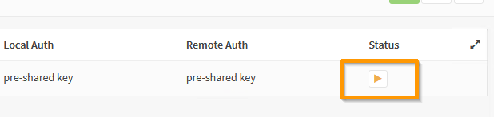

Si les paramètres sont corrects le tunnel s’établit, et deux nouvelles icones apparaissent :

- Désactiver le tunnel
- Obtenir des informations sur l’état du tunnel

Cliquer sur l’icône d’informations

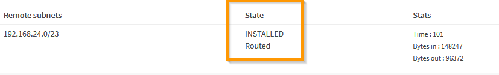

Le tunnel est maintenant opérationnel, n’oubliez pas, si nécessaire, à ce stade d’ajouter une route sur la ZVM locale vers le réseau de la ZVM OVHCloud.

**Troubleshooting** :

Si le tunnel ne monte pas, vérifiez que les paramètres ont bien été saisis :

- La clé partagée
- L’IP du point de connexion distant.
- La plage IP du réseau distant

Vérifiez également qu’un firewall ne bloque pas les flux entre les deux extrémités du VPN

Vous pouvez également consulter le fichier de log IPSec dans /var/log/ipsec.log

## 6. Ouvertures Firewall

Afin de permettre l’appairage entre le site client et le site OVH, il
faut autoriser :

- Le port 9081 entre les ZVM
- Les ports 4007 et 4008 entre les vRAs

### a. Ouvertures ZVM

Allez dans le menu « Firewall » section « Rules » et « IPSec »

Cliquez sur Add pour créer une nouvelle régle

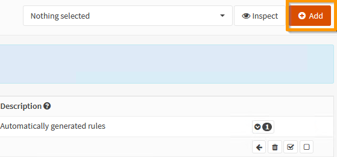

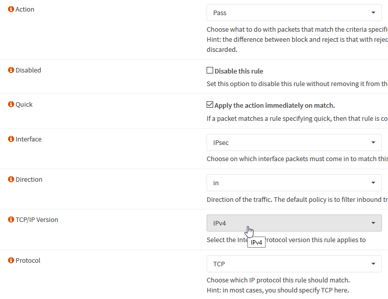

C’est une règle qui comporte les paramètres suivants :

- Action : « Pass » (Autoriser le flux)
- Interface : « IPsec » (les flux entrant à autoriser proviennent  du VPN)
- Protocole : « TCP »

Les sections Source et Destination sont de types « Single host or Network » et référencent respectivement les IP de la ZVM OVH vers la ZVM client.

Le port TCP de destination autorisé est le 9081.
Sauvegardez la régle et déployez là.

### b. Ouvertures pour les vRA

Les ouvertures pour les vRA sont un peu plus complexes puisqu’il y a autant de vRA que d’ESXi aussi bien coté client que coté OVHCloud et toutes doivent pouvoir se parler sur les ports TCP 4007 et 4008. Pour simplifier ce type de situations OPNSense offre les alias. Un alias est un groupe d’objets (IPs, réseaux, URLs etc…) qui peut être utilisé dans la définition des règles de firewall.

Dans notre cas, nous aurons besoins de 3 alias :

- Un pour les IPs des vRAs coté client
- Un pour les IPs des vRAs coté OVHCloud
- Un pour les ports à autoriser

L’IP des vRAs coté OVH Cloud visible dans l’interface vSphere du Private Cloud de destination

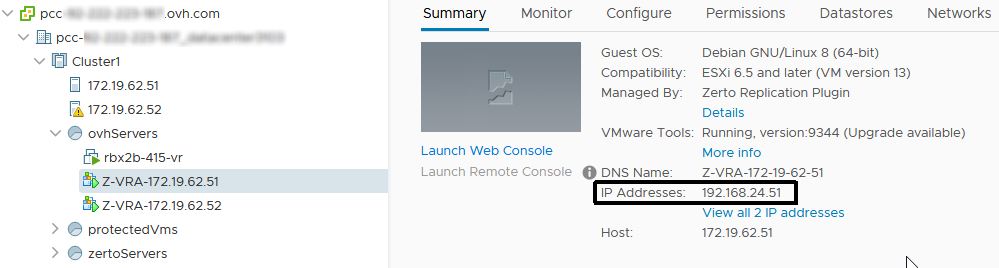

Créons l’alias OVH_VRA pour les vRAs coté OVHCLoud :

De manière similaire il faut créer un alias pour les machines coté client :

Il ne reste plus qu’à créer l’alias pour les ports

Nous avons maintenant tous éléments pour créer nos règles firewalls qui autorisent le flux en provenance d’OVH vers la plateforme client. La procédure est la même, il suffit simplement d’utiliser les alias dans les paramètres :

A ce stade la connexion VPN est opérationnelle et sécurisée

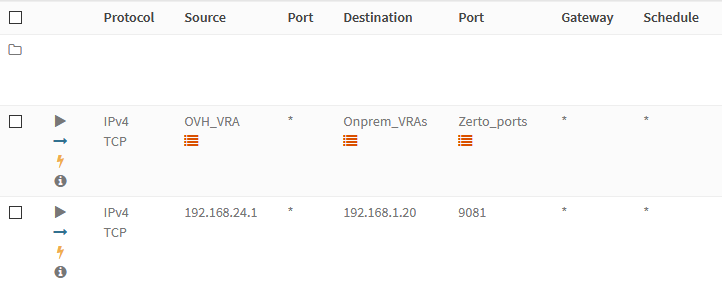

## 7. Appairage des ZVM

Une fois la ZVM installée sur le site client, vous pouvez vous connecter à l’interface Zerto. 
L’écran suivant s’affiche :

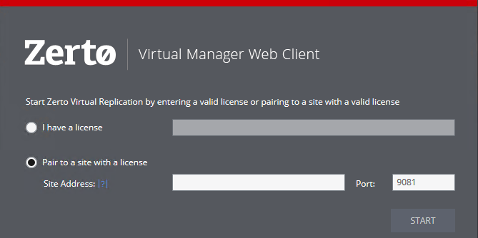

Choisir l’option « Pair to a site with a licence » et saisir l’adresse IP de la ZVM coté OVH puis « Start »

Dans le tableau de bord, un message indique que l’appairage est en
cours :

Si l’opération c’est bien déroulée le message suivant s’affiche :

Vous pouvez vérifier que le le nom de votre PCC OVHCloud est bien visible dans l’onglet « Sites »

A ce stade votre solution Zerto est opérationnelle et vous pouvez créer vos groupes de protection virtuels (VPG)

***NOTE :*** En cas d’impossibilité d’établir un dialogue entre les ZVM (notamment en cas d’omission au niveau des règles de firewall) le message suivant s’affiche :

Puis vous êtes ramené à l’écran de connexion de la ZVM avec le message d’erreur suivant.

La cause la plus probable est que la ZVM OVHCloud n'arrive pas à contacter la ZVM client sur le port TCP 9081, il est nécessaire qu'elle puisse ouvrir la connexion.
