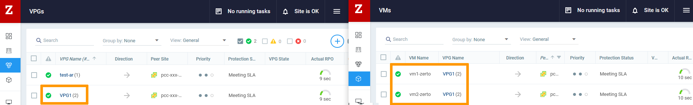
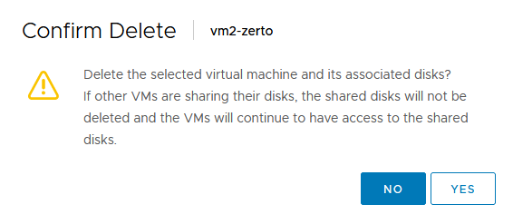
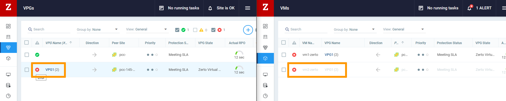
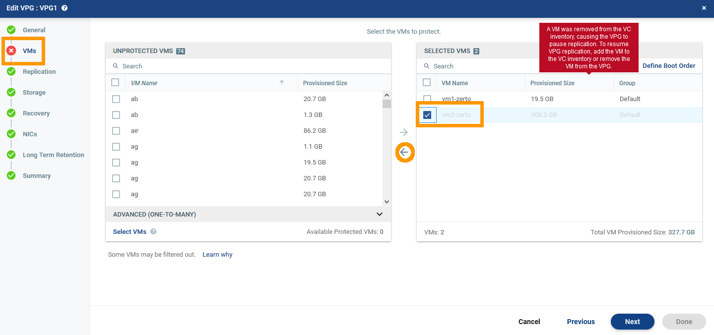

> [!primary]
> Tłumaczenie zostało wygenerowane automatycznie przez system naszego partnera SYSTRAN. W niektórych przypadkach mogą wystąpić nieprecyzyjne sformułowania, na przykład w tłumaczeniu nazw przycisków lub szczegółów technicznych. W przypadku jakichkolwiek wątpliwości zalecamy zapoznanie się z angielską/francuską wersją przewodnika. Jeśli chcesz przyczynić się do ulepszenia tłumaczenia, kliknij przycisk "Zgłóś propozycję modyfikacji" na tej stronie.
>

**Ostatnia aktualizacja z dnia 09-12-2021**

## Wprowadzenie

Gdy wirtualna maszyna jest celowo usuwana ze strony źródłowej, VPG Zerto wstrzymuje synchronizację i wyświetla się błąd. 
Pliki kopii wirtualnej maszyny są zawsze na stronie docelowej. 
Ten dokument pokazuje, jak usunąć te pliki i przywrócić funkcję VPG.

**Użyj interfejsu Zerto, aby usunąć kopię wirtualnych maszyn z docelowej strony.**

## Wymagania początkowe

- Posiadanie kontaktu administracyjnego infrastruktury [Hosted Private Cloud](https://www.ovhcloud.com/pl/enterprise/products/hosted-private-cloud/), aby otrzymywać dane do logowania.
- Posiadanie aktywnego identyfikatora użytkownika z uprawnieniami dla Zerto (utworzonego w [Panelu klienta](https://www.ovh.com/auth/?action=gotomanager&from=https://www.ovh.pl/&ovhSubsidiary=pl))
- Wdrożenie [Zerto Virtual Replication](https://docs.ovh.com/pl/private-cloud/zerto-virtual-replication-vmware-vsphere-drp/)

## W praktyce

W interfejsie Zerto strony docelowej sprawdź dashboardy `VPGs`{.action} i `VMs`{.action}. 
W naszym przykładzie VPG1 zawiera dwie wirtualne maszyny, vm1-zerto i vm2-zerto. Status synchronizacji strony działa poprawnie.

{.thumbnail}

W interfejsie vSphere strony źródłowej vm2-zerto zostaje automatycznie usunięta. 
Wirtualna maszyna i jej dyski są usuwane.

{.thumbnail}

Wracając do interfejsu Zerto strony docelowej, VPG wstrzymuje synchronizację i wyświetla się błąd. Wirtualna maszyna vm2-zerto jest szara.

{.thumbnail}

W zakładce `VPGs`{.action} zaznacz VPG1 i w menu `Actions`{.action} kliknij `Edit VPG`{.action}.

{.thumbnail}

W `VMs`{.action} usuń vm2-zerto z sekcji `selected VMS` (zaznacz VM, następnie kliknij strzałkę wskazującą w lewo). 
Kliknij na `Done`{.action}.

{.thumbnail}

Kliknij `No`{.action} w oknie ostrzegawczym. Na ogół nie ma potrzeby zapisywania dysku odzyskiwającego.

{.thumbnail}

VPG znów się synchronizuje i w środku działa z jedną wirtualną maszyną.

{.thumbnail}

## Sprawdź również

Dołącz do społeczności naszych użytkowników na stronie<https://community.ovh.com/en/>.
