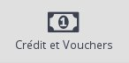
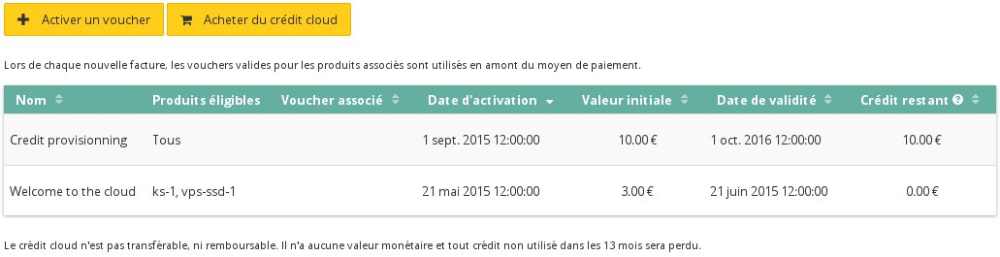
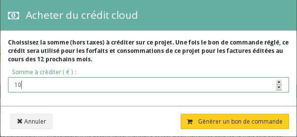

## 
In dieser Hilfe erklären wir Ihnen, wie Sie Guthaben auf Ihr Public Cloud Konto aufladen können - über einen Gutschein oder einen Bestellschein.

## 

- Loggen Sie sich in Ihr OVH Public Cloud [Kundencenter](https://www.ovh.com/manager/cloud/) ein
- Erstellen Sie bei Bedarf ein neues Projekt
- Klicken Sie auf "Verwaltung und Verbrauch des Projekts"

{.thumbnail}

- Klicken Sie auf "Guthaben und Gutscheine"

{.thumbnail}
Über dieses neue Menü können Sie:

- die History Ihrer Aufladungen einsehen,
- einen Gutschein einlösen oder
- Cloud Guthaben kaufen.

{.thumbnail}

## Gutschein einlösen
Bei manchen Gelegenheiten erhalten Sie Gutscheine, mit denen Sie Ihrem Public Cloud Projekt Guthaben hinzufügen können, etwa im Rahmen eines Discovery-Angebots oder auch bei OVH Events.

- Klicken Sie auf "Einen Gutschein aktivieren"
- Geben Sie Ihren Aktivierungscode ein:

{.thumbnail}

## Guthaben kaufen

- Klicken Sie auf "Cloud Guthaben aufladen"
- Geben Sie den Betrag an, den Sie Ihrem Cloud-Guthaben hinzufügen möchten:

{.thumbnail}

## 
... lesen Sie auch unsere anderen Hilfen zum Thema Cloud!

