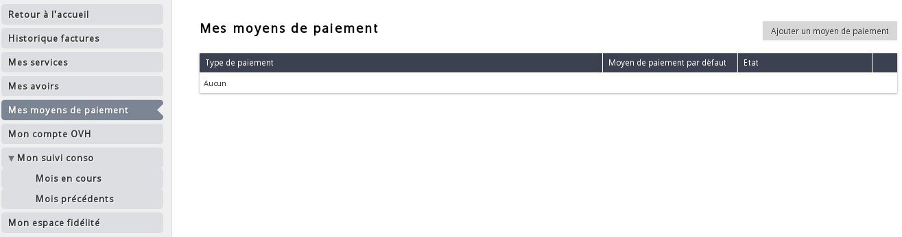
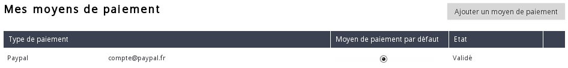

## 
Płatności za faktury Public Cloud można wykonywać na 2 sposoby:

- Za pomocą środków zasilających konto Public Cloud
- w sposób automatyczny poprzez skonfigurowanie sposobu płatności

Przewodnik ten wyjaśnia procedurę dodania automatycznego sposobu płatności.

## 

- Zaloguj się do panelu klienta Public Cloud OVH.
- Kliknij na "Płatności" na górze po prawej stronie:

{.thumbnail}

- Kliknij na "Moje sposoby płatności" w menu po prawej stronie.

{.thumbnail}

- Kliknij na "Dodaj sposób płatności".

{.thumbnail}
Dostępne sposoby płatności to:

|Konto Paypal|

Po dodaniu sposobu płatności kliknij na "Domyślny sposób płatności", aby dokonać aktywacji.

{.thumbnail}

## 
[Przewodniki Cloud]({legacy}1785)

