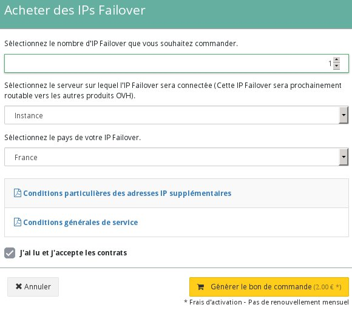

## 
Per configurare un IP Failover sulle tue istanze Public Cloud, ad esempio se:

- ospiti più siti sulla tua istanza 
- ospiti progetti internazionali 

è possibile acquistare indirizzi IP Failover per le tue istanze.

Questi indirizzi possono essere trasferiti esclusivamente verso le istanze di uno stesso progetto.

Questa guida ti mostra come acquistare un IP Failover per il tuo progetto Public Cloud OVH.

## Requisiti necessari

- [Crea un'istanza dallo Spazio Cliente OVH]({legacy}1775)

## 
Per ordinare il tuo indirizzo IP accedi alla sezione Cloud del tuo Spazio Cliente OVH, clicca sul tasto Aggiungi in alto a sinistra e seleziona Acquista IP Failover:

{.thumbnail}
Si apre una nuova finestra in cui ti viene richiesto:

- il numero di indirizzi IP Failover che vuoi acquistare
- l'istanza a cui vuoi associare i tuoi IP Failover

Il menu si adatterà in base alla localizzazione del server che hai selezionato.

{.thumbnail}
Per un'istanza europea puoi scegliere tra questi Paesi:

|Belgio|Finlandia|Francia|Germania|Repubblica Ceca|
|Irlanda|Italia|Lituania|Paesi Bassi|Regno Unito|
|Portogallo|Spagna|Polonia|||

Le istanze canadesi saranno disponibili a breve.

## Attenzione!
In base alla disponibilità degli indirizzi IP, è possibile che alcuni Paesi non vengano visualizzati.
Per essere reindirizzato al tuo buono d'ordine, clicca su "Genera ordine" oppure sul messaggio visualizzato subito dopo la sua creazione:

{.thumbnail}

## 

- [Importa un IP Failover]({legacy}1883)
- [Trasferisci il tuo IP Failover]({legacy}1890)
- [Configura un IP Failover a caldo]({legacy}1884)

## 
[Ritorna all'indice delle guide Cloud]({legacy}1785)

