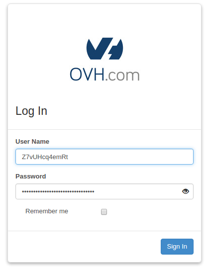
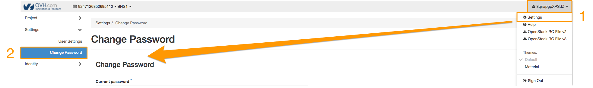
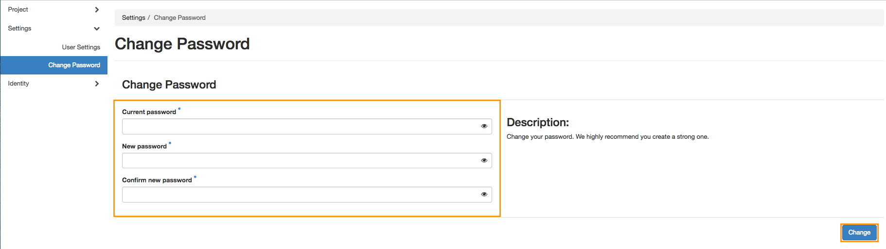

**Last updated 07th March 2018**

## Objective

In our guide to [Configuring user access to Horizon](https://docs.ovh.com/gb/en/public-cloud/configure_user_access_to_horizon/){.external}, we explained how to create and delete OpenStack users, as well as how to generate an access password.

Using the Horizon panel, you can also set passwords for each individual user. Please note that when you change a user password, the previous password will be immediately cancelled.

**This guide explains how to set custom user passwords in the Horizon interface.**

## Requirements

- You need to have created an OpenStack Horizon user account.

## Instructions

You can create an OpenStack password once you have logged in to your [OpenStack Horizon](https://horizon.cloud.ovh.net){.external} interface:

{.thumbnail}

Your user profile is visible in the top right-hand corner of the Horizon interface. Click on your profile to open a menu with various options, select `Settings`{.action}, then `Change password`{.action} on the left-hand side:

{.thumbnail}

Enter your current password into the first field, then re-enter and confirm your new password in the next two fields.

> [!primary]
>
> When you change your password, please ensure that it meets the following criteria:
>
> - password must contain a minimum of eight characters
> - password must contain a maximum of 30 characters
> - password must contain at least one upper-case letter
> - password must contain at least one lower-case letter
> - password must contain at least one number
> - password must only contain letters and numbers
>

To confirm your new password, click `Change`{.action}.

{.thumbnail}

Please note that when you change your user password, your old password will be immediately cancelled.

## Go further

Join our community of users on <https://community.ovh.com/en/>.