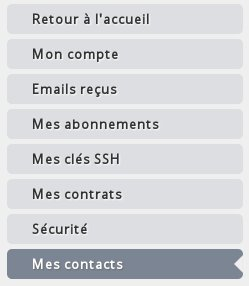

## 
Die OVH Public Cloud ermöglicht Ihnen die Änderung des Administrator- und des Rechnungs-Kontakts Ihrer Projekte.
So können Sie zum Beispiel den OVH Account, der die Rechnungen begleicht, und den für die Administration der Instanzen zuständigen Account voneinander trennen.

In dieser Hilfe wird die Vorgehensweise zur Änderung Ihrer Kontakte beschrieben.

## Voraussetzungen

- 2 OVH Accounts
- Ein Public Cloud Projekt

## 
Um die Kontakte Ihres Projekts zu ändern begeben Sie sich in die Rubrik Verwaltung und Verbrauch des Projekts.

{.thumbnail}
Auf der nun angezeigten Seite wählen Sie Kontakte und Rechte aus.

{.thumbnail}
Sie sehen dann Ihren derzeitigen Administrator- und Rechnungs-Kontakt.

{.thumbnail}
Mit einem Klick auf Ändern gelangen Sie auf eine neue Seite, auf der Sie Ihre Kontakte ändern können:

{.thumbnail}
Sobald die neuen Kontakte konfiguriert wurden, wird den beiden OVH Accounts eine E-Mail mit einem Code zugesandt, mit dem die Kontaktänderung bestätigt werden kann:

{.thumbnail}
Diese Bestätigung muss dann auf den beiden Accounts durchgeführt werden.

Klicken Sie dazu in Ihrem Kundencenter rechts oben auf Ihren Namen, wählen Sie Mein Account aus und klicken Sie in dem Menü auf der linken Seite auf Meine Kontakte.

{.thumbnail}
Der ursprüngliche Kontakt führt die Bestätigung in der Rubrik Meine versandten Anfragen durch, der neue Kontakt tut dies in der Rubrik Meine erhaltenen Anfragen.
Jede Anfrage wird in einer eigenen Zeile aufgeführt:

{.thumbnail}
Bestätigen Sie dann die Anfrage und geben Sie den per E-Mail erhaltenen Validierungs-Code ein, um die Änderung der Kontakte abzuschließen.

## 

- [Projekte delegieren]({legacy}1914)
- [Abrechnung analysieren und verwalten]({legacy}2031)

## 
[Zurück zum Index der Cloud Hilfen]({legacy}1785)

