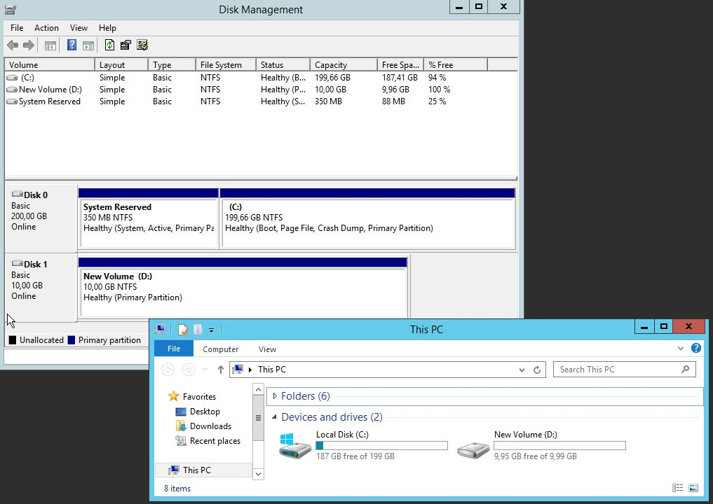

## 
It is possible to create additional disks for your Public Cloud instances.
This can be useful in cases where:

- You want to increase your storage capacity without changing the instance model.
- You want to have a highly available, high-performance storage.
- You want to move your storage as well as your data to another instance.


This guide explains how to create an additional disk and then configure it on one of your instances.


## Prerequisites

- An instance


## 

- Log on to your 
[OVH control panel](https://ca.ovh.com/manager/cloud/)
- Click "Add" and select "Add a disk"


{.thumbnail}
From this new menu you can:

- Name your drive
- Select the disc type:

|Classic|200 IOPS guaranteed|
|High Performance|Up to 3000 IOPS|


- Choose the disk capacity: from 10 GB
- Select your disk region
- Confirm the disk creation


A new window will appear with your disk:

{.thumbnail}
You can then attach your additional disk to an instance:

- By dragging and dropping your disk on your instance .
- By clicking on the arrow at the bottom right of your drive and selecting "Attach to a server."


Once done, it will appear just below your instance:

{.thumbnail}


## From an instance under Linux

- List the disks 

```
admin@serveur-1:~$ lsblk

NAME MAJ:MIN RM SIZE RO TYPE MOUNTPOINT
vda 254:0 0 10G 0 disk
└─vda1 254:1 0 10G 0 part /
vdb 254:16 0 10G 0 disk
```


VDA usually refers to your instance's disk, VDB will therefore be the additional disk

- Create a partition

```
admin@serveur-1:~$ sudo fdisk /dev/vdb

Welcome to fdisk (util-linux 2.25.2).
Changes will remain in memory only, until you decide to write them.
Be careful before using the write command.

Device does not contain a recognized partition table.
Created a new DOS disklabel with disk identifier 0x95c4adcc.
```


```
Command (m for help): n

Partition type
p primary (0 primary, 0 extended, 4 free)
e extended (container for logical partitions)
Select (default p):
Using default response p.
Partition number (1-4, default 1):
First sector (2048-20971519, default 2048):
Last sector, +sectors or +size{K,M,G,T,P} (2048-20971519, default 20971519):

Created a new partition 1 of type 'Linux' and of size 10 GiB.
```


```
Command (m for help): w

The partition table has been altered.
Calling ioctl() to re-read partition table.
Syncing disks.
```


- The partition table has been altered.

Calling ioctl() to re-read partition table.
Syncing disks.[/code]


- Format the partition

```
admin@serveur-1:~$ sudo mkfs.ext4 /dev/vdb1
mke2fs 1.42.12 (29-Aug-2014)
Creating filesystem with 2621184 4k blocks and 655360 inodes
Filesystem UUID: 781be788-c4be-462b-b946-88429a43c0cf
Superblock backups stored on blocks:
32768, 98304, 163840, 229376, 294912, 819200, 884736, 1605632

Allocating group tables: done
Writing inode tables: done
Creating journal (32768 blocks): done
Writing superblocks and filesystem accounting information: done
```


- Mount the partition 

```
admin@serveur-1:~$ sudo mkdir /mnt/disk
admin@serveur-1:~$ sudo mount /dev/vdb1 /mnt/disk/
```


- Check the mounting

```
admin@serveur-1:~$ df -h

Filesystem Size Used Avail Use% Mounted on
/dev/vda1 9.8G 840M 8.6G 9% /
udev 10M 0 10M 0% /dev
tmpfs 393M 5.2M 388M 2% /run
tmpfs 982M 0 982M 0% /dev/shm
tmpfs 5.0M 0 5.0M 0% /run/lock
tmpfs 982M 0 982M 0% /sys/fs/cgroup
/dev/vdb1 9.8G 23M 9.2G 1% /mnt/disk
```


To mount a persistent disk, you have to change the /etc/fstab file:

Retrieve the block ID

```
admin@serveur-1:~$ sudo blkid

/dev/vda1: UUID="51ba13e7-398b-45f3-b5f3-fdfbe556f62c" TYPE="ext4" PARTUUID="000132ff-01"
/dev/vdb1: UUID="2e4a9012-bf0e-41ef-bf9a-fbf350803ac5" TYPE="ext4" PARTUUID="95c4adcc-01"
```


- Add your disk to the /etc/fstab file:

```
admin@serveur-1:~$ vim /etc/fstab

/etc/fstab: static file system information.

# Use 'blkid' to print the universally unique identifier for a
# device; this may be used with UUID= as a more robust way to name devices
# that works even if disks are added and removed. See fstab(5).
#
# <file system> <mount point> <type> <options> <dump> <pass>
UUID=51ba13e7-398b-45f3-b5f3-fdfbe556f62c / ext4 defaults 0 0
UUID=2e4a9012-bf0e-41ef-bf9a-fbf350803ac5 /mnt/disk ext4 nofail 0 0
```


## From an instance under Windows

- Access the disk manager tool


{.thumbnail}
Format the disk

{.thumbnail}
Warning:
If the "offline (the disk is offline because of policy set by an administrator)" message appears, you have to change the disk properties by right clicking on your drive, then selecting "Online" and " Initialise", or using Diskpart:


- Start PowerShell or a command prompt
- Verification of the strategy applied:

```
PS C:\> diskpart
DISKPART> san

SAN Policy : Offline Shared
```


- Change strategy :

```
DISKPART> san policy = OnlineAll

DiskPart successfully changed the SAN policy for the current operating system . [/ Code]

- Implementation of the strategy on the extra disk:
[Code] DISKPART> list disk

Disk ### Status Size Free Dyn Gpt
-------- ------------- ------- ------- --- ---
Disk 0 Online 200 GB 0 B
* Disk 1 Offline 10 GB 1024 KB
```


```
DISKPART> select disk 1

Disk 1 is now the selected disk.
```


```
DISKPART> attributes disk clear readonly

Disk attributes cleared successfully.
```


```
DISKPART> attributes disk

Current Read-only State : No
Read-only : No
Boot Disk : No
Pagefile Disk : No
Hibernation File Disk : No
Crashdump Disk : No
Clustered Disk : No
```


```
DISKPART> online disk

DiskPart successfully onlined the selected disk.
```


- Start up the disk from the disk manager then format the disk.


Once the disk is formatted, you can simply access it from your file explorer.

{.thumbnail}