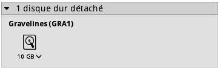
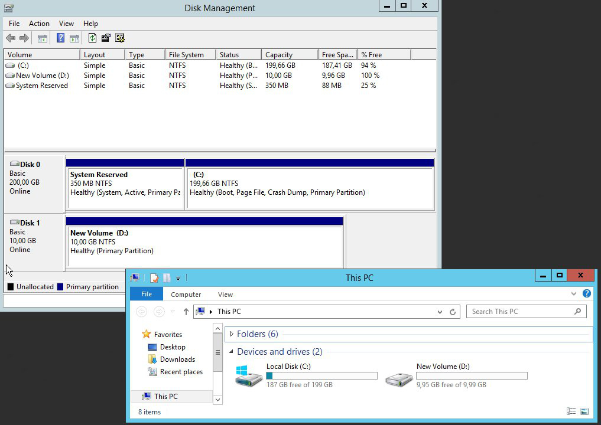

## Preambule
Il est possible de créer des disques additionnels pour vos instances Public Cloud. Cela peut être utile dans le cas où :

- Vous souhaitez augmenter votre capacité de stockage sans pour autant changer de modèle d'instance.
- Vous souhaitez disposer d'un espace de stockage hautement disponible et performant.
- Vous souhaitez pouvoir déplacer votre espace de stockage ainsi que les données contenues sur une autre instance.

Ce guide vous explique comment créer un disque supplémentaire puis le configurer sur l'une de vos instance.


### Prérequis
- Une instance


## Création du disque
- Se connecter à [l'espace client
OVH](https://www.ovh.com/manager/cloud/){.external}
- Cliquer sur le bouton "Ajouter" et sélectionner "Ajouter un disque"


{.thumbnail}

Vous pouvez, depuis ce nouveau menu :

- Nommer votre disque
- Sélectionner le type de disque :

|---|---|
|Classique|200 IOPS garanties|
|Haute performance|Jusqu'à 3000 IOPS|

**Classique**

- Choisir la capacité du disque : à partir de 10GB
- Choisir la région de votre disque
- Valider la création du disque

Une nouvelle fenêtre apparaitra avec votre disque :


{.thumbnail}

Vous pouvez ensuite attacher votre disque supplémentaire à une instance :

- En faisant un glisser/déposer de votre disque sur votre instance.
- En cliquant sur la flèche en bas à droite de votre disque et sélectionner "Attacher à un serveur".

Une fois cela fait, celui-ci apparaitra juste en-dessous de votre instance :


{.thumbnail}


## Montage du disque

### Depuis une instance sous Linux
- Lister les disques

```
admin@serveur-1:~$ lsblk

NAME MAJ:MIN RM SIZE RO TYPE MOUNTPOINT
vda 254:0 0 10G 0 disk
└─vda1 254:1 0 10G 0 part /
vdb 254:16 0 10G 0 disk
```

VDA correspond généralement au disque de votre instance, VDB sera donc le disque supplémentaire

- Créer une partition

```
admin@serveur-1:~$ sudo fdisk /dev/vdb

Welcome to fdisk (util-linux 2.25.2).
Changes will remain in memory only, until you decide to write them.
Be careful before using the write command.

Device does not contain a recognized partition table.
Created a new DOS disklabel with disk identifier 0x95c4adcc.
```


```
Command (m for help): n

Partition type
p primary (0 primary, 0 extended, 4 free)
e extended (container for logical partitions)
Select (default p):
Using default response p.
Partition number (1-4, default 1):
First sector (2048-20971519, default 2048):
Last sector, +sectors or +size{K,M,G,T,P} (2048-20971519, default 20971519):

Created a new partition 1 of type 'Linux' and of size 10 GiB.
```


```
Command (m for help): w

The partition table has been altered.
Calling ioctl() to re-read partition table.
Syncing disks.
```

- Formater la partition

```
admin@serveur-1:~$ sudo mkfs.ext4 /dev/vdb1
mke2fs 1.42.12 (29-Aug-2014)
Creating filesystem with 2621184 4k blocks and 655360 inodes
Filesystem UUID: 781be788-c4be-462b-b946-88429a43c0cf
Superblock backups stored on blocks:
32768, 98304, 163840, 229376, 294912, 819200, 884736, 1605632

Allocating group tables: done
Writing inode tables: done
Creating journal (32768 blocks): done
Writing superblocks and filesystem accounting information: done
```

- Monter la partition

```
admin@serveur-1:~$ sudo mkdir /mnt/disk
admin@serveur-1:~$ sudo mount /dev/vdb1 /mnt/disk/
```

- Vérification du montage

```
admin@serveur-1:~$ df -h

Filesystem Size Used Avail Use% Mounted on
/dev/vda1 9.8G 840M 8.6G 9% /
udev 10M 0 10M 0% /dev
tmpfs 393M 5.2M 388M 2% /run
tmpfs 982M 0 982M 0% /dev/shm
tmpfs 5.0M 0 5.0M 0% /run/lock
tmpfs 982M 0 982M 0% /sys/fs/cgroup
/dev/vdb1 9.8G 23M 9.2G 1% /mnt/disk
```

**Pour un montage de disque persistant, il faudra modifier le fichier /etc/fstab :**

- Récupérer l'ID du bloc

```
admin@serveur-1:~$ sudo blkid

/dev/vda1: UUID="51ba13e7-398b-45f3-b5f3-fdfbe556f62c" TYPE="ext4" PARTUUID="000132ff-01"
/dev/vdb1: UUID="2e4a9012-bf0e-41ef-bf9a-fbf350803ac5" TYPE="ext4" PARTUUID="95c4adcc-01"
```

- Ajouter votre disque dans le fichier /etc/fstab :

```
admin@serveur-1:~$ vim /etc/fstab

/etc/fstab: static file system information.

# Use 'blkid' to print the universally unique identifier for a
# device; this may be used with UUID= as a more robust way to name devices
# that works even if disks are added and removed. See fstab(5).
#
# <file system> <mount point> <type> <options> <dump> <pass>
UUID=51ba13e7-398b-45f3-b5f3-fdfbe556f62c / ext4 defaults 0 0
UUID=2e4a9012-bf0e-41ef-bf9a-fbf350803ac5 /mnt/disk ext4 nofail 0 0
```

### Depuis une instance sous Windows
- Accéder au l'outil de gestion de disque


{.thumbnail}

- Formater le disque


{.thumbnail}

Attention : Si le message "offline (the disk is offline because of policy set by an administrator)" apparaît, il faudra modifier les attributs des disques en effectuant un clic droit sur votre disque, puis sélectionner "Online" puis "Initialize" ou en utilisant Diskpart :

- Lancer Powershell ou une invite de commande
- Vérification de la stratégie appliquée :
- Changer la stratégie :
- Application de la stratégie sur le disque supplémentaire :
- Initialiser le disque depuis le gestionnaire de disques puis procéder au formatage du disque.

Une fois le disque formaté, vous pourrez y accéder simplement depuis votre explorateur de fichiers.


{.thumbnail}
